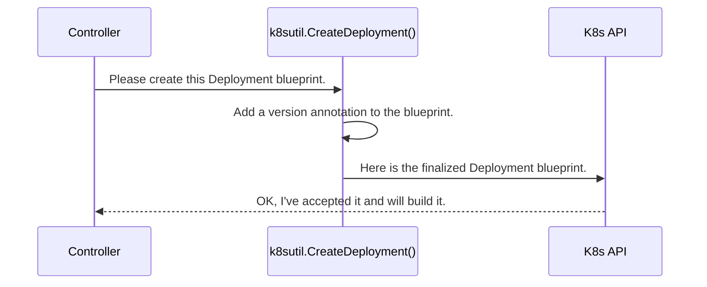

# Chapter 5: k8sutil Package

In the [previous chapter](04_ceph_client_wrapper_.md), we explored the operator's toolkit for talking to the Ceph cluster. But the operator has two jobs: managing Ceph *and* managing the Kubernetes resources that run Ceph. How does it handle the second part?

This is where the `k8sutil` package comes in. Think of it as a set of pre-fabricated components and specialized power tools for Kubernetes. It is the operator's utility belt for all Kubernetes-related tasks.

### What Problem Does `k8sutil` Solve?

Imagine you are the site manager (the Rook operator). You have your Ceph-specific tools (the [Ceph Client Wrapper](04_ceph_client_wrapper_.md)) for plumbing and electrical work. But you also need general construction tools: a crane to lift a `Deployment` into place, a power drill to set `OwnerReferences`, and safety locks (`Finalizers`) to prevent accidental demolition.

Interacting with the Kubernetes API directly can be repetitive and complex. You have to build entire object definitions, handle potential race conditions, and parse API responses. The `k8sutil` package simplifies these common Kubernetes tasks into easy-to-use Go functions. It makes the operator's code cleaner, more reliable, and less error-prone when it needs to:

*   Create, update, or delete a `Deployment`, `Service`, or `Secret`.
*   Manage labels and annotations.
*   Handle "finalizers" to ensure safe cleanup.
*   Set ownership so Kubernetes can automatically garbage-collect resources.

### The Toolkit in Action: Creating a Service

Let's say a controller needs to create a Kubernetes Service to allow other pods to talk to the Ceph Monitors. Instead of writing dozens of lines of raw API code, it can use a simple helper from `k8sutil`.

First, the controller defines the service it wants, just like drawing a simple blueprint.

```go
// Define the service we want to create
service := &v1.Service{
	ObjectMeta: metav1.ObjectMeta{
		Name:      "rook-ceph-mon-a",
		Namespace: "rook-ceph",
	},
	Spec: v1.ServiceSpec{
		// ... service details like ports and selectors ...
	},
}
```

Then, it hands this blueprint to a helper function from `k8sutil`.

```go
// Use the k8sutil helper to create or update the service
_, err := k8sutil.CreateOrUpdateService(ctx, clientset, "rook-ceph", service)
if err != nil {
	return errors.Wrap(err, "failed to create mon service")
}
```

That's it! The `CreateOrUpdateService` function handles everything. It checks if the service already exists. If it does, it updates it. If it doesn't, it creates it. This prevents the operator logic from getting cluttered with boilerplate code.

### Under the Hood: The Life of a `k8sutil` Call

What happens inside that simple function call? Let's trace the creation of a `Deployment`.

1.  **Preparation:** The controller calls a helper like `k8sutil.CreateDeployment`. The helper function often does extra prep work, like adding a special annotation to the Deployment object. This annotation acts like a blueprint version number, helping Rook know if the Deployment needs to be updated later.
2.  **API Call:** The helper function then makes the actual, low-level call to the Kubernetes API server, saying "Please create this resource for me."
3.  **Kubernetes Takes Over:** The Kubernetes API server receives the request, validates it, and saves it. From there, other Kubernetes components, like the scheduler, take over to actually create the Pods for the Deployment.

Here is a simplified diagram of this process:



### A Peek into the Code

Let's look at some of the most important tools in this utility belt.

#### Creating Resources: `CreateOrUpdateService`

This helper function, found in `operator/k8sutil/service.go`, is a perfect example of simplifying a common task.

---
*File: `operator/k8sutil/service.go`*
```go
func CreateOrUpdateService(
	ctx context.Context, clientset kubernetes.Interface, namespace string, service *v1.Service,
) (*v1.Service, error) {

	// First, try to create the service
	s, err := clientset.CoreV1().Services(namespace).Create(ctx, service, metav1.CreateOptions{})
	if err != nil {
		// If it already exists, that's okay! We'll just update it.
		if kerrors.IsAlreadyExists(err) {
			s, err = UpdateService(ctx, clientset, namespace, service)
			// ... error handling ...
		}
	}
	return s, err
}
```
---
This function encapsulates a common pattern: "try to create, and if it's already there, update it." This single helper saves every controller from having to write this logic over and over.

#### Setting Ownership: `SetOwnerReference`

When Rook creates a `Deployment` for a Ceph OSD, that Deployment should "belong" to the main `CephCluster` custom resource. This is done with an "Owner Reference." It tells Kubernetes, "If the parent `CephCluster` is ever deleted, please automatically delete this child Deployment too."

---
*File: `operator/k8sutil/resources.go`*
```go
// SetOwnerReference set the owner reference of object
func (info *OwnerInfo) SetOwnerReference(object metav1.Object) error {
	if info.owner != nil {
		// Use a built-in library to set the reference
		return controllerutil.SetOwnerReference(info.owner, object, info.scheme)
	}
	// ... more logic for other cases ...
	return nil
}
```
---
This helper abstracts away the details of creating and attaching a valid owner reference, ensuring resources are properly garbage collected.

#### Safety Latches: Finalizers

What if you delete a `CephCluster` CR, but Rook needs to perform some cleanup in the Ceph cluster *before* all the Kubernetes resources disappear? This is what **Finalizers** are for. A finalizer is like a safety latch. When present, Kubernetes will not fully delete a resource. Instead, it just marks it for deletion.

The Rook operator sees this "marked for deletion" status and performs its cleanup tasks. Once done, Rook removes the finalizer, which signals to Kubernetes that it's now safe to complete the deletion.

---
*File: `operator/ceph/controller/finalizer.go`*
```go
// AddFinalizerIfNotPresent adds a finalizer to an object.
func AddFinalizerIfNotPresent(ctx context.Context, client client.Client, obj client.Object) (bool, error) {
	objectFinalizer := buildFinalizerName(obj.GetObjectKind().GroupVersionKind().Kind)
	accessor, _ := meta.Accessor(obj)

	// Check if the finalizer is already there
	if !contains(accessor.GetFinalizers(), objectFinalizer) {
		logger.Infof("adding finalizer %q on %q", objectFinalizer, accessor.GetName())
		// If not, add it to the list of finalizers
		accessor.SetFinalizers(append(accessor.GetFinalizers(), objectFinalizer))

		// Update the object in Kubernetes
		if err := client.Update(ctx, obj); err != nil {
			// ... error handling ...
		}
	}
	return false, nil
}
```
---
This function provides a simple, reliable way for any controller to add a safety latch to a resource, ensuring a graceful shutdown.

### Conclusion

The **`k8sutil` package** is the operator's essential utility belt for interacting with Kubernetes. It's a collection of simple, robust helper functions that handle the nitty-gritty details of the Kubernetes API.

*   It provides helpers to **create and update** resources like `Deployments` and `Services`.
*   It simplifies **owner management** to ensure proper garbage collection.
*   It manages **finalizers** to allow for safe and orderly cleanup.
*   By abstracting away common tasks, it keeps the operator's core logic clean and focused on its goals.

So far, we've seen how the operator runs long-lived daemons using `Deployments`. But what about short-lived, one-off tasks? In the next chapter, we'll look at a special pattern Rook uses for this: the [CmdReporter Job](06_cmdreporter_job_.md).

---

Generated by [AI Codebase Knowledge Builder](https://github.com/The-Pocket/Tutorial-Codebase-Knowledge)