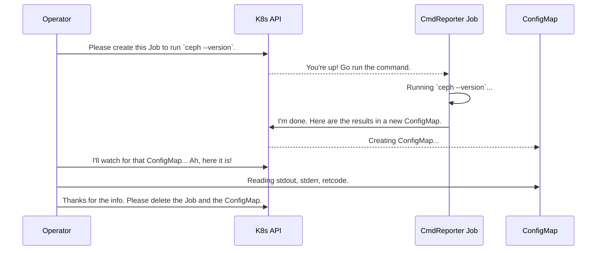

# Chapter 6: CmdReporter Job

In the [previous chapter](05_k8sutil_package_.md), we saw how the [k8sutil Package](05_k8sutil_package_.md) helps the operator manage long-running Kubernetes resources like `Deployments`. But what about short-lived, one-off tasks? What if the operator just needs to run a single command and get the result back?

This is where the `CmdReporter` Job comes in. It's a clever pattern Rook uses to run commands in a specific environment and have the output "reported" back.

### The Problem: Running an Errand You Can't Do Yourself

Imagine you are the Rook operator, working diligently inside your office (your pod). You need to find out which version of Ceph is inside a specific shipping container (a container image like `ceph/ceph:v17.2.0`).

You can't just open the container yourself. Your office doesn't have the right tools, and you're not allowed to leave. The operator pod is running the `rook` image, not the `ceph` image, so it doesn't have the `ceph` command-line tool.

How do you solve this? You hire a temporary courier—an errand runner. You give the courier specific instructions: "Go to this container, run the `ceph --version` command, and bring me back a note with the exact output."

This is precisely what the `CmdReporter` Job does. It's a specialized, temporary "errand runner" pod that the operator launches to perform a specific task.

### The Errand Runner's Workflow

The `CmdReporter` pattern follows a simple, reliable, four-step process:

1.  **Dispatch the Courier (Create a Job):** The operator creates a Kubernetes `Job`. This `Job` will launch a temporary pod using the exact container image needed for the task (e.g., `ceph/ceph:v17.2.0`).

2.  **Run the Errand (Execute the Command):** Inside this temporary pod, a small Rook utility program called `cmd-reporter` starts up. Its first job is to run the command it was given, like `ceph --version`. It carefully captures everything: the standard output, the standard error, and the final exit code.

3.  **Deliver the Message (Write to a ConfigMap):** Once the command is finished, `cmd-reporter` writes the results into a new Kubernetes `ConfigMap`. This `ConfigMap` acts like a sealed envelope containing the courier's report.

4.  **Read the Report and Clean Up:** The operator, which has been waiting for this `ConfigMap` to appear, reads the output. Once it has the information it needs, it cleans up by deleting both the `Job` and the `ConfigMap`, as if paying the courier and discarding the envelope. The errand is complete.

### How It Works: A Visual Guide

This flow ensures that the operator can get information from any environment without having to run the commands in its own pod.



### A Peek into the Code

Let's see how the operator dispatches this "errand runner" to detect the Ceph version.

#### 1. Dispatching the Courier

The logic to start the version check is in `operator/ceph/controller/version.go`. It uses a helper to prepare the errand.

---
*File: `operator/ceph/controller/version.go`*
```go
func DetectCephVersion(/*...args...*/) (*cephver.CephVersion, error) {
	cephImage := cephClusterSpec.CephVersion.Image
	
	// Prepare the instructions for our courier
	versionReporter, err := cmdreporter.New(
		clientset,
		ownerInfo,
		jobName, // Name for the job and ConfigMap
		namespace,
		[]string{"ceph"},      // The command to run
		[]string{"--version"}, // The arguments
		rookImage,
		cephImage, // The image to run it in!
		// ... more config
	)
	// ...
}
```
---
This `cmdreporter.New()` call is like filling out the work order for the courier. We specify the exact command (`ceph --version`) and, most importantly, the `cephImage` where the command should be run.

Next, the operator tells the courier to go!

---
*File: `operator/ceph/controller/version.go`*
```go
// ... inside DetectCephVersion ...
	// Run the job and wait for the result
	stdout, stderr, retcode, err := versionReporter.Run(ctx, detectCephVersionTimeout)
	if err != nil {
		return nil, errors.Wrap(err, "failed to complete ceph version job")
	}
	// ... check retcode and parse stdout ...

	version, err := cephver.ExtractCephVersion(stdout)
	return version, nil
}
```
---
The `versionReporter.Run()` call does all the work described in our workflow: it creates the `Job`, waits for the `ConfigMap`, reads the `stdout`, and cleans everything up.

### Under the Hood

Let's look at the two key components of this pattern.

#### The Operator's Side: `operator/k8sutil/cmdreporter`

This is the code that prepares and manages the job. The `Run` method orchestrates the whole process.

---
*File: `operator/k8sutil/cmdreporter/cmdreporter.go`*
```go
func (cr *CmdReporter) Run(ctx context.Context, timeout time.Duration) (/*...results...*/) {
	// 1. Make sure no old ConfigMap exists
	k8sutil.DeleteConfigMap(ctx, cr.clientset, cr.job.Name, cr.job.Namespace, delOpts)

	// 2. Create the Job in Kubernetes
	k8sutil.RunReplaceableJob(ctx, cr.clientset, cr.job, true)

	// 3. Wait for the results ConfigMap to appear
	cr.waitForConfigMap(ctx, timeout)

	// 4. Read the data from the ConfigMap
	resultMap, _ := cr.clientset.CoreV1().ConfigMaps(namespace).Get(ctx, jobName, metav1.GetOptions{})

	// 5. Clean up everything
	k8sutil.DeleteBatchJob(ctx, cr.clientset, namespace, jobName, false)
	k8sutil.DeleteConfigMap(ctx, cr.clientset, jobName, namespace, delOpts)
	
	// 6. Return the results
	return stdout, stderr, retcode, nil
}
```
---
This function is a perfect summary of the pattern: create, wait, read, and clean up.

#### The Courier's Side: `daemon/util/cmdreporter`

This is the small program that runs inside the temporary pod. Its `Run` method is the heart of the courier's logic.

---
*File: `daemon/util/cmdreporter.go`*
```go
func (r *CmdReporter) Run() error {
	// 1. Run the actual command the user requested (e.g., `ceph --version`)
	stdout, stderr, retcode, err := r.runCommand()
	if err != nil {
		// This is an error with the system, not the command itself
		return fmt.Errorf("system failed to run command. %+v", err)
	}

	// 2. Save the results to the ConfigMap for the operator to read
	if err := r.saveToConfigMap(stdout, stderr, retcode); err != nil {
		return fmt.Errorf("failed to save command output to ConfigMap. %+v", err)
	}

	return nil // Success! The report has been delivered.
}
```
---
This shows the two simple responsibilities of the errand runner: run the command, and report the results.

### Conclusion

The **`CmdReporter` Job** is a simple yet powerful pattern used throughout Rook. It provides a robust and isolated way to execute one-off commands.

*   It acts like a temporary **errand runner** pod.
*   The operator dispatches a Kubernetes **`Job`** with a specific command and container image.
*   The job runs the command and reports the `stdout`, `stderr`, and `retcode` back via a **`ConfigMap`**.
*   The operator reads the result and cleans up all the temporary resources.

This pattern allows the main operator to remain simple while still being able to interact with different environments and tools across the cluster.

So far, we've seen many different components: controllers, wrappers, and jobs. How do they all get the configuration and client connections they need to do their work? They all rely on a central "briefcase" of information.

In our next chapter, we'll explore this briefcase: the [clusterd.Context](07_clusterd_context_.md).

---

Generated by [AI Codebase Knowledge Builder](https://github.com/The-Pocket/Tutorial-Codebase-Knowledge)