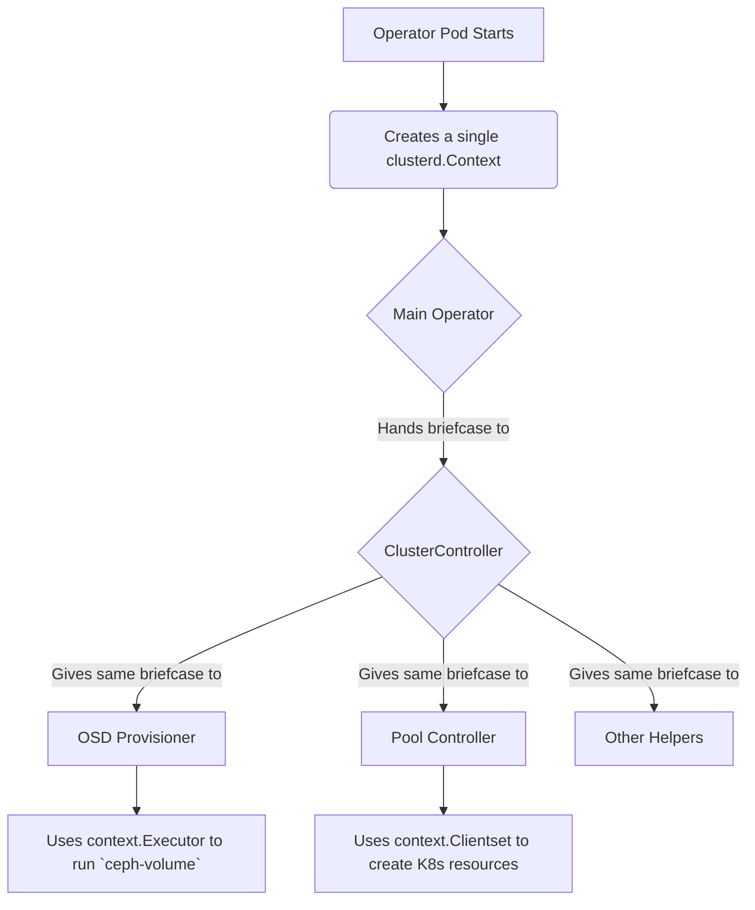

# Chapter 7: clusterd.Context

In the [previous chapter](06_cmdreporter_job_.md), we saw how Rook uses the [CmdReporter Job](06_cmdreporter_job_.md) pattern to run one-off errands. We've now explored many different components: [Operator Controllers](02_operator_controllers_.md), the [Ceph Client Wrapper](04_ceph_client_wrapper_.md), and various jobs.

A key question arises: how do all these different pieces get the tools they need to do their job? How does a controller get a connection to the Kubernetes API? How does an OSD provisioning job know how to run a command? This is where our final core concept comes in: the `clusterd.Context`.

### The Project Manager's Briefcase

Imagine our construction project. The project manager (the Rook Operator) doesn't just hire workers and give them blueprints. They also hand each worker a standard-issue briefcase. Inside this briefcase is everything they need for the job:

*   A **phonebook** to call the main office (the Kubernetes API).
*   A set of **power tools** for general tasks (a command executor).
*   The **address** of the main supply depot (paths to configuration files).

The `clusterd.Context` is exactly this: the project manager's briefcase. It's a single, neatly packaged Go object that is passed to every worker on the job site. Instead of each controller bringing its own tools, they all share this common context. This ensures everyone works with the same information and capabilities, making the whole operation consistent and efficient.

### What's Inside the Briefcase?

The `clusterd.Context` is a Go `struct` that holds a collection of essential clients and configuration details. Let's look at its definition to see what's inside.

---
*File: `pkg/clusterd/context.go`*
```go
// Context for loading or applying the configuration state of a service.
type Context struct {
	// Clientset is a connection to the core kubernetes API
	Clientset kubernetes.Interface

	// RookClientset is a typed connection to the rook API
	RookClientset rookclient.Interface

	// The implementation of executing a console command
	Executor exec.Executor

	// The root configuration directory used by services
	ConfigDir string

	// ... and several other useful clients and fields
}
```
---
Let's break down the most important tools in this briefcase:

*   `Clientset`: This is the standard "phonebook" for talking to Kubernetes. Any time a controller needs to create a `Deployment`, `Service`, or `Secret`, it uses this client.
*   `RookClientset`: This is a specialized client for talking about Rook's own custom resources, like `CephCluster` or `CephBlockPool`.
*   `Executor`: These are the "power tools." This provides a standard way to run shell commands, which is critical for tasks like formatting disks during [OSD Provisioning](03_osd_provisioning_.md).
*   `ConfigDir`: This tells every component where to find and store important configuration files, ensuring consistency.

### The Journey of the Briefcase

The beauty of the `clusterd.Context` is that it's created **once** when the operator starts up and is then passed down to every component that needs it. It's never created again. This ensures everyone is on the same page.

1.  **Packed at the Start:** When the Rook operator process first launches, one of its first actions is to create a single `clusterd.Context` object, filling it with connections to Kubernetes and other initial settings.
2.  **Given to the General Contractor:** This context is then given to the main `Operator` object, which in turn passes it to the lead "General Contractor," the `ClusterController`.
3.  **Distributed to the Workers:** The `ClusterController` holds onto this briefcase. Whenever it needs to perform a task—like creating OSDs or reconciling a pool—it passes the *same* briefcase down to the helper functions and specialized controllers responsible for that work.

Let's visualize this flow:



### A Peek into the Code

Let's follow the briefcase's journey through the code.

#### 1. Receiving the Briefcase

First, the main `Operator` struct is created. Notice how its `New` function takes a `*clusterd.Context` as an argument and saves it.

---
*File: `operator/ceph/operator.go`*
```go
// Operator type for managing storage
type Operator struct {
	context *clusterd.Context
	// ... other fields
}

// New creates an operator instance
func New(context *clusterd.Context, rookImage, serviceAccount string) *Operator {
	o := &Operator{
		context:   context,
		// ...
	}
	// The operator also creates the ClusterController and passes the context to it
	o.clusterController = cluster.NewClusterController(context, rookImage)
	return o
}
```
---

#### 2. Passing it to the Controller

The `New` function immediately creates the `ClusterController` and passes the context along. The `ClusterController` also saves a copy for its own use.

---
*File: `operator/ceph/cluster/controller.go`*
```go
// ClusterController controls an instance of a Rook cluster
type ClusterController struct {
	context   *clusterd.Context
	// ... other fields
}

// NewClusterController create controller for watching cluster custom resources
func NewClusterController(context *clusterd.Context, rookImage string) *ClusterController {
	return &ClusterController{
		context:    context,
		rookImage:  rookImage,
		// ...
	}
}
```
---

#### 3. Using a Tool from the Briefcase

Now, any function within the `ClusterController` or any helper it calls has access to the briefcase. For example, when it's time to format a disk, the OSD provisioning code can pull the `Executor` out of the context and use it.

---
*File: `daemon/ceph/osd/volume.go` (Simplified)*
```go
// This function is called by the OSD prepare job
func (a *OsdAgent) initializeDevicesRawMode(context *clusterd.Context, /*...*/) error {

	// Get the command-line execution tool from the context
	executor := context.Executor

	// Use the tool to run the 'ceph-volume' command
	op, err := executor.ExecuteCommandWithCombinedOutput(
        "ceph-volume",
        "raw",
        "prepare",
        "--data",
        "/dev/sdb",
    )
	// ...
	return nil
}
```
---
This example perfectly shows the pattern: a function receives the `context`, unpacks the tool it needs (`Executor`), and gets to work. It doesn't need to know how to create an executor or where it came from; it just trusts that the briefcase contains a working one.

### Conclusion

You've now learned about the `clusterd.Context`, the simple but vital object that ties the entire Rook operator together.

*   It acts as a **shared briefcase** or **toolbox** for all components.
*   It contains essential tools like the **Kubernetes clientset** and a **command executor**.
*   It is created **once** and passed down, ensuring consistency across the entire operator.
*   This pattern is a form of dependency injection that keeps the code clean, organized, and easy to test.

This concludes our journey through the core concepts of the Rook `pkg`! You've seen how users declare their intent with [Ceph Custom Resources (CRDs)](01_ceph_custom_resources__crds__.md), how [Operator Controllers](02_operator_controllers_.md) work to make that intent a reality, and the key tools and patterns they use along the way. You are now well-equipped to navigate the Rook codebase and understand how it brings the power of Ceph to Kubernetes.

---

Generated by [AI Codebase Knowledge Builder](https://github.com/The-Pocket/Tutorial-Codebase-Knowledge)