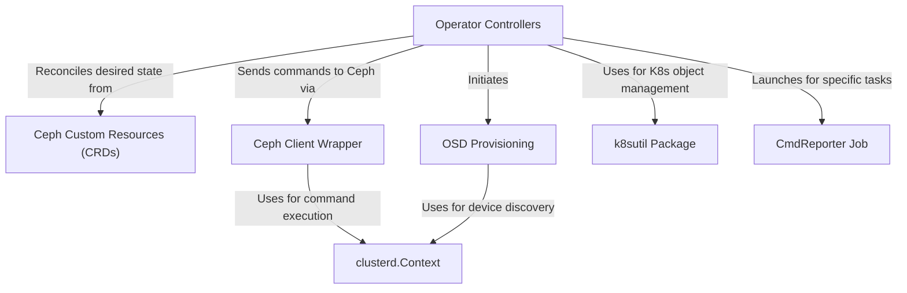

# Tutorial: pkg

This project is the brain of the **Rook Ceph operator**, which automatically manages Ceph storage clusters inside Kubernetes.
You tell it *what kind of storage you want* by creating simple configuration files (called **Custom Resources**).
The operator's controllers then read your request and do all the hard work: they set up the core Ceph components, provision storage disks (OSDs), and make sure everything keeps running as you defined it.

**Source Repository:** [None](None)

## Chapters

1. [Ceph Custom Resources (CRDs)
](01_ceph_custom_resources__crds__.md)
2. [Operator Controllers
](02_operator_controllers_.md)
3. [OSD Provisioning
](03_osd_provisioning_.md)
4. [Ceph Client Wrapper
](04_ceph_client_wrapper_.md)
5. [k8sutil Package
](05_k8sutil_package_.md)
6. [CmdReporter Job
](06_cmdreporter_job_.md)
7. [clusterd.Context
](07_clusterd_context_.md)

---

Generated by [AI Codebase Knowledge Builder](https://github.com/The-Pocket/Tutorial-Codebase-Knowledge)