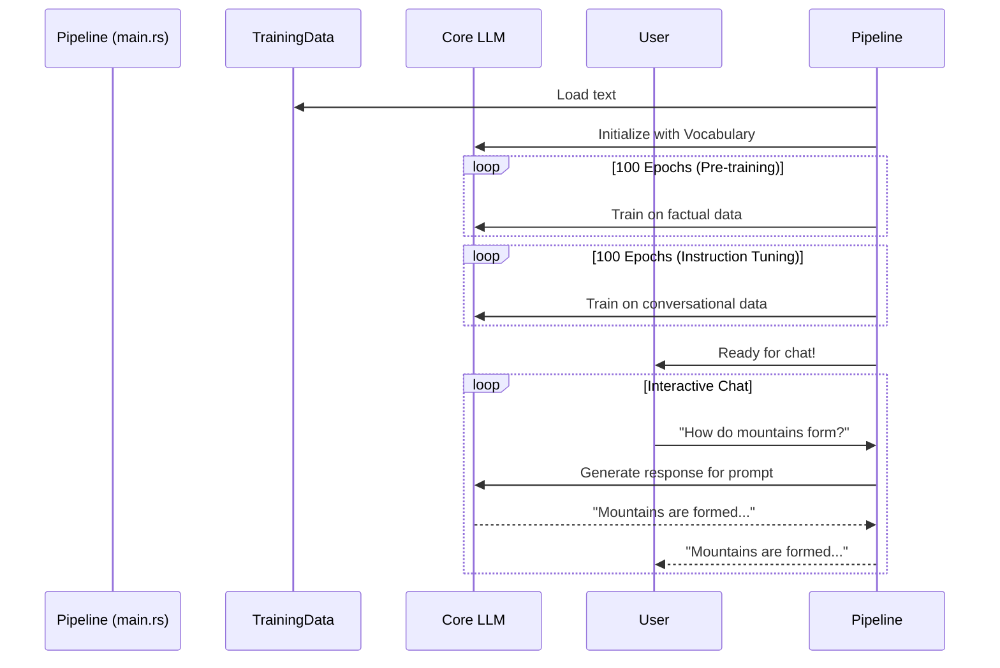

# Chapter 1: Training Pipeline

Welcome to RustGPT! In this series, we're going to build a complete Large Language Model (LLM) from scratch in pure Rust. Our journey begins with the most important process of all: teaching the model how to think.

Imagine you have a student—brand new, with no knowledge of the world. How would you teach them? You wouldn't just hand them a dictionary and expect them to hold a conversation. You'd create a curriculum:
1.  First, they'd learn basic facts and vocabulary (like reading a textbook).
2.  Next, they'd learn how to answer questions and have a dialogue (like practicing conversation).
3.  Finally, you'd test their knowledge by talking to them.

This entire process—the curriculum, the teaching schedule, and the final exam—is exactly what our **Training Pipeline** does for our model. It's the master controller that turns our "blank slate" model into a conversational AI.

### The Goal: From Zero to Chatbot

Our main goal is to run a command, `cargo run`, and end up with a program that we can chat with. The Training Pipeline is the script that makes this happen. It manages the two critical phases of learning before letting us talk to the model.

1.  **Phase 1: Pre-training.** The model learns the fundamentals of language and basic facts about the world from simple statements.
2.  **Phase 2: Instruction Tuning.** The model learns how to be a helpful assistant by studying examples of conversations.

Let's see how this is orchestrated in the code, which you can find in `src/main.rs`.

### Step 1: Preparing the Classroom

Before any learning can happen, the teacher needs to prepare the materials. For our model, this means loading the training data and building a dictionary of all the words it needs to know. This dictionary is its "vocabulary."

```rust
// In src/main.rs

// 1. Load the text data for both learning phases.
let pretrain_data = load_data("data/pretrain.txt");
let instruction_data = load_data("data/instructions.txt");

// 2. Create a vocabulary from all the text.
let mut vocab = Vocabulary::new();
vocab.build(&pretrain_data);
vocab.build(&instruction_data);
```

This code does two simple things:
- It reads our training text from files. Think of these as the model's textbooks.
- It builds a complete list of unique words, which we'll explore more in [Chapter 3: Vocabulary & Tokenization](03_vocabulary___tokenization_.md).

### Step 2: Phase 1 - Learning the Facts (Pre-training)

Now that the materials are ready, the first phase of teaching begins. We'll feed the model simple, factual statements to build its foundational knowledge. The pipeline controls how many times the model studies this material (called "epochs") and how quickly it learns (the "learning rate").

```rust
// In src/main.rs

// Create our Language Model instance.
let mut llm = LLM::new(&config, vocab.size());

// --- Pre-training Phase ---
println!("Starting pre-training...");
let pretrain_lr = 0.0005; // A learning rate for this phase
for epoch in 0..100 {
    // The `train` function is where the magic happens!
    llm.train(&pretrain_data, pretrain_lr, &vocab);
    println!("Pre-training Epoch {}/100", epoch + 1);
}
```
Here, we loop 100 times, telling our [Core LLM](02_core_llm_.md) to study the pre-training data. The `train` function handles the complex process of learning, which we'll unpack in later chapters.

### Step 3: Phase 2 - Learning to Converse (Instruction Tuning)

Once the model has a grasp of basic facts, it's time to teach it how to be a helpful chatbot. We use a new dataset with question-and-answer pairs. Notice we use a smaller "learning rate" here—this is like making smaller, more careful adjustments to its existing knowledge.

```rust
// In src/main.rs

// --- Instruction Tuning Phase ---
println!("Starting instruction tuning...");
let finetune_lr = 0.0001; // A smaller learning rate for fine-tuning
for epoch in 0..100 {
    llm.train(&instruction_data, finetune_lr, &vocab);
    println!("Instruction-tuning Epoch {}/100", epoch + 1);
}
```
This loop is almost identical to the first one, but it uses the conversational dataset and a different learning rate. The model is now refining its skills to be more interactive.

### Step 4: Graduation - The Interactive Chat

The training is complete! The pipeline's final job is to open up a chat session so you can talk to your newly trained model.

```rust
// In src/main.rs

// --- Interactive Mode ---
println!("Entering interactive mode.");
loop {
    print!("Enter prompt: ");
    // ... code to read user input ...

    let output = llm.generate(&user_input, &vocab, 80);
    println!("Model output: {}", output);
}
```
This final piece of code creates a simple loop that waits for your input, sends it to the model's `generate` function, and prints the response.

### How It Works: A High-Level View

The Training Pipeline is the conductor of an orchestra. It doesn't play any instruments itself, but it tells all the other components when and how to act.

Here’s a diagram of the entire flow:



As you can see, the pipeline in `main.rs` is the central coordinator. It prepares the data, manages the two-phase training process by repeatedly calling the [Core LLM](02_core_llm_.md), and finally connects the trained model to you, the user.

Inside the `llm.train(...)` calls, the model is working hard:
1.  It makes a prediction.
2.  It compares its prediction to the correct answer.
3.  It calculates its mistake (this is the "loss").
4.  It uses the [Adam Optimizer](08_adam_optimizer_.md) to adjust its internal numbers to make a better prediction next time.

We'll cover all those exciting details soon! For now, just know that the Training Pipeline is the script that guides the model through this entire learning journey.

### Conclusion

In this chapter, we learned about the Training Pipeline, the master controller of our project. It acts as the model's "teacher," guiding it through a two-phase curriculum:
1.  **Pre-training** to learn facts.
2.  **Instruction Tuning** to learn conversation.

Finally, it launches the interactive mode where we can chat with our trained model. The pipeline itself is simple—it mainly consists of loops that call the model's `train` function. Its power comes from organizing the entire learning process from start to finish.

Now that we've seen *how* the model is taught from a high level, are you curious about the "student" itself? In the next chapter, we'll dive into the heart of our project. Let's explore the [Chapter 2: Core LLM](02_core_llm_.md).

---

Generated by [AI Codebase Knowledge Builder](https://github.com/The-Pocket/Tutorial-Codebase-Knowledge)