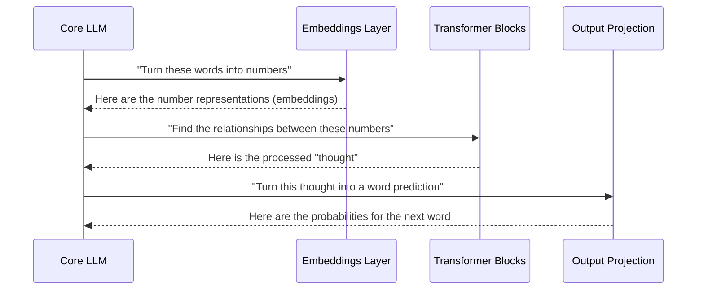

# Chapter 2: Core LLM

In [Chapter 1: Training Pipeline](01_training_pipeline_.md), we saw how a "teacher" script orchestrates our model's education. We saw it repeatedly calling `llm.train(...)` and `llm.generate(...)`. But what exactly is this `llm` object?

Welcome to the brain of our operation: the **Core LLM**. If the Training Pipeline is the teacher, the Core LLM is the student. It's the central component that holds all the knowledge, performs the thinking, and does the learning.

Think of it like a general contractor building a house. The contractor doesn't lay bricks or wire outlets themselves. Instead, they coordinate a team of specialists: the foundation crew, the framers, the electricians, and the plumbers. The Core LLM is that contractor. It manages all the specialized layers of our neural network to produce a final result.

### The Anatomy of a Digital Brain

The Core LLM's main job is to hold the entire model architecture together. It's a `struct` defined in `src/llm.rs` that contains all the essential parts of our language model.

Let's look at a simplified version of its structure:

```rust
// In src/llm.rs

pub struct LLM {
    // The "dictionary" of the model
    embeddings: EmbeddingLayer,

    // The "reasoning" part of the brain
    transformer_blocks: Vec<TransformerBlock>,

    // The part that makes the final word choice
    output_projection: OutputProjectionLayer,

    // The tool used to update its knowledge
    optimizer: Adam,
}
```

This simple structure holds the three main stages of thinking for our model:
1.  **`embeddings`**: The layer that converts words into numbers. We'll explore this in the [Embeddings Layer](04_embeddings_layer_.md) chapter.
2.  **`transformer_blocks`**: A series of powerful layers that find relationships between the words. This is the core "thinking" engine, which we'll cover in the [Transformer Block](05_transformer_block_.md) chapter.
3.  **`output_projection`**: The final layer that takes the "thought" and turns it back into a probability for every word in the dictionary. We'll learn more about this in the [Output Projection Layer](07_output_projection_layer_.md) chapter.

The `LLM` struct simply owns these components and tells them what to do and when.

### The Two Fundamental Tasks

Just like the general contractor has two main phases—building and fixing mistakes—our Core LLM has two primary tasks:

1.  **The Forward Pass (Generating Text)**: This is the process of taking an input prompt and producing an output. It's the "thinking" part. Data flows *forward* through the layers, from input to output. This is used by the `generate` function.
2.  **The Backward Pass (Learning)**: This is the process of learning from a mistake. After a forward pass, the model compares its prediction to the correct answer. The "error" is then sent *backward* through the layers, telling each one how to adjust itself to be more accurate next time. This is used by the `train` function.

Let's see how the LLM orchestrates these two tasks.

### Task 1: The Forward Pass - From Prompt to Prediction

Imagine you ask the model, "How do mountains form?" How does it come up with an answer? It uses the forward pass. This is a step-by-step assembly line coordinated by the `LLM`.

Here’s how it works conceptually:



The `LLM` acts as the manager, passing the data from one specialist layer to the next in the correct order.

The code for this process lives in the `forward` method inside `src/llm.rs`. Here's a simplified view:

```rust
// In src/llm.rs (simplified forward method)

fn forward(&mut self, inputs: &Array2<usize>) -> Array2<f32> {
    // 1. Pass data to the embedding layer
    let mut x = self.embeddings.forward(inputs);

    // 2. Pass it through all the reasoning blocks
    for block in &mut self.transformer_blocks {
        x = block.forward(&x);
    }

    // 3. Get the final prediction from the output layer
    let logits = self.output_projection.forward(&x);

    logits
}
```
This function is a perfect reflection of our assembly line:
1.  It starts with `inputs` (the tokenized text).
2.  It calls `self.embeddings.forward()` to get the initial numerical representation.
3.  It loops through the `transformer_blocks`, passing the output of one as the input to the next.
4.  Finally, it calls `self.output_projection.forward()` to get the final result.

### Task 2: The Backward Pass - Learning From Mistakes

Generating text is great, but how does the model get good at it? By learning from its mistakes. This is where the backward pass comes in.

After the forward pass, the `train` function compares the model's prediction to the actual correct answer. The difference is the "error." The backward pass is the process of figuring out who to blame for that error and telling them how to fix it.

This process is called **backpropagation**. It sends the error signal *backward* through the network, in the exact reverse order of the forward pass.

1.  The **Output Projection Layer** is told: "Your prediction was wrong by *this* much. Adjust yourself."
2.  The **Transformer Blocks** are told: "The output layer was wrong, and you contributed to it. Adjust yourselves."
3.  The **Embeddings Layer** is told: "The transformers were off, and you contributed to that. Adjust yourselves."

The code for this is in the `backward` method in `src/llm.rs`:

```rust
// In src/llm.rs (simplified backward method)

fn backward(&mut self, grad: &Array2<f32>) {
    // 1. Start with the final layer
    let mut grad = self.output_projection.backward(grad);

    // 2. Go through transformers in reverse order
    for block in self.transformer_blocks.iter_mut().rev() {
        grad = block.backward(&grad);
    }

    // 3. Finish with the embedding layer
    self.embeddings.backward(&grad);
}
```
Notice how this function is a mirror image of the `forward` method. It starts with the last layer and works its way backward to the first, passing the "blame" (gradient) along the way.

Once the backward pass has calculated *how* to adjust every parameter, the [Adam Optimizer](08_adam_optimizer_.md) steps in and actually makes the updates.

### Conclusion

The **Core LLM** is the heart of our project. It's not a single, magical algorithm but a manager that holds and coordinates all the specialized layers of the neural network.

In this chapter, we learned that the `LLM` struct:
-   **Holds the full model architecture**: the embeddings, transformer blocks, and output layer.
-   **Manages the forward pass**: a step-by-step process to generate text by passing data through each layer in order.
-   **Manages the backward pass**: a reverse process to learn from mistakes by passing an error signal backward through the layers.

We've now seen the "teacher" (the Training Pipeline) and the "student" (the Core LLM). But how does our student learn to read in the first place? How do we turn human language like "hello world" into numbers the model can understand?

That brings us to the very first step in our model's assembly line. Let's dive into [Chapter 3: Vocabulary & Tokenization](03_vocabulary___tokenization_.md).

---

Generated by [AI Codebase Knowledge Builder](https://github.com/The-Pocket/Tutorial-Codebase-Knowledge)