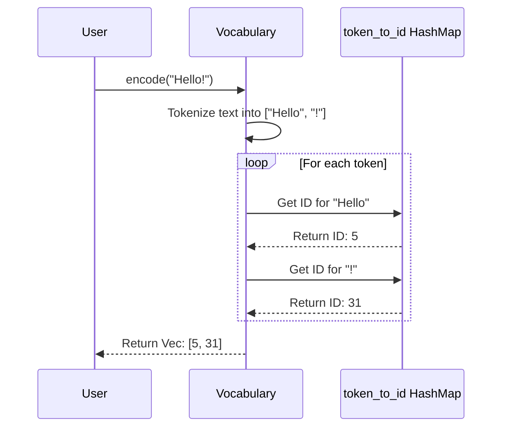

# Chapter 3: Vocabulary & Tokenization

In the [previous chapter](02_core_llm_.md), we learned about the [Core LLM](02_core_llm_.md), the "student" brain that does all the thinking. But before this brain can process any information, we face a fundamental problem: computers don't understand words. They only understand numbers.

How do we take a sentence like "What is Rust?" and turn it into a format our model can work with?

This is where **Vocabulary & Tokenization** comes in. It's the first, essential step in our entire process. Think of it as a special translator that converts human language into a secret numerical code that our model can understand.

### The Two-Step Translation Process

Our language translator works in two simple steps:

1.  **Tokenization**: First, we break a sentence down into a list of its basic building blocks, called "tokens." These are usually words, but can also include punctuation.
    -   **Input**: `"Hello, world!"`
    -   **Output**: `["Hello", ",", "world", "!"]`

2.  **Numericalization**: Next, we use a dictionary, which we call a "vocabulary," to look up a unique number (or ID) for each token.
    -   **Vocabulary**: `{"Hello": 5, ",": 12, "world": 23, "!": 31}`
    -   **Input**: `["Hello", ",", "world", "!"]`
    -   **Output**: `[5, 12, 23, 31]`

And that's it! We've successfully translated human text into a list of numbers. This numerical sequence is the *only* thing our model will ever see.

### How We Use It in `RustGPT`

In our project, this entire process is managed by the `Vocabulary` struct, which is defined in `src/vocab.rs`. Let's see how the [Training Pipeline](01_training_pipeline_.md) uses it.

#### Step 1: Building the Dictionary

Before we can translate anything, we first need to build our dictionary. We do this by showing it all the text we plan to train our model on. The `Vocabulary` will read through everything and make a list of every unique word and punctuation mark it finds.

```rust
// In src/main.rs

// 1. Create an empty vocabulary.
let mut vocab = Vocabulary::new();

// 2. Read all the text from our training data files.
let pretrain_data = load_data("data/pretrain.txt");

// 3. Build the dictionary from this text.
vocab.build(&pretrain_data);
```
After this code runs, `vocab` now contains a complete map of every unique token in our training data to a unique ID. For example, it might have learned that "the" is ID `1`, "mountain" is ID `2`, and so on.

#### Step 2: Translating Back and Forth

Once the vocabulary is built, we can use it to translate in both directions.

**Encoding**: Turning text into numbers. This is used to prepare user input for the model.

```rust
// Turn a sentence into a list of token IDs.
let text = "how are you?";
let token_ids = vocab.encode(text);

// Example output (the actual numbers will vary):
// token_ids is now a Vec<usize> like [42, 18, 5, 67]
println!("{:?}", token_ids);
```
This is how we prepare the prompt "how are you?" before sending it to the [Core LLM](02_core_llm_.md).

**Decoding**: Turning numbers back into text. This is used to show the model's final output to the user.

```rust
// Turn a list of token IDs back into a sentence.
let token_ids = vec![42, 18, 5, 67];
let text = vocab.decode(&token_ids);

// Example output:
// text is now a String like "how are you ?"
println!("{}", text);
```
When our model predicts a sequence of numbers, this is how we translate it back into a human-readable response.

### Under the Hood: How Does It Work?

The implementation in `src/vocab.rs` is surprisingly simple. The `Vocabulary` struct just holds two `HashMap`s (a super-fast way to look things up).

1.  `token_to_id`: A map to find the ID for a given token (e.g., `token_to_id["hello"]` gives `5`).
2.  `id_to_token`: A map to find the token for a given ID (e.g., `id_to_token[5]` gives `"hello"`).

Having two maps makes both encoding and decoding incredibly fast.

Here’s a step-by-step look at what happens when you call `vocab.encode("Hello!")`:



The process is just: split the text, then look up each piece in the `token_to_id` map. Decoding works the same way, but in reverse using the `id_to_token` map.

#### A Peek at the Code

Let's look at a simplified version of the `Vocabulary` struct and its `encode` function from `src/vocab.rs`.

First, the struct itself holds our two lookup tables:

```rust
// In src/vocab.rs

use std::collections::HashMap;

pub struct Vocabulary {
    // Maps a String token to its unique usize ID
    token_to_id: HashMap<String, usize>,
    
    // Maps a usize ID back to its String token
    id_to_token: HashMap<usize, String>,
}
```
This is the core data structure. All the logic revolves around filling and reading from these two maps.

Next, here’s a simplified `encode` function. It shows how we perform the translation:

```rust
// In src/vocab.rs (simplified)

impl Vocabulary {
    pub fn encode(&self, text: &str) -> Vec<usize> {
        // 1. Split text by spaces and punctuation.
        let tokens = self.tokenize(text);
        
        // 2. Look up each token and collect the IDs.
        tokens
            .iter()
            .map(|token| self.token_to_id.get(token).unwrap_or(&0))
            .cloned()
            .collect()
    }
    
    // A private helper to tokenize text (simplified).
    fn tokenize(&self, text: &str) -> Vec<String> {
        // ... logic to split "Hello, world!" into ["Hello", ",", "world", "!"] ...
    }
}
```
The logic is straightforward: it tokenizes the input string and then uses a `map` to look up each token in `token_to_id`. (We use `unwrap_or(&0)` to handle unknown words, assigning them a default ID of 0).

### Conclusion

In this chapter, we learned about the critical first step in processing language: **Vocabulary & Tokenization**. This process acts as a translator, converting human-readable text into a numerical format that our model can understand.

We saw that:
-   **Tokenization** breaks text into smaller units like words and punctuation.
-   The **Vocabulary** is a dictionary that maps each unique token to a number (ID).
-   This is handled by the `Vocabulary` struct, which uses `encode()` to go from text to numbers and `decode()` to go from numbers back to text.

We've successfully turned our words into a list of simple IDs. But these IDs—`5`, `12`, `23`, `31`—are just arbitrary labels. They don't capture the *meaning* or context of the words. How does the model know that the words "king" and "queen" are more related than "king" and "taco"?

To solve this, we need to turn these simple IDs into rich, meaningful numerical representations. This is the job of our next component. Let's explore the [Chapter 4: Embeddings Layer](04_embeddings_layer_.md).

---

Generated by [AI Codebase Knowledge Builder](https://github.com/The-Pocket/Tutorial-Codebase-Knowledge)