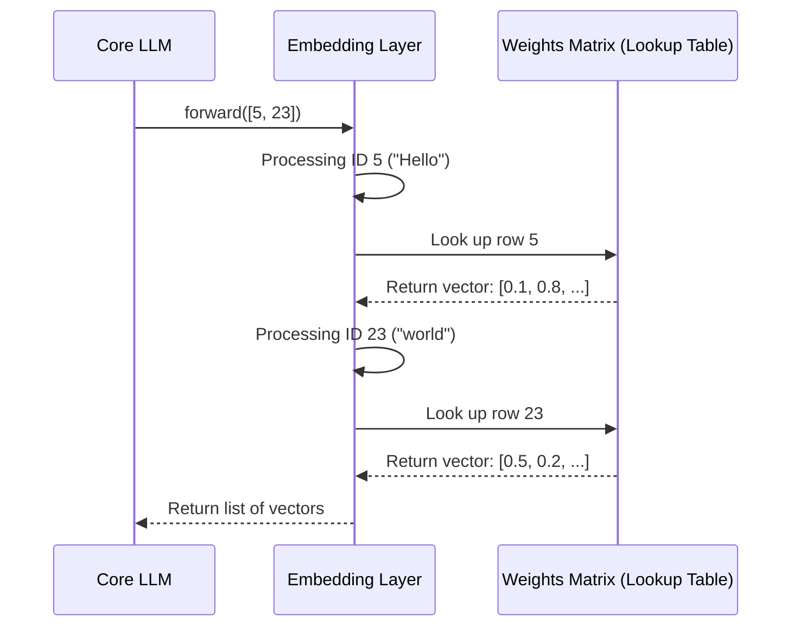

# Chapter 4: Embeddings Layer

In the [previous chapter](03_vocabulary___tokenization_.md), we learned how to turn a sentence like "Hello, world!" into a list of simple numerical IDs, like `[5, 23]`. This is a great first step, but these numbers are just labels. They don't have any inherent meaning. The number `5` for "Hello" is no more related to `23` for "world" than it is to `100` for "taco."

So, how does our model learn that words like "happy" and "joyful" are similar, while "happy" and "car" are very different?

This is the job of the **Embeddings Layer**. It takes those simple, meaningless IDs and transforms them into rich, multi-dimensional "profiles" for each word. These profiles, called **vectors**, capture the semantic meaning of the words.

### From a Simple ID to a Rich Profile

Imagine you're building a video game and need to define your characters. You wouldn't just give them an ID like "Character #8." You'd give them a detailed character sheet with attributes:

-   **King (ID: 8):** `[Royalty: 95%, Power: 90%, Magic: 10%, Stealth: 5%]`
-   **Queen (ID: 9):** `[Royalty: 95%, Power: 85%, Magic: 15%, Stealth: 10%]`
-   **Assassin (ID: 45):** `[Royalty: 5%, Power: 60%, Magic: 20%, Stealth: 95%]`

By looking at these profiles (vectors), you can immediately see that "King" and "Queen" are very similar, while "Assassin" is quite different. This is exactly what the Embeddings Layer does for words. It turns a simple ID into a vector of numbers that represents the word's "attributes" in a way the model can understand.

### The Magic Lookup Table

At its core, the Embeddings Layer is just a giant lookup table. It’s a huge list where the index of the list corresponds to a word's ID.

-   **Index 5:** The vector profile for "Hello"
-   **Index 8:** The vector profile for "King"
-   **Index 23:** The vector profile for "world"
-   ...and so on, for every word in our vocabulary.

When we give it a list of token IDs, it simply looks up the corresponding profile for each one.

-   **Input:** `[5, 23]` (the IDs for "Hello, world!")
-   **Action:** Look up the vector at index `5`, then look up the vector at index `23`.
-   **Output:** A list containing two vectors: `[ [vector_for_hello], [vector_for_world] ]`

This output is what gets passed to the next part of our model's brain. It’s no longer just a list of labels; it's a rich representation of the meaning of the input sentence.

### Using the Embeddings Layer in `RustGPT`

The [Core LLM](02_core_llm_.md) uses the `EmbeddingLayer` as the very first step in its thinking process (the "forward pass"). You can see this in `src/llm.rs`:

```rust
// In src/llm.rs (from the `forward` method)

// 'inputs' is our list of token IDs, like [5, 23]
// The first thing we do is convert them into meaningful vectors.
let mut x = self.embeddings.forward(inputs);
```
This single line takes the numerical IDs from the tokenizer and transforms them into the meaningful vectors that the rest of the model will use for its reasoning.

### Under the Hood: The `EmbeddingLayer` Struct

The implementation in `src/embeddings.rs` is very direct. The struct itself just holds the big lookup table, which we call `weights`.

```rust
// In src/embeddings.rs

use ndarray::Array2;

pub struct EmbeddingLayer {
    // This is our giant lookup table!
    // Each row is a word's ID.
    // Each column is an attribute in its "profile".
    pub weights: Array2<f32>,
}
```
The `weights` field is a 2D array (a matrix) where:
-   The number of rows equals the size of our vocabulary.
-   The number of columns is the "embedding dimension"—how many attributes are in each word's profile (in our case, 128).

Here is a step-by-step diagram of what happens when `embeddings.forward()` is called:



#### Where Do the "Profiles" Come From?

This is the most magical part: **the model learns the best profiles on its own!**

When we first create the `EmbeddingLayer`, the `weights` table is filled with random numbers. The vectors don't mean anything yet. But during training, as the model makes mistakes, the [Adam Optimizer](08_adam_optimizer_.md) sends signals backward through the network.

This signal tells the `EmbeddingLayer`: "Hey, you used the vector for 'happy' but the right answer involved 'joyful'. Maybe you should make their vectors a little more similar." Over thousands of examples, the vectors are slowly adjusted until they accurately represent the relationships between words.

The `backward` function in the `EmbeddingLayer` is responsible for figuring out exactly which vectors need to be changed.

```rust
// In src/embeddings.rs (simplified)

impl EmbeddingLayer {
    // ... forward function ...

    // This gets called during training to learn the vectors.
    pub fn backward(&mut self, grad: &Array2<f32>) {
        // ... complex math happens here ...
        // It calculates how to adjust our `weights` table to
        // make better predictions next time.
    }
}
```

### Conclusion

In this chapter, we've bridged the gap between meaningless numbers and meaningful concepts. The **Embeddings Layer** is the first truly "intelligent" part of our model.

We learned that:
-   It converts simple token IDs into rich, multi-dimensional vectors (word profiles).
-   These vectors capture the semantic meaning of words, allowing the model to understand context.
-   Under the hood, it's a giant lookup table (`weights`) that is learned during training.

We now have a way to represent our input text with rich, meaningful vectors. But a sentence is more than just a collection of words; it's about the relationships *between* those words. How does "king" relate to "throne"? How does "not happy" mean the opposite of "happy"?

To understand these complex interactions, we need the core reasoning engine of our LLM. It's time to dive into the most powerful component of our model. Let's explore the [Chapter 5: Transformer Block](05_transformer_block_.md).

---

Generated by [AI Codebase Knowledge Builder](https://github.com/The-Pocket/Tutorial-Codebase-Knowledge)