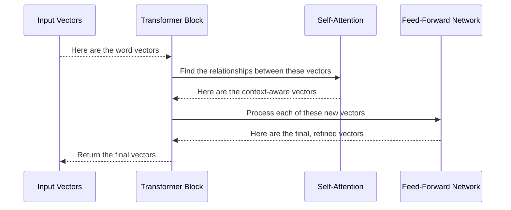

# Chapter 5: Transformer Block

In the [previous chapter](04_embeddings_layer_.md), we learned how the [Embeddings Layer](04_embeddings_layer_.md) turns our words into rich, meaningful vector "profiles." We now have a list of high-quality representations for each word in our sentence. But a sentence's meaning isn't just in the words themselves—it's in how they connect to each other.

Consider the sentence: "The robot picked up the red block because **it** was heavy." What does "**it**" refer to? The robot or the block? As humans, we know "it" refers to the block. How can we teach our model to make these kinds of connections?

This is the job of the **Transformer Block**. It is the fundamental reasoning engine of our model. Think of it as a single, powerful "thought unit." The model chains many of these units together, one after the other, to perform complex thinking. Each block refines the model's understanding of how the words in a sentence relate to one another.

### A Two-Step Thinking Process

Each Transformer Block performs a two-step process on the word vectors it receives. Imagine it's a team of workers on an assembly line, and each worker represents a word.

1.  **Step 1: Communication (Self-Attention)**. First, all the workers stop and look at each other. They share information to understand the overall context. The worker for "it" looks at "robot" and "block" and decides that "block" is much more relevant to its own meaning in this context.
2.  **Step 2: Individual Processing (Feed-Forward Network)**. After communicating, each worker takes the new information they've gathered and does some individual "thinking" to process it. They update their own understanding based on the context they just learned.

This cycle of "communication" and "processing" allows the model to build a very deep understanding of language. By stacking these blocks, the model can refine its understanding layer by layer.

### The Two Core Components

The Transformer Block is made of two key sub-components that perform these two steps:

1.  **The Self-Attention Mechanism**: This is the "communication" part. It allows every word vector to be updated based on its relationship with every other word vector in the sentence. We will explore this amazing mechanism in detail in the [next chapter](06_self_attention_mechanism_.md).
2.  **The Feed-Forward Network**: This is the "processing" part. It's a simple neural network that further processes each word vector individually after the attention step has finished.

### How We Use It in `RustGPT`

Our [Core LLM](02_core_llm_.md) is built by stacking several of these Transformer Blocks. The output of one block becomes the input for the next, allowing for progressively more complex reasoning.

You can see this in the `forward` method of our `LLM` struct in `src/llm.rs`:

```rust
// In src/llm.rs (from the `forward` method)

// 'x' starts as the output from the Embeddings Layer.
// Now, we pass it through all our reasoning blocks.
for block in &mut self.transformer_blocks {
    x = block.forward(&x);
}
```
This simple loop is the heart of the model's thinking process. It passes the data through each "thought unit" in sequence, with each block adding a deeper layer of understanding.

### Under the Hood: A Look Inside the Block

So what happens inside a single call to `block.forward(&x)`? Let's follow the data on its journey.

The process looks like this:



The `TransformerBlock` itself is just a manager. It contains an instance of the `SelfAttention` mechanism and the `FeedForward` network and calls them in the right order.

#### A Peek at the Code

Let's look at the `TransformerBlock` struct in `src/transformer.rs`. It holds the two main components we discussed.

```rust
// In src/transformer.rs

pub struct TransformerBlock {
    // The "communication" part
    attention: SelfAttention,
    
    // The "processing" part
    ffn: FeedForward,
    
    // Helper layers to keep training stable
    norm1: LayerNorm,
    norm2: LayerNorm,
}
```
Along with `attention` and `ffn`, you'll see two `LayerNorm` components. Think of these as "stabilizers." They clean up the numerical data after each major step to ensure the training process runs smoothly.

Now, let's see the simplified `forward` method for the block itself:

```rust
// In src/transformer.rs (simplified forward method)

impl TransformerBlock {
    pub fn forward(&mut self, x: &Array2<f32>) -> Array2<f32> {
        // 1. Communication step (Self-Attention)
        let attention_output = self.attention.forward(&self.norm1.forward(x));
        let x = x + attention_output; // Add the new insights to the original

        // 2. Processing step (Feed-Forward Network)
        let ffn_output = self.ffn.forward(&self.norm2.forward(&x));
        let x = x + ffn_output; // Add more insights to the result

        x
    }
}
```
This code perfectly follows our two-step process:
1.  First, it calls the `attention` mechanism to get the context-aware updates. Notice the `x = x + attention_output` line. This is called a **residual connection**. It's like taking the original word vectors and adding the "notes" from the communication step. This helps the model learn faster by ensuring it doesn't forget the original information.
2.  Next, it calls the `ffn` (Feed-Forward Network) and does the same thing: it adds the results of the individual processing back to the vectors.

### Conclusion

In this chapter, we've explored the core reasoning unit of our model: the **Transformer Block**. This powerful component is what gives our LLM the ability to understand context, relationships, and the intricate nuances of language.

We learned that:
-   A Transformer Block is like a "thought unit" that processes word vectors.
-   It uses a two-step process: **Self-Attention** (communication) followed by a **Feed-Forward Network** (processing).
-   These blocks are stacked one after another in the [Core LLM](02_core_llm_.md) to enable deep and complex reasoning.
-   Residual connections (`x = x + ...`) are used to help the model learn more effectively.

We've talked a lot about the "communication" step, where words look at each other to understand context. But how does this `SelfAttention` mechanism actually work? How can a list of numbers "talk" to another list of numbers? This is the revolutionary idea at the heart of the Transformer architecture.

Let's dive into the most fascinating part of our model. Let's explore the [Chapter 6: Self-Attention Mechanism](06_self_attention_mechanism_.md).

---

Generated by [AI Codebase Knowledge Builder](https://github.com/The-Pocket/Tutorial-Codebase-Knowledge)