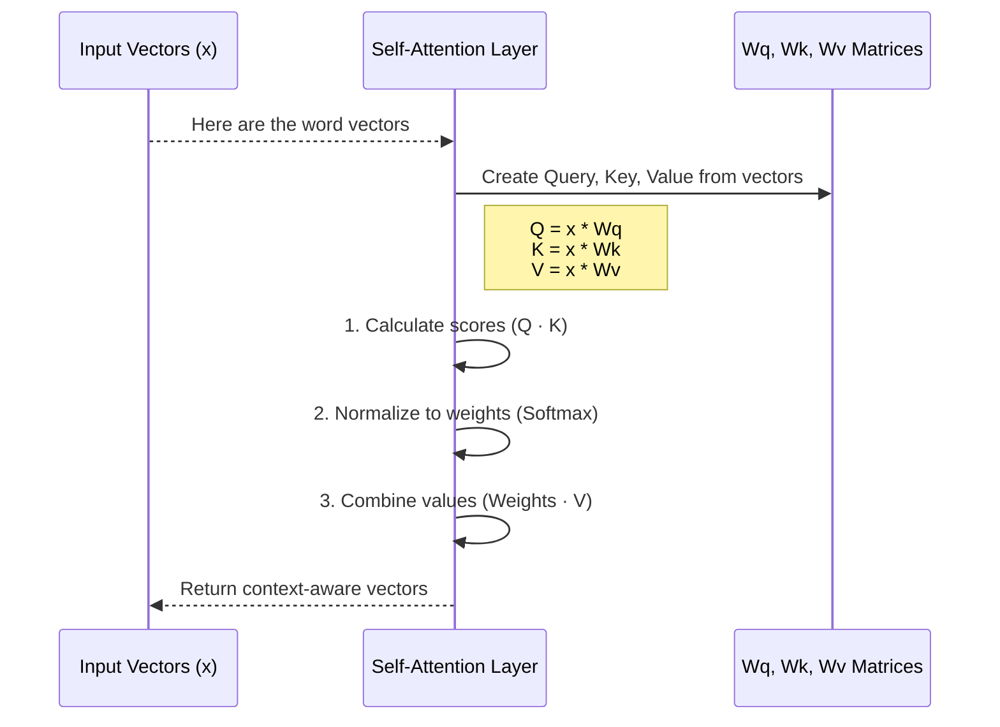

# Chapter 6: Self-Attention Mechanism

In the [previous chapter](05_transformer_block_.md), we learned that the [Transformer Block](05_transformer_block_.md) is the core reasoning engine of our model. We saw that it has a two-step process: a "communication" step and a "processing" step. We mentioned that the communication step, where words "talk" to each other, is the real magic.

Welcome to that magic. This chapter is all about the **Self-Attention Mechanism**, the revolutionary idea that allows a model to understand context.

### The Problem: Words Don't Live in a Vacuum

Let's revisit our example sentence: "The dog chased the ball, and **it** rolled away." How does a machine know that "**it**" refers to the "ball" and not the "dog"?

The meaning of "it" depends entirely on its relationship with the other words in the sentence. Self-attention is the mechanism that allows the model to figure out these relationships. It lets each word look at every other word in the sentence and decide which ones are most important for understanding its own meaning. It's like creating a dynamic network of connections between words, where the strength of each connection shows how relevant they are to each other in that specific context.

### The Core Idea: A Library Search

Imagine each word in our sentence is a researcher in a library. The researcher for the word "**it**" needs to figure out what it means. To do this, it announces a research topic.

1.  **The Query (Q):** The "**it**" researcher creates a "Query." This is a little note that says, "I am a pronoun that refers to something that just performed an action. I'm looking for the object that fits this role."

2.  **The Keys (K):** Every other researcher in the library (including "it" itself) has a "Key" on their desk. This is like a title or a keyword that describes what they are.
    -   The "dog" researcher's Key might say: "I am an animal, an agent of action."
    -   The "ball" researcher's Key might say: "I am an inanimate object, capable of being acted upon (like rolling)."

3.  **The Values (V):** Each researcher also has a "Value," which is the full, rich information they have—their actual meaning vector.

The "**it**" researcher takes its Query and walks around the library, comparing it to every other researcher's Key.
-   When it compares its Query to the "dog's" Key, it finds a poor match. A "dog" isn't something that "rolled away."
-   When it compares its Query to the "ball's" Key, it finds a perfect match! A "ball" fits the context perfectly.

Based on these matches, the "**it**" researcher assigns an "attention score" or "weight." The "ball" gets a very high score (say, 95%), while the "dog" gets a low score (say, 3%).

Finally, the "**it**" researcher creates a new, context-aware meaning for itself by blending the **Values** of all the other words according to their scores. Its new meaning becomes 95% of the "ball's" meaning + 3% of the "dog's" meaning + a tiny bit of everyone else's.

Now, the vector for "**it**" is almost identical to the vector for "ball"! The model has successfully learned the connection.

### How We Use It in `RustGPT`

The `SelfAttention` mechanism is called by the [Transformer Block](05_transformer_block_.md) as the first step in its reasoning process.

```rust
// In src/transformer.rs (from the `forward` method)

// 'x' contains the input word vectors.
// We pass them to the attention mechanism to get context.
let attention_output = self.attention.forward(&self.norm1.forward(x));

// Then we add this new contextual information back to our original vectors.
let x = x + attention_output;
```
The `attention.forward()` call is where the entire Query-Key-Value process happens. It takes in the original word vectors and returns new vectors that are enriched with information from the rest of the sentence.

### Under the Hood: The Three-Step Calculation

The implementation in `src/self_attention.rs` follows the Query-Key-Value logic exactly. The `SelfAttention` struct holds three special matrices (`Wq`, `Wk`, `Wv`) that are used to generate the Q, K, and V vectors from the input word vectors.

Let's walk through the steps inside `attention.forward()`:



#### Step 1: Create Q, K, and V

First, we take our input word vectors (`x`) and use our special learned matrices (`Wq`, `Wk`, `Wv`) to generate the Query, Key, and Value for every word.

```rust
// In src/self_attention.rs (simplified forward)

// 1. Generate Q, K, V from the input 'x'.
let q = x.dot(&self.wq); // 'wq' is the Query matrix
let k = x.dot(&self.wk); // 'wk' is the Key matrix
let v = x.dot(&self.wv); // 'wv' is the Value matrix
```
This is like giving each of our "researchers" the instructions on how to formulate their Query, Key, and Value based on their initial knowledge.

#### Step 2: Calculate Attention Scores

Next, we calculate the scores. For each word's Query, we compare it with every other word's Key using a dot product (a mathematical way of measuring similarity).

```rust
// In src/self_attention.rs (simplified forward)

// 2. Calculate raw similarity scores.
let mut scores = q.dot(&k.t()); // k.t() is the transpose of K
```
This gives us a matrix where `scores[i][j]` is the raw relevance score of word `j` to word `i`.

#### Step 3: Normalize and Combine

Finally, we turn these raw scores into percentages (using a function called `softmax`) and use those percentages to create a weighted sum of the Value vectors.

```rust
// In src/self_attention.rs (simplified forward)

// 3. Turn scores into percentages (attention weights).
let weights = softmax(&scores);

// 4. Create the final output by combining Values.
let output = weights.dot(&v);
```
The `output` now contains the new, context-aware vectors. The vector for "it" now contains the semantic information of "ball". This `output` is what gets returned to the [Transformer Block](05_transformer_block_.md).

### Conclusion

In this chapter, we unveiled the magic at the heart of the Transformer: the **Self-Attention Mechanism**. This powerful idea allows the model to understand context by dynamically weighing the importance of different words in a sentence.

We learned that:
-   Self-attention solves the problem of understanding relationships between words, like pronoun resolution.
-   It works using a **Query, Key, and Value** system, analogous to a library search.
-   A **Query** from one word is compared against the **Keys** of all other words to get attention scores.
-   These scores are used to create a weighted sum of the **Values**, producing new, context-aware word vectors.

We have now completed our journey through the "thinking" part of the model. We've seen how words are turned into vectors ([Embeddings Layer](04_embeddings_layer_.md)) and how those vectors are refined through contextual reasoning ([Transformer Block](05_transformer_block_.md) and Self-Attention).

But after all this thinking, how does the model make a final decision? How does it take its final "thought" vector and choose the single best word to say next? That's the job of our final layer. Let's explore the [Chapter 7: Output Projection Layer](07_output_projection_layer_.md).

---

Generated by [AI Codebase Knowledge Builder](https://github.com/The-Pocket/Tutorial-Codebase-Knowledge)