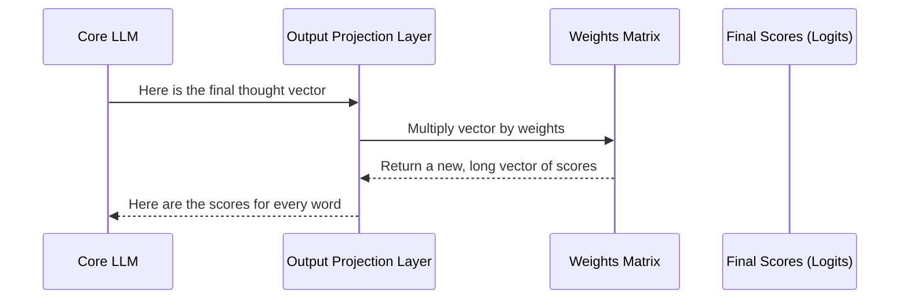

# Chapter 7: Output Projection Layer

In the [previous chapter](06_self_attention_mechanism_.md), we explored the magic of the [Self-Attention Mechanism](06_self_attention_mechanism_.md), the core engine that allows our model to understand context. After passing our word vectors through a series of [Transformer Blocks](05_transformer_block_.md), we are left with a final, highly refined set of vectors. These vectors represent the model's deep "thought" about the input sentence.

But there's a problem. This "thought" is still just a list of abstract numbers. How do we turn this complex internal state into a concrete, final answer? How does the model decide which *single word* to say next?

This is the job of the **Output Projection Layer**. It's the grand finale of our model's thinking process. It takes the model's final, complex thought and "projects" it back into the world of human language by choosing the most likely next word from our entire vocabulary.

### The Grand Announcer of the Talent Show

Imagine our model is a talent show.
1.  **The Words (Contestants):** Every single word in our vocabulary is a contestant.
2.  **The Transformer Blocks (Judges):** They analyze the performance, creating complex notes (the final thought vectors).
3.  **The Output Projection Layer (The Announcer):** At the end of the show, the announcer takes the judges' detailed notes, reviews them, and then steps up to the microphone to declare a winner.

The announcer doesn't just pick a winner randomly. They look at the notes and assign a final score to *every single contestant*.
-   "Mountain": 95% chance of winning!
-   "Hill": 3% chance of winning.
-   "Taco": 0.001% chance of winning.

This is exactly what the Output Projection Layer does. It gives a probability score to every word in our dictionary, telling us which one is most likely to come next.

### How We Use It in `RustGPT`

The Output Projection Layer is the very last step in the [Core LLM](02_core_llm_.md)'s forward pass. After the data has been processed by the embeddings and all the transformer blocks, this final layer is called to produce the final prediction.

```rust
// In src/llm.rs (from the `forward` method)

fn forward(&mut self, inputs: &Array2<usize>) -> Array2<f32> {
    // 1. Convert words to vectors (Embeddings)
    let mut x = self.embeddings.forward(inputs);

    // 2. Process vectors for context (Transformers)
    for block in &mut self.transformer_blocks {
        x = block.forward(&x);
    }

    // 3. Project the final thought to word scores (Logits)
    let logits = self.output_projection.forward(&x);

    logits
}
```
The `logits` variable holds the final scores for every word in the vocabulary. The word with the highest score is the model's prediction for the next word in the sequence.

### Under the Hood: From Thought to Word Scores

So how does this layer convert a complex thought vector into scores for thousands of words? The answer is surprisingly simple: it uses a single matrix multiplication.

The layer holds one large matrix of weights.
-   The number of rows in this matrix matches the size of our internal thought vectors (the "embedding dimension," which is 128).
-   The number of columns matches the size of our entire vocabulary (e.g., 5,000 words).

By multiplying our final thought vector by this matrix, we transform it from the "thought space" into the "vocabulary space."

Here's a step-by-step diagram of what happens:


Each element in the final output vector corresponds to a word in our vocabulary. A higher number means a higher probability that this word should come next.

#### A Peek at the Code

The implementation in `src/output_projection.rs` is one of the simplest in our entire project. The `OutputProjectionLayer` struct just holds the `weights` matrix.

```rust
// In src/output_projection.rs

pub struct OutputProjectionLayer {
    // This matrix maps from the model's internal
    // "thought space" to the "vocabulary space."
    pub weights: Array2<f32>,
}
```
Its `forward` method is just as simple—it performs the single matrix multiplication that does the "projection."

```rust
// In src/output_projection.rs

impl OutputProjectionLayer {
    pub fn forward(&self, x: &Array2<f32>) -> Array2<f32> {
        // Just one matrix multiplication to get the final scores!
        x.dot(&self.weights)
    }
}
```
This elegant operation is the final bridge between the model's abstract internal world and the concrete world of words.

### The Learning Process

Just like all our other layers, the `weights` in this layer start out as random numbers. During training, the `backward` pass tells this layer how wrong its predictions were. If the model predicted "taco" with a high score but the correct answer was "mountain," the optimizer will adjust the weights to make "taco" less likely and "mountain" more likely in the future for a similar context.

### Conclusion

In this chapter, we've learned about the final step in our model's thinking process: the **Output Projection Layer**. This crucial component acts as the final translator, converting the model's abstract thoughts into actionable predictions.

We saw that:
-   It takes the final thought vector from the [Transformer Blocks](05_transformer_block_.md).
-   It "projects" this vector into the vocabulary space, producing a score for every single word.
-   The word with the highest score is the model's prediction for the next word.
-   Under the hood, this is achieved with a simple but powerful matrix multiplication.

We have now seen the entire journey of a piece of data through our model, from input text to a final prediction. We've also mentioned that during training, a "backward pass" sends signals back through the network to help it learn. But what is the tool that actually takes these error signals and uses them to update all the weights in our model?

That is the job of the optimizer. In our final chapter, we'll explore the engine that drives all the learning in our model. Let's look at the [Chapter 8: Adam Optimizer](08_adam_optimizer_.md).

---

Generated by [AI Codebase Knowledge Builder](https://github.com/The-Pocket/Tutorial-Codebase-Knowledge)