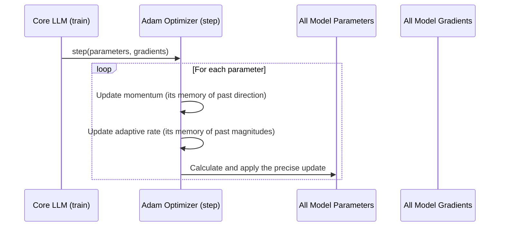

# Chapter 8: Adam Optimizer

In [Chapter 7: Output Projection Layer](07_output_projection_layer_.md), we completed our journey through the model's thinking process. We saw how an input sentence is transformed into a rich internal "thought" and finally projected into a prediction for the next word. We've also talked a lot about a "backward pass" where the model learns from its mistakes.

But how does this learning *actually* happen? After the model calculates its error, what is the mechanism that goes back and adjusts all the millions of internal knobs and dials to be better next time?

This is the job of the **Adam Optimizer**. It is the powerful engine that drives the entire learning process. Think of it as a highly skilled mechanic for our model's brain. After each training step (like a race car completing a lap), the mechanic analyzes the performance data (the error) and makes thousands of precise adjustments to the engine's components (the model's parameters) to ensure the next lap is even better.

### The Problem: A Clumsy Mechanic

Imagine you have a simple, naive mechanic. Their only tool is a single wrench, and they apply the same amount of force to every single bolt they turn. This is what a basic optimizer does. It updates every parameter in the model using the same fixed "learning rate."

-   **If the learning rate is too high**, our mechanic is too aggressive. They'll overtighten every bolt, potentially breaking the engine. The model's learning will be unstable and fly out of control.
-   **If the learning rate is too low**, our mechanic is too timid. They'll barely tighten the bolts, and the engine will never get properly tuned. The model will learn incredibly slowly, or get stuck.

Adam is a much smarter mechanic. It's sophisticated and has two special superpowers that make it much more effective.

#### Superpower 1: Momentum (A Rolling Ball)

Adam doesn't just look at the most recent mistake; it remembers the direction of past adjustments.

Imagine a ball rolling down a bumpy hill towards the lowest point (the point of lowest error). A simple optimizer might get stuck in a small dip. Adam, however, has **momentum**. Like a ball that has been rolling for a while, it builds up speed in a consistent direction. This momentum helps it to roll right over the small bumps and continue confidently towards the true bottom of the hill. This makes the training process smoother and faster.

#### Superpower 2: Adaptive Learning Rates (A Versatile Toolkit)

This is Adam's greatest strength. It understands that not all bolts are the same. It has a full toolkit and knows exactly how much force to apply to each individual parameter.
-   For a large, important parameter that is clearly wrong, it makes a big adjustment.
-   For a tiny, sensitive parameter that is close to correct, it makes a very small, delicate adjustment.

This is what "Adaptive" means: it adapts the learning rate for *every single parameter in the model*, making the training process much more efficient and stable.

### How We Use It in `RustGPT`

The optimizer is a core part of our [Core LLM](02_core_llm_.md). First, we create an instance of it inside the `LLM` struct.

```rust
// In src/llm.rs

pub struct LLM {
    // ... other layers like embeddings, transformers ...

    // The tool used to update its knowledge
    optimizer: Adam,
}
```
The `LLM` owns the optimizer. The real action happens inside the `train` function, which we saw in [Chapter 1: Training Pipeline](01_training_pipeline_.md). The learning process is a clear three-step dance:

```rust
// In src/llm.rs (from the `train_step` method)

// 1. Make a prediction (Forward Pass)
let logits = self.forward(&inputs);

// 2. Calculate the error and "blame" (Backward Pass)
self.backward(&grad);

// 3. Tell the optimizer to update everything!
self.optimizer.step(&mut self.get_params(), &self.get_grads());
```
The `optimizer.step()` function is where our smart mechanic gets to work. It takes all the parameters from every layer and all the calculated "blame" (gradients) and performs its magic update.

### Under the Hood: The Mechanic's Workshop

So what happens inside that `optimizer.step()` call? The Adam optimizer consults its notes (its memory of past updates) and carefully updates each parameter.

Here’s a high-level look at the process:



The optimizer maintains its own internal "memory" for each parameter it's in charge of. This memory consists of two key pieces of information:
1.  **`m` (First Moment):** This tracks the momentum, like the speed and direction of our rolling ball.
2.  **`v` (Second Moment):** This tracks the past magnitudes of updates, which is used to adapt the learning rate.

#### A Peek at the Code

Let's look at the `Adam` struct in `src/adam.rs`. You can see it holds this memory for each parameter.

```rust
// In src/adam.rs

pub struct Adam {
    // ... learning rate and other settings ...
    
    // Memory of momentum for each parameter
    m: Vec<Array2<f32>>,

    // Memory for the adaptive learning rate for each parameter
    v: Vec<Array2<f32>>,
}
```
The `step` function then iterates through all the model's parameters and their corresponding gradients, using its `m` and `v` memory to perform the smart update.

Here is a heavily simplified version of what happens inside the `step` function for a single parameter:

```rust
// In src/adam.rs (simplified from `step` method)

for i in 0..params.len() {
    // 1. Update momentum (the rolling ball's speed)
    self.m[i] = beta1 * &self.m[i] + (1.0 - beta1) * &grads[i];
    
    // 2. Update the adaptive learning rate component
    self.v[i] = beta2 * &self.v[i] + (1.0 - beta2) * (&grads[i] * &grads[i]);

    // 3. Apply the final, smart update to the parameter
    params[i] -= learning_rate * &self.m[i] / (&self.v[i].mapv(f32::sqrt) + epsilon);
}
```
You don't need to understand the exact math, but you can see the logic:
1.  It updates its memory (`m` and `v`) based on the current gradient.
2.  It uses that memory to calculate the final update. Notice how both `m` and `v` are used in the last line—it's combining both of its superpowers!
3.  It applies this update to the actual model parameter.

### Conclusion

In this chapter, we've met the engine of our model: the **Adam Optimizer**. This sophisticated algorithm is what makes learning possible, efficient, and stable.

We learned that:
-   Adam is like a smart mechanic that intelligently tunes our model's parameters.
-   It uses **momentum** to maintain a consistent learning direction and avoid getting stuck.
-   It uses **adaptive learning rates** to apply tailored updates to every single parameter in the model.
-   It is the final, critical step in the training loop, turning calculated errors into real model improvements.

You have now seen every major component of `RustGPT`! From turning words into numbers with [Vocabulary & Tokenization](03_vocabulary___tokenization_.md), to understanding meaning with [Transformer Blocks](05_transformer_block_.md), to making predictions with the [Output Projection Layer](07_output_projection_layer_.md), and finally, to learning with the Adam Optimizer.

Congratulations! You now have a complete, high-level understanding of how a Large Language Model is built from scratch. From here, you can dive deeper into the code, experiment with changing the model's architecture, or even try training it on your own data. The journey of building and understanding AI is in your hands.

---

Generated by [AI Codebase Knowledge Builder](https://github.com/The-Pocket/Tutorial-Codebase-Knowledge)