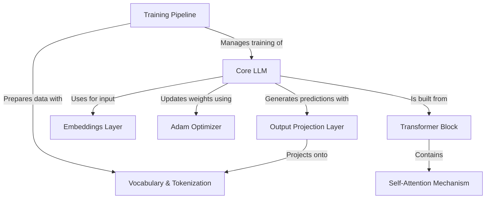

# Tutorial: RustGPT

This project is a **Large Language Model (LLM)** built entirely *from scratch* in the Rust programming language. It demonstrates how modern AI like ChatGPT works under the hood by implementing a complete **transformer architecture** without relying on any external machine learning frameworks. You can watch it learn from text and then have a conversation with it in an interactive chat mode.

**Source Repository:** [None](None)

## Chapters

1. [Training Pipeline
](01_training_pipeline_.md)
2. [Core LLM
](02_core_llm_.md)
3. [Vocabulary & Tokenization
](03_vocabulary___tokenization_.md)
4. [Embeddings Layer
](04_embeddings_layer_.md)
5. [Transformer Block
](05_transformer_block_.md)
6. [Self-Attention Mechanism
](06_self_attention_mechanism_.md)
7. [Output Projection Layer
](07_output_projection_layer_.md)
8. [Adam Optimizer
](08_adam_optimizer_.md)

---

Generated by [AI Codebase Knowledge Builder](https://github.com/The-Pocket/Tutorial-Codebase-Knowledge)