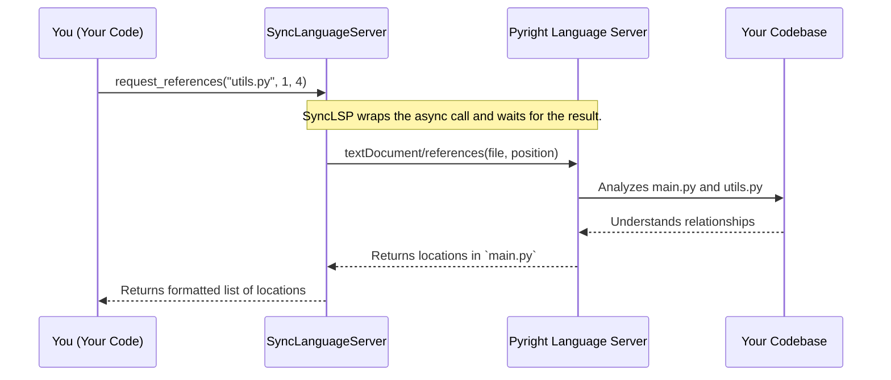

# Chapter 1: Language Server Abstraction (multilspy)

Welcome to the Serena tutorial! We're thrilled to have you here. Over the next few chapters, we'll peel back the layers of Serena's architecture to understand how it works its magic. Let's start with the very foundation of its "code sense": the Language Server Abstraction.

## What's the Big Idea?

Imagine you're a detective trying to solve a case in a massive library. You're looking for every mention of a specific character, let's say "Dr. Watson." If you just search for the text "Watson," you'll find everything: the character's name, street names like "Watson Avenue," and even other people named Watson. It's noisy and inefficient.

What you *really* want is an expert librarian who understands the story. You want to ask, "Show me every place where the character Dr. Watson appears," and get a precise list.

In the world of coding, this is the exact problem Serena faces. A simple text search for a function name like `get_user` in a large project is a recipe for confusion. Serena needs to understand code not as plain text, but as a structured, meaningful system of functions, classes, and variables.

This is where the **Language Server Abstraction**, powered by a component named `multilspy`, comes in. It's Serena's expert librarian.

### The Universal Translator for Code

Think of `multilspy` as a universal translator that is also an expert in many programming languages. It uses the **Language Server Protocol (LSP)**, the same technology that powers intelligent features in modern IDEs like VS Code or PyCharm (e.g., "Go to Definition," "Find All References").

By talking to standard Language Servers (like `Pyright` for Python or `Eclipse JDTLS` for Java), `multilspy` gives Serena the power to ask deep questions about the code:
- "Where is this `calculate_total` function actually defined?"
- "Show me every single place this `User` class is used in the entire project."
- "What are the properties of this `request` object?"

This semantic understanding is what separates a true coding agent from a simple script. It's the foundation for all of Serena's advanced capabilities.

## A Concrete Example: Finding All Usages

Let's see how we can use `multilspy` to solve a classic problem: finding every reference to a specific function.

Imagine our project has two files:

**`utils.py`**
```python
# A helper function
def get_user_name(user_id):
    # ... logic to fetch user from a database
    return "Alice"
```

**`main.py`**
```python
from utils import get_user_name

def process_user(user_id):
    # We use our helper function here
    name = get_user_name(user_id)
    print(f"Processing user: {name}")

# And we use it again
user_name = get_user_name(123)
```

We want to find all the places where `get_user_name` is called. Here's how you'd do it using `multilspy`'s synchronous wrapper, `SyncLanguageServer`.

```python
from multilspy import SyncLanguageServer, MultilspyConfig, Language

# 1. Configure for a Python project
config = MultilspyConfig(
    code_language=Language.PYTHON,
    # ... other configurations can go here
)

# 2. Create the Language Server for our project root
#    NOTE: In a real app, you'd provide your actual project path.
lsp = SyncLanguageServer.create(config, logger, repository_root_path="/path/to/your/project")

# 3. Start the server (this happens in the background)
with lsp.start_server():
    # 4. Ask for references to our function
    #    We point to the function definition in `utils.py` at line 2, column 5
    references = lsp.request_references("utils.py", line=1, column=4)

    # 5. Print the results!
    for ref in references:
        print(f"Found reference in {ref['relativePath']} at line {ref['range']['start']['line']}")
```
*(`logger` is a standard logging object, which we've omitted for brevity.)*

This code first sets up and starts a language server for our Python project. Then, it asks for all references to the symbol located at `utils.py` on line 2 (which is our `get_user_name` function).

**Expected Output:**

The server will analyze the code and return the precise locations of the two calls in `main.py`:
```
Found reference in main.py at line 4
Found reference in main.py at line 8
```
Notice how it correctly identified only the *calls* to the function, ignoring the `import` statement and the definition itself. This is the power of semantic understanding!

## How It Works Under the Hood

So what happens when you call `lsp.request_references(...)`? It's not magic, but a well-orchestrated conversation.

Here's a simplified step-by-step breakdown:



1.  **Your Code to `SyncLanguageServer`**: You call the simple, synchronous `request_references` method.
2.  **`SyncLanguageServer` to `Pyright`**: `multilspy` translates your request into a formal LSP message (`textDocument/references`) and sends it to the underlying language server process (in this case, `pyright-langserver`).
3.  **`Pyright` to the Codebase**: The `Pyright` server, which has already analyzed your project, looks at its internal model of your code to find all the symbols that refer to the function definition.
4.  **`Pyright` to `SyncLanguageServer`**: `Pyright` sends the results back as a list of file URIs and line/character ranges.
5.  **`SyncLanguageServer` to You**: `multilspy` parses this response, cleans it up into a user-friendly Python dictionary, and returns it to your code.

### A Peek at the Code

Let's look at a few key snippets from the `serena` source to see how this is implemented.

**1. Creating the Right Server**

The `LanguageServer.create` method acts as a factory. Based on the language you specify, it knows which specific server implementation to spin up.

*File: `src/multilspy/language_server.py`*
```python
@classmethod
def create(cls, config: MultilspyConfig, logger: MultilspyLogger, repository_root_path: str) -> "LanguageServer":
    """
    Creates a language specific LanguageServer instance...
    """
    if config.code_language == Language.PYTHON:
        from multilspy.language_servers.pyright_language_server.pyright_server import (
            PyrightServer,
        )
        return PyrightServer(config, logger, repository_root_path)
    
    elif config.code_language == Language.JAVA:
        # ... logic to create a Java server ...
    
    # ... and so on for other languages
```
This is a classic factory pattern. It abstracts away the details of which server to use and how to initialize it.

**2. Language-Specific Setup**

Each language-specific server, like `PyrightServer`, provides the command needed to start the actual LSP process.

*File: `src/multilspy/language_servers/pyright_language_server/pyright_server.py`*
```python
class PyrightServer(LanguageServer):
    def __init__(self, config: MultilspyConfig, logger: MultilspyLogger, repository_root_path: str):
        """
        Creates a PyrightServer instance.
        """
        super().__init__(
            config,
            logger,
            repository_root_path,
            # This is the key part: the command to run the server
            ProcessLaunchInfo(cmd="python -m pyright.langserver --stdio", cwd=repository_root_path),
            "python",
        )
```
As you can see, `multilspy` simply runs the `pyright` language server as a background command-line process and communicates with it via standard input/output (`stdio`).

**3. The Sync-over-Async Wrapper**

The core `LanguageServer` is asynchronous (`async`). The `SyncLanguageServer` is a convenient wrapper that manages the `asyncio` event loop for you, making the API much simpler to use in many scripts.

*File: `src/multilspy/language_server.py`*
```python
class SyncLanguageServer:
    # ... (initialization)

    def request_references(self, file_path: str, line: int, column: int) -> List[multilspy_types.Location]:
        """
        Raise a [textDocument/references] request...
        """
        # It runs the async version of the method in a managed event loop
        result = asyncio.run_coroutine_threadsafe(
            self.language_server.request_references(file_path, line, column), self.loop
        ).result()
        return result
```
This wrapper makes the powerful async features of the LSP accessible in a simple, blocking call.

## Conclusion

The Language Server Abstraction (`multilspy`) is the sensory organ of Serena. It provides a deep, semantic "code sense" that goes far beyond simple text processing. By leveraging the industry-standard Language Server Protocol, Serena can intelligently navigate and understand any codebase, just like a seasoned developer using a modern IDE.

Now that we understand how Serena can *find* and locate meaningful pieces of code, we need a way to represent them. In the next chapter, we'll explore how Serena uses the [Symbol and SymbolManager](02_symbol_and_symbolmanager_.md) abstractions to create structured, usable objects from the raw location data we get from the language server.

---

Generated by [AI Codebase Knowledge Builder](https://github.com/The-Pocket/Tutorial-Codebase-Knowledge)