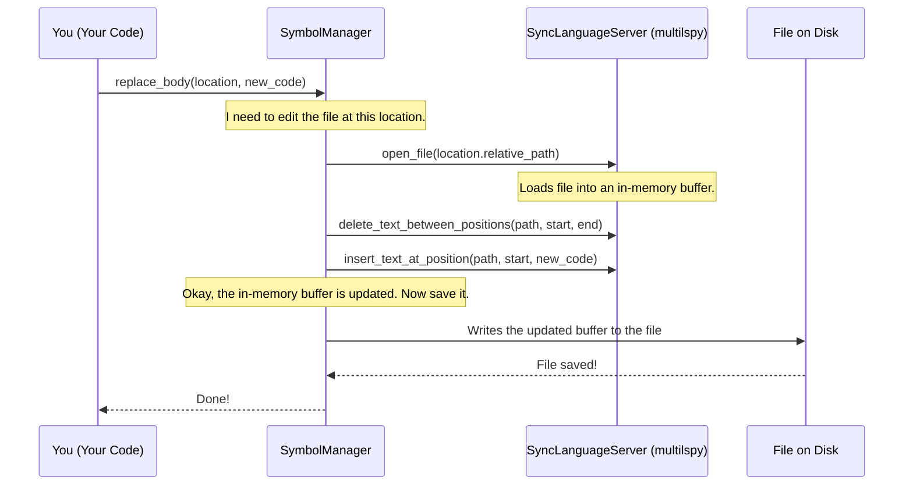

# Chapter 2: Symbol and SymbolManager

In the [previous chapter](01_language_server_abstraction__multilspy__.md), we learned how Serena gets its "code sense" using `multilspy`, our expert librarian. We saw how it can find the precise locations of functions and variables in a big project, just like finding a specific sentence in a library full of books.

But knowing a location (e.g., "utils.py, line 5") isn't enough. We need to understand *what* is at that location. Is it a function? A class? A variable? What is its name? What is its content?

This is where the `Symbol` and `SymbolManager` abstractions come in. They take the raw location data from the language server and turn it into something structured and useful that Serena can work with.

## What's the Big Idea?

Let's continue our library analogy. The language server gave us the shelf number and position of a book. Now, we need to know more about the book itself. Is it a novel? A textbook? Who is the author? What's the title?

A `Symbol` is like a business card for a piece of code. It holds all the key information in a neat package:
- **Name:** `get_user_name`
- **Kind:** `Function`
- **Location:** `utils.py`, line 2, column 5
- **Body:** `def get_user_name(...): ...`

The `SymbolManager` is the rolodex that holds all these business cards. It's Serena's main tool for interacting with the codebase. You can ask the `SymbolManager` to:
- "Find the business card for the function named `get_user_name`."
- "Give me the business cards of every class in this file."
- "Take this card, go to its location, and replace the function's body with this new code."

This approach allows Serena to perform surgical code modifications, like replacing a single function or adding a new method to a class, instead of performing clumsy and error-prone text searches and replacements.

## A Concrete Example: Replacing a Function's Body

Let's set a simple goal: we have a function that returns a hardcoded name, and we want to update it to return a different name.

Here's our starting file:

**`user_service.py`**
```python
def get_user_greeting(user_id):
    # Old logic
    return "Hello, Alice"
```

Our task is to change the implementation to return "Hello, Bob" instead. Here’s how we can do it with `SymbolManager`.

```python
# In a real Serena app, these objects are provided automatically.
# We're creating them here for the example.
from serena.agent import SerenaAgent 

# 1. Setup Serena's agent, which contains the SymbolManager
#    (Don't worry too much about this part yet, we'll cover it in the next chapter)
agent = SerenaAgent(project_file_path="project.yml", start_language_server=True)
symbol_manager = agent.symbol_manager

# 2. Find the symbol for our function
#    We search for a symbol named "get_user_greeting"
symbols = symbol_manager.find_by_name("get_user_greeting")
greeting_function_symbol = symbols[0] # Let's assume it's the first result

# 3. Define the new body for the function
new_body = """
    # New and improved logic
    return "Hello, Bob"
"""

# 4. Use the symbol's location to replace its body
symbol_manager.replace_body(greeting_function_symbol.location, new_body)
```
*(We've simplified the setup. `SerenaAgent` and `symbol_manager` are core components we'll explore more later.)*

After running this code, the file `user_service.py` is automatically updated:

**`user_service.py` (after modification)**
```python
def get_user_greeting(user_id):
    # New and improved logic
    return "Hello, Bob"
```
Success! We precisely targeted the function `get_user_greeting` and replaced its implementation without affecting any other part of the file. This is the power of symbolic manipulation.

## The `Symbol` Class: The Business Card

The `Symbol` object is a wrapper around the complex data that the language server provides. It makes accessing key details easy.

Let's imagine we've found a `Symbol` object for a class. We can inspect it like this:

```python
# Assume 'my_class_symbol' is a Symbol object we found earlier
print(f"Name: {my_class_symbol.name}")
print(f"Kind: {my_class_symbol.kind}")
print(f"File: {my_class_symbol.relative_path}")
print(f"Line: {my_class_symbol.line}")
```
**Expected Output:**
```
Name: User
Kind: Class
File: models/user.py
Line: 10
```

The `Symbol` class simply provides convenient properties to access the underlying dictionary of information returned by `multilspy`.

*File: `src/serena/symbol.py`*
```python
class Symbol(ToStringMixin):
    def __init__(self, s: UnifiedSymbolInformation) -> None:
        # 's' is the raw dictionary from the language server
        self.s = s

    @property
    def name(self) -> str:
        return self.s["name"]

    @property
    def kind(self) -> str:
        # It even converts the numeric kind into a readable string like "Function"
        return SymbolKind(self.symbol_kind).name
    
    # ... and many other useful properties
```

## How It Works Under the Hood

When you call `symbol_manager.replace_body()`, a few things happen in a coordinated sequence. The `SymbolManager` acts as a middleman, translating your simple request into a series of precise commands for the language server.



1.  **You to `SymbolManager`**: You make a high-level request: "replace the body of this symbol."
2.  **`SymbolManager` to `SyncLanguageServer`**: The `SymbolManager` translates this. It knows the symbol's start and end positions from its "business card."
    - It tells the language server to open the file and load it into an in-memory buffer.
    - It issues a `delete` command for the range of the old function body.
    - It issues an `insert` command to place the new code at the start position.
3.  **`SymbolManager` to File**: After the language server has modified the in-memory version of the file, the `SymbolManager` takes that final content and writes it back to the actual file on disk.

### A Peek at the Code

Let's look at the implementation of `replace_body` to see this in action.

*File: `src/serena/symbol.py`*
```python
class SymbolManager:
    # ... (other methods)

    def replace_body(self, location: SymbolLocation, body: str) -> None:
        """
        Replace the body of the symbol at the given location with the given body
        """
        # This context manager handles opening and saving the file
        with self._edited_symbol_location(location) as symbol:
            # Command 1: Delete the old body
            self.lang_server.delete_text_between_positions(
                location.relative_path, symbol.body_start_position, symbol.body_end_position
            )
            # Command 2: Insert the new body
            self.lang_server.insert_text_at_position(
                location.relative_path, symbol.body_start_position["line"], 
                symbol.body_start_position["character"], body
            )
```
This code clearly shows the two-step process: `delete` then `insert`. The `_edited_symbol_location` is a helper that ensures the file is properly opened before the edits and saved after. This makes code manipulation safe and reliable.

## Conclusion

The `Symbol` and `SymbolManager` abstractions are the hands and fingers of Serena. They build upon the "code sense" from `multilspy` to give Serena the ability to not just *see* the code, but to *interact* with it in a structured and intelligent way.

- A **`Symbol`** is a data-rich representation of a code element (like a business card).
- The **`SymbolManager`** is the high-level API for finding, analyzing, and modifying symbols (like a rolodex and a personal assistant combined).

Now that we have the core components for understanding and manipulating code, how do we put them all together? How does an AI agent decide *which* symbols to find and *how* to modify them to solve a user's request? That's the job of the [SerenaAgent](03_serenaagent_.md), which we will explore in the next chapter.

---

Generated by [AI Codebase Knowledge Builder](https://github.com/The-Pocket/Tutorial-Codebase-Knowledge)