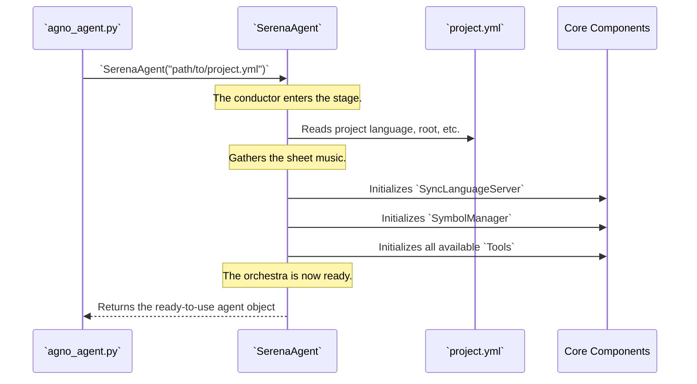

# Chapter 3: SerenaAgent

In the last two chapters, we saw Serena's "senses" and "hands." With [Language Server Abstraction (multilspy)](01_language_server_abstraction__multilspy__.md), it can *see* and understand code structure. With the [Symbol and SymbolManager](02_symbol_and_symbolmanager_.md), it can *interact* with and modify that code.

But what brings all of this together? What's the "brain" that orchestrates these pieces? Meet the `SerenaAgent`.

## What's the Big Idea?

Imagine building a custom car. You have a specialist for the engine, another for the electronics, and a third for the bodywork. But you still need a **project manager**. The project manager doesn't build the engine themselves, but they have the blueprints (the configuration), they hire the specialists, and they make sure everyone has the tools and parts they need to work together.

The `SerenaAgent` is Serena's project manager.

It is the central coordinating object for the entire system. When you start Serena, the first thing you do is create a `SerenaAgent`. This agent then:
1.  **Reads the Project Blueprints**: It loads your project's configuration file (`.yml`) to understand the language, root directory, and other settings.
2.  **Hires the Specialists**: It creates and holds instances of all the critical components, like the `SymbolManager` and the language server.
3.  **Provides the Toolbox**: It gathers all the available `Tool` classes (like `read_file` or `find_symbol`) and makes them ready for the AI to use.

When a request comes in from a user, the `SerenaAgent` provides the complete, ready-to-use environment for the Large Language Model (LLM) to begin its work. It's the starting point for understanding how all the pieces of Serena fit together.

## A Concrete Example: Starting Serena

You never interact with the `SerenaAgent` directly as an end-user, but it's the first and most important object created by the scripts that launch Serena. Let's look at a simplified version of how the `agno_agent.py` script starts up.

The very first step is to create the agent by telling it where to find the project's configuration file.

```python
# A simplified example based on scripts/agno_agent.py

from serena.agent import SerenaAgent

# 1. Define the path to our project's configuration
project_config_file = "myproject.demo.yml"

# 2. Create the SerenaAgent instance. This is the main setup step!
#    This one line kicks off the entire initialization process.
serena_agent = SerenaAgent(project_config_file, start_language_server=True)

# 3. Now, the agent is ready.
#    We can pass its tools and configuration to the AI framework.
#    (The actual code for this is more complex, but this is the core idea)
print("Serena is ready to work!")
```

When that single line `SerenaAgent(...)` is executed, a cascade of setup events happens in the background. The agent reads the config, starts the language server, creates the `SymbolManager`, and prepares all the tools. By the time the line is finished, the entire system is assembled and ready to receive commands.

## How It Works Under the Hood

The `SerenaAgent`'s `__init__` method is the conductor's first tap of the baton, calling the whole orchestra to attention. Let's see the sequence of events.



This diagram shows that creating the agent is not a passive step. It's an active process that builds and connects all the other major components we've discussed (and will discuss).

### A Peek at the Code

Let's look inside the `SerenaAgent`'s `__init__` method in `src/serena/agent.py` to see this in action. We'll break it down into small, easy-to-understand parts.

**Part 1: Reading the Configuration**

The first thing the agent does is read the `.yml` file you gave it.

*File: `src/serena/agent.py`*
```python
class SerenaAgent:
    def __init__(self, project_file_path: str, ...):
        # Open and read the YAML configuration file
        with open(project_file_path, encoding="utf-8") as f:
            project_config = yaml.safe_load(f)
        
        # Store the config and key details like language and project root
        self.project_config = project_config
        self.language = Language(project_config["language"])
        self.project_root = str(Path(project_config["project_root"]).resolve())
```
This is straightforward: it opens the file, parses the YAML, and stores the values in instance variables like `self.language` and `self.project_root` for other components to use.

**Part 2: Creating the Core Components**

Next, it uses that configuration to initialize the specialists: the language server and the `SymbolManager`.

*File: `src/serena/agent.py`*
```python
# ... continuing in the __init__ method ...

# Create the language server instance using the configured language
config = MultilspyConfig(code_language=self.language)
self.language_server = SyncLanguageServer.create(config, ...)

# Create the SymbolManager, giving it access to the language server
self.symbol_manager = SymbolManager(self.language_server, self)
```
Here you can see the dependency chain clearly. The `SerenaAgent` creates the `language_server` and then passes it directly to the `SymbolManager`, ensuring they can work together.

**Part 3: Assembling the Toolbox**

Finally, the agent discovers and creates an instance of every available `Tool`.

*File: `src/serena/agent.py`*
```python
# ... continuing in the __init__ method ...

# Find all tool classes and instantiate them
self.tools: dict[type[Tool], Tool] = {}
for tool_class in iter_tool_classes():
    # Create an instance of the tool, giving it a reference to the agent
    tool_instance = tool_class(self)
    
    # Add it to our toolbox (unless it's been excluded in the config)
    if tool_class.get_name() not in project_config.get("excluded_tools", []):
        self.tools[tool_class] = tool_instance
```
This code automatically finds every class that inherits from the base `Tool` class and creates it. This makes Serena highly extensible—to add a new tool, a developer just needs to create a new `Tool` class, and the `SerenaAgent` will automatically find it and make it available.

## Conclusion

The `SerenaAgent` is the glue that holds the entire system together. It's not the component that directly talks to the LLM, nor does it perform file edits itself. Instead, it plays the crucial role of **project manager**:

-   It reads the project configuration.
-   It initializes all the necessary components (`SymbolManager`, `Tools`, etc.).
-   It acts as a central container, providing a complete and ready-to-use context for the AI.

Understanding the `SerenaAgent` is key to seeing the big picture of Serena's architecture. It's the central hub from which all other components are managed and accessed.

Now that we see how the system is organized, let's explore a more advanced capability: how Serena can learn project-specific information and remember it for future tasks. In the next chapter, we'll dive into [Onboarding and Memories](04_onboarding_and_memories_.md).

---

Generated by [AI Codebase Knowledge Builder](https://github.com/The-Pocket/Tutorial-Codebase-Knowledge)