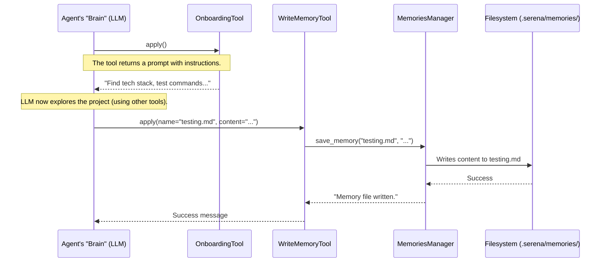

# Chapter 4: Onboarding and Memories

In the [previous chapter](03_serenaagent_.md), we met the [SerenaAgent](03_serenaagent_.md), the project manager that assembles all of Serena's components. But a great project manager doesn't just manage; they also learn. They remember key details about a project so they don't have to ask the same questions every day.

What if Serena could do the same? What if it could remember a project's tech stack, testing commands, and coding style, making it faster and smarter with every interaction?

## What's the Big Idea?

Imagine you're a new developer joining a team. On your first day, you'd probably spend hours exploring the codebase. You'd read the `README.md`, find the test folder, and maybe run a few commands to see how things work. You would take notes in your personal notebook:
- "Project uses Python with `uv` for package management."
- "Tests are in the `tests/` folder."
- "Run tests with: `uv run test`"
- "Code style: `black` formatter is used."

The next day, when you need to run tests, you don't re-explore the whole project. You just flip open your notebook to the right page.

This is exactly what **Onboarding and Memories** bring to Serena. It's the agent's own project notebook.
-   **Onboarding**: This is the process for the first day. The `OnboardingTool` guides the agent to explore a new project and take notes.
-   **Memories**: These are the notes themselves. They are simple text files stored in a special `.serena/memories/` folder within your project.
-   **Memory Tools**: The agent uses tools like `ReadMemoryTool` and `WriteMemoryTool` to read and write in its notebook.

This system makes Serena incredibly efficient. Instead of re-analyzing the codebase from scratch in every new chat session, it can quickly read its memories to get up to speed.

## A Concrete Example: A Tale of Two Sessions

Let's see this in action. We'll follow Serena through its first encounter with a project and then see how it uses its memory in a later session.

### Session 1: The First Day Onboarding

A user starts a new chat with Serena for a project it has never seen before. The first thing the agent does is check if it's been onboarded.

1.  **Agent checks for memories:** The agent calls `CheckOnboardingPerformedTool`. It finds no memories. The tool responds: "Onboarding not performed yet... you should perform onboarding..."

2.  **Agent starts onboarding:** The agent calls the `OnboardingTool`. This tool doesn't *do* the work itself; it returns a detailed set of instructions (a prompt) telling the agent *what* to look for, like the tech stack, testing commands, etc.

3.  **Agent explores and takes notes:** Following the instructions, the agent uses its other tools to explore. It might `list_dir`, `read_file("README.md")`, and `execute_shell_command("ls tests")`.

4.  **Agent writes memories:** After gathering information, the agent uses `WriteMemoryTool` to save its findings.
    ```python
    # Hypothetical tool call by the agent's LLM
    agent.get_tool(WriteMemoryTool).apply(
        memory_file_name="testing_commands.md",
        content="To run tests, execute the command: `uv run test`"
    )

    agent.get_tool(WriteMemoryTool).apply(
        memory_file_name="code_style.md",
        content="This project uses the 'black' formatter for Python code style."
    )
    ```
    This creates two new files in the `.serena/memories/` directory. The onboarding is complete!

### Session 2: Getting Back to Work

The next day, the user opens a new chat and asks: "Add a new feature and run the tests."

1.  **Agent consults its memory:** Instead of guessing, the agent first checks what it already knows.
    ```python
    # Agent calls the ListMemoriesTool
    agent.get_tool(ListMemoriesTool).apply()
    # Output: '["testing_commands.md", "code_style.md"]'
    ```

2.  **Agent reads the relevant note:** Seeing `testing_commands.md`, the agent knows this is important.
    ```python
    # Agent calls the ReadMemoryTool
    agent.get_tool(ReadMemoryTool).apply(memory_file_name="testing_commands.md")
    # Output: "To run tests, execute the command: `uv run test`"
    ```

3.  **Agent acts with confidence:** Now, after implementing the feature, the agent knows exactly what to do. It calls `execute_shell_command("uv run test")` without needing to search for the command again.

Thanks to its memory, the agent was faster, more accurate, and required less guidance.

## How It Works Under the Hood

The memory system is coordinated by the LLM, but the `MemoriesManager` and its associated tools provide the simple file-handling capabilities. The `OnboardingTool` is special because it just provides instructions to the LLM.

Here's how the onboarding process flows:



1.  **LLM to `OnboardingTool`**: The agent's brain (the LLM) decides to start onboarding and calls the `OnboardingTool`.
2.  **`OnboardingTool` to LLM**: The tool doesn't explore the file system. It simply returns a pre-defined prompt that acts as a checklist for the LLM.
3.  **LLM to `WriteMemoryTool`**: After exploring and finding information, the LLM calls `WriteMemoryTool` with a filename and the content it wants to save.
4.  **`WriteMemoryTool` to `MemoriesManager`**: The tool delegates the actual file-writing task to the `MemoriesManager`.
5.  **`MemoriesManager` to Filesystem**: The `MemoriesManager` handles the low-level details of creating the `.serena/memories` directory and writing the file to disk.

### A Peek at the Code

Let's see how simple these components are.

**1. The `OnboardingTool`**

This tool is surprisingly simple. Its job is just to provide the "checklist" prompt to the LLM.

*File: `src/serena/agent.py`*
```python
class OnboardingTool(Tool):
    """
    Performs onboarding (identifying the project structure and essential tasks...).
    """
    def apply(self) -> str:
        """
        Call this tool if onboarding was not performed yet.
        ...
        :return: instructions on how to create the onboarding information
        """
        system = platform.system()
        # It gets the prompt from a factory and returns it as a string.
        return self.prompt_factory.create_onboarding_prompt(system=system)
```
The "magic" here is not in complex code, but in a well-crafted prompt that guides the LLM to perform a useful, structured task.

**2. The `MemoriesManager`**

This class is the dedicated file clerk for memories. It knows where the memory files are stored and how to read/write them.

*File: `src/serena/agent.py`*
```python
class MemoriesManager:
    def __init__(self, memory_dir: str):
        self._memory_dir = Path(memory_dir)
        # Make sure the .serena/memories directory exists
        self._memory_dir.mkdir(parents=True, exist_ok=True)

    def save_memory(self, memory_file_name: str, content: str) -> str:
        # It creates the full path and writes the file.
        memory_file_path = self._memory_dir / memory_file_name
        with open(memory_file_path, "w", encoding="utf-8") as f:
            f.write(content)
        return f"Memory file {memory_file_name} written."
```
As you can see, it's just doing basic file I/O in a specific, pre-defined directory (`.serena/memories/`).

**3. The `ReadMemoryTool` and `WriteMemoryTool`**

These tools are simple wrappers that give the LLM access to the `MemoriesManager`.

*File: `src/serena/agent.py`*
```python
class WriteMemoryTool(Tool):
    """
    Writes a named memory...
    """
    def apply(self, memory_file_name: str, content: str, ...) -> str:
        # It just calls the MemoriesManager to do the real work.
        return self.memories_manager.save_memory(memory_file_name, content)

class ReadMemoryTool(Tool):
    """
    Reads the memory with the given name...
    """
    def apply(self, memory_file_name: str, ...) -> str:
        # Again, it delegates to the MemoriesManager.
        return self.memories_manager.load_memory(memory_file_name)
```
This clean separation of concerns is a core design principle in Serena. Tools are the simple public-facing API for the LLM, while managers handle the underlying logic.

## Conclusion

The Onboarding and Memories system transforms Serena from a stateless tool into a learning-enabled assistant. It creates a virtuous cycle:
1.  **Onboarding** establishes a baseline understanding of a project.
2.  **Memories** store this understanding persistently.
3.  Future sessions become **faster and more context-aware** by leveraging these memories.

This simple yet powerful "project notebook" concept is a key reason why Serena can handle complex tasks effectively over multiple interactions.

So far, we've mentioned various "Tools" like `OnboardingTool`, `ReadFileTool`, and `WriteMemoryTool`. But what exactly is a `Tool` and how do you create a new one? In the next chapter, we'll dive deep into the [Tool](05_tool_.md) abstraction, the building blocks for all of Serena's capabilities.

---

Generated by [AI Codebase Knowledge Builder](https://github.com/The-Pocket/Tutorial-Codebase-Knowledge)