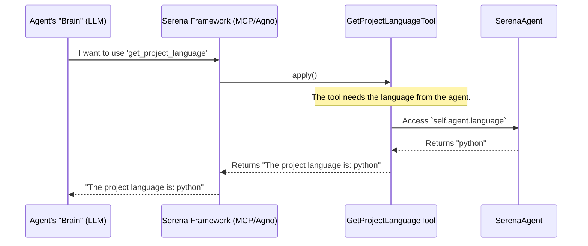

# Chapter 5: Tool

In the last chapter on [Onboarding and Memories](04_onboarding_and_memories_.md), we saw how Serena uses tools like `WriteMemoryTool` and `ReadMemoryTool` to act like a developer taking notes. We've mentioned many tools so far: `find_symbol`, `read_file`, `execute_shell_command`.

But what exactly *is* a tool in Serena? How does the system know what tools are available, and how can we add new ones? Let's open up the toolbox and find out.

## What's the Big Idea?

Imagine a craftsperson's workshop. The workshop is filled with tools, each designed for a specific job: a hammer for nails, a screwdriver for screws, a saw for cutting wood. The craftsperson (our LLM) looks at the task at hand—say, "build a chair"—and decides which tool to pick up from the toolbox to make progress.

In Serena, a `Tool` is a single, discrete capability that the agent can use.
- `find_symbol` is like a high-tech stud finder for locating functions and classes.
- `read_file` is like a magnifying glass for examining the contents of a file.
- `execute_shell_command` is like a powerful multi-tool that can run tests or install packages.

The base `Tool` class is the **blueprint** for every tool in the workshop. It defines a contract that every tool must follow. This ensures that no matter what the tool does, the craftsperson knows how to hold it and use it. To add a new capability to Serena, you simply need to design a new tool based on this blueprint and add it to the workshop. The [SerenaAgent](03_serenaagent_.md) will automatically find it and make it available to the LLM.

## A Concrete Example: Creating a New Tool

Let's say we want to give Serena a very simple new ability: a tool to quickly check the programming language of the current project. This could be useful for the LLM to confirm its understanding before writing any code.

We'll call our new tool `get_project_language`. Here’s how we would create it.

1.  **Create a new Python file** for our tool (or add it to an existing one).
2.  **Define the new tool class**, making sure it inherits from `serena.agent.Tool`.
3.  **Implement the `apply` method**. This method contains the actual logic for the tool.

Here is the complete code for our new tool. It's surprisingly simple!

**`my_new_tools.py`**
```python
# We must import the base Tool class
from serena.agent import Tool, SerenaAgent

class GetProjectLanguageTool(Tool):
    """
    Returns the programming language of the current project.
    """
    def apply(self) -> str:
        """
        :return: A string with the project's language (e.g., "python", "java").
        """
        # The 'self.agent' property gives us access to the main SerenaAgent
        # which holds the project's language configuration.
        return f"The project language is: {self.agent.language.value}"
```

That's it! When the [SerenaAgent](03_serenaagent_.md) starts up, it automatically scans for any class that inherits from `Tool` and adds an instance of it to its toolbox. The LLM can then use it just like any other built-in tool.

For example, the LLM might decide to call it and would see the following output:
```
The project language is: python
```

## How It Works Under the Hood

A developer never calls a tool's `apply()` method directly. Tools are designed to be used by the LLM, which is orchestrated by the agent framework (like `mcp` or `agno`). The `Tool` abstraction makes this possible through two key mechanisms: **Discovery** and **Execution**.

1.  **Discovery:** When the `SerenaAgent` is initialized, it automatically searches the codebase for all classes that are children of the `Tool` class. It then creates one instance of each, effectively filling its toolbox. This is why our `GetProjectLanguageTool` becomes available without any extra registration steps.

2.  **Execution:** When the LLM decides to use a tool, the agent framework receives this request. It finds the corresponding `Tool` object in the agent's toolbox and calls its `apply()` method with the arguments provided by the LLM. The result is then sent back to the LLM.

Let's visualize the execution flow when an LLM uses our new tool.


As you can see, the `Tool` class is the clean, simple interface between the complex agent framework and the specific capability you want to implement.

### A Peek at the Code

Let's look at the key pieces of code that make this system work.

**1. The `Tool` Base Class**

The `Tool` class itself is very minimal. It inherits from a `Component` class, which is what gives it the handy `self.agent` property.

*File: `src/serena/agent.py`*
```python
class Component(ABC):
    def __init__(self, agent: "SerenaAgent"):
        self.agent = agent
        # ... other properties like self.language_server, self.project_root, etc.

class Tool(Component):
    @classmethod
    def get_name(cls) -> str:
        # Automatically converts "GetProjectLanguageTool" to "get_project_language"
        # ... (implementation details omitted)

    def get_apply_fn(self) -> Callable:
        # Returns the 'apply' method of the subclass
        # ...
```
This base structure ensures every tool has access to the central `SerenaAgent` and a standardized way to get its name. The docstrings on the class and its `apply` method are also very important, as they are used to generate the descriptions that the LLM sees.

**2. Automatic Tool Discovery**

How does the `SerenaAgent` find our `GetProjectLanguageTool`? It uses a helper function to iterate through all subclasses of `Tool`.

*File: `src/serena/agent.py`*
```python
class SerenaAgent:
    def __init__(self, project_file_path: str, ...):
        # ... (other setup)

        # Find all tool classes and instantiate them
        self.tools: dict[type[Tool], Tool] = {}
        for tool_class in iter_tool_classes():
            # Create an instance of the tool (e.g., GetProjectLanguageTool)
            tool_instance = tool_class(self)
            
            # Add it to our toolbox
            self.tools[tool_class] = tool_instance
```
This simple loop in the agent's constructor is the "magic" behind the automatic discovery. As long as your new class inherits from `Tool`, this loop will find it, create it, and make it available.

## Conclusion

The `Tool` abstraction is the heart of Serena's extensibility. It provides a simple yet powerful pattern for adding new capabilities.

-   A **`Tool`** is a single, focused capability for the agent.
-   All tools inherit from the base `Tool` class, ensuring a **consistent contract**.
-   The **`SerenaAgent` automatically discovers and loads** all available tools at startup.
-   Creating a new tool is as simple as creating a new class and implementing its `apply` method.

We've now seen how the agent is assembled, how it remembers things, and how its capabilities are defined as a set of tools. But how does the agent's "brain"—the LLM—know which tool to use and when? The answer lies in carefully crafted instructions. In the next chapter, we'll explore the [Prompting System](06_prompting_system_.md) that guides the LLM's reasoning.

---

Generated by [AI Codebase Knowledge Builder](https://github.com/The-Pocket/Tutorial-Codebase-Knowledge)