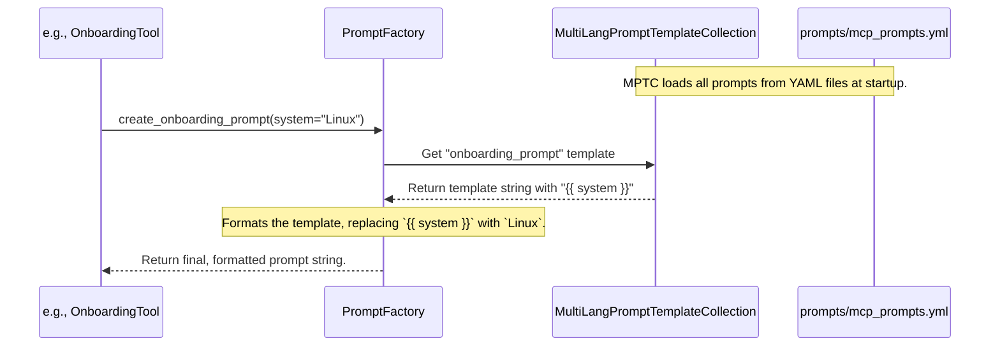

# Chapter 6: Prompting System

In the [previous chapter](05_tool_.md), we opened up Serena's toolbox and saw how each `Tool` represents a specific capability, like a hammer or a screwdriver. We now have a powerful agent, equipped with a full set of tools to work on any codebase.

But how does the agent know *what* to do? If you give a talented actor a stage but no script or director, you'll get a very unpredictable performance. The agent's "brain"—the Large Language Model (LLM)—is that talented actor. It needs direction.

This is where the **Prompting System** comes in. It's Serena's scriptwriter and director, all in one.

## What's the Big Idea?

The Prompting System is responsible for giving the LLM clear, consistent, and effective instructions. It tells the LLM:
-   **Its Role**: The fundamental "system prompt" tells the LLM its personality and high-level goal (e.g., "You are a professional coding agent...").
-   **Its Task**: When a complex operation like onboarding is needed, the system provides a detailed script for the LLM to follow.
-   **When to Think**: It provides special prompts that encourage the LLM to pause, reflect on its progress, and check if it's still on track. This prevents it from making mistakes or getting lost.

These instructions aren't hardcoded in Python. Instead, they live in simple text files (`.yml`), making them easy to read and modify without changing the agent's core logic. The `PromptFactory` is a special class that reads these files and generates the final, ready-to-use instructions for the LLM.

This separation of instructions (prompts) from logic (code) is key to making Serena both powerful and easy to maintain.

## A Concrete Example: Guiding the Onboarding Process

Remember the `OnboardingTool` from our chapter on [Onboarding and Memories](04_onboarding_and_memories_.md)? We mentioned that its job is to give the LLM a "checklist" of what to find in a new project. How does it get that checklist? It asks the `PromptFactory`.

Let's look at the `apply` method of the `OnboardingTool`:

```python
# From src/serena/agent.py (simplified)
class OnboardingTool(Tool):
    def apply(self) -> str:
        # Get the current operating system (e.g., "Windows", "Linux")
        system = platform.system()

        # Ask the PromptFactory to create the onboarding prompt
        return self.prompt_factory.create_onboarding_prompt(system=system)
```
The tool doesn't have the instructions itself. It calls `create_onboarding_prompt` on the `prompt_factory` and passes in the current operating system.

The `PromptFactory` then finds the corresponding template in a YAML file.

**`prompts/mcp_prompts.yml`** (snippet)
```yaml
prompts:
  onboarding_prompt: |
    You are viewing the project for the first time.
    Your task is to assemble relevant high-level information...
    The project is being developed on the system: {{ system }}.

    You need to identify at least the following information:
    * the project's purpose
    * the tech stack used
    * the commands for testing, formatting, and linting
    * ... (and so on) ...
```
Notice the `{{ system }}` placeholder. The `PromptFactory` replaces this with the actual value ("Windows", "Linux", etc.) and returns the final, complete instruction string to the LLM. The LLM then receives a clear, detailed script telling it exactly what to look for during onboarding, tailored to the user's specific environment.

## How It Works Under the Hood

The magic of the Prompting System happens in two stages: a one-time code generation step during development, and a prompt formatting step that happens every time the agent runs.

**Stage 1: Generating the Factory (Development Time)**

The `PromptFactory` class is not written by hand. A script, `gen_prompt_factory.py`, reads all the prompt names from the `.yml` files and **automatically generates the `prompt_factory.py` file**.

This means when you add a new prompt called `my_new_prompt` to a YAML file and run the script, a new method called `create_my_new_prompt()` will magically appear in the `PromptFactory` class! This keeps the Python code perfectly in sync with the available prompts.

**Stage 2: Formatting the Prompt (Run Time)**

When a tool calls a method on the `PromptFactory`, a simple process unfolds.


1.  **Tool to `PromptFactory`**: The `OnboardingTool` calls the generated method `create_onboarding_prompt`.
2.  **`PromptFactory` to `MultiLangPromptTemplateCollection`**: The factory asks its helper, the `MultiLangPromptTemplateCollection`, for the raw template named `onboarding_prompt`. This helper object is responsible for loading all the `.yml` files when Serena starts.
3.  **Formatting**: The `PromptFactory` uses a templating engine (Jinja) to replace any placeholders like `{{ system }}` with the values passed to the method.
4.  **Return**: The final, ready-to-use string is returned to the tool, which then passes it on to the LLM.

### A Peek at the Code

Let's look at the key files that make this work.

**1. The Prompt Template (`prompts/mcp_prompts.yml`)**

This is where the raw instructions live. They are written in plain English, making them easy for anyone to understand and edit.

```yaml
# A prompt to guide the LLM's reasoning
think_about_task_adherence: |
  Are you deviating from the task at hand? Do you need any additional information?
  Have you loaded all relevant memory files to see whether your implementation is fully aligned with the
  code style, conventions, and guidelines of the project?
```
This is a "thinking" prompt. It doesn't ask the LLM to *do* anything with the code, but to *reflect* on its own behavior. This is like a director telling the actor, "Pause for a moment and remember your character's motivation."

**2. The Prompt Loader (`src/serena/llm/multilang_prompt.py`)**

The `MultiLangPromptTemplateCollection` class is responsible for finding and parsing all the `.yml` and `.txt` files in the `prompts/` directory.

```python
class MultiLangPromptTemplateCollection:
    def __init__(self) -> None:
        self.prompt_templates: dict[str, MultiLangPromptTemplate] = {}
        # ...
        prompts_dir = self._prompt_template_folder()
        # This method reads all the files in the directory
        self._read_prompt_templates(prompts_dir)
```
This class acts as a librarian, reading all the prompt "books" and organizing them so the `PromptFactory` can find them easily.

**3. The Factory Generator (`scripts/gen_prompt_factory.py`)**

This script is the architect that builds the `PromptFactory`. It loops through all the prompts found by the collection and writes the corresponding Python methods.

```python
def main():
    coll = MultiLangPromptTemplateCollection()
    methods = []
    # Loop over every prompt template that was found
    for mpt in coll.prompt_templates.values():
        prompt_name = mpt.name
        # Generate a Python method string for this prompt
        methods.append(
            f"def create_{prompt_name}(self, ...): ...\n\n"
        )
    
    # Write the generated methods into a template file
    # ...
```
This automation is what makes the system so easy to extend.

**4. The Final Product (`src/serena/llm/prompt_factory.py`)**

The output of the generator script is a clean, ready-to-use Python class. You should never edit this file directly, as it will be overwritten.

```python
# NOTE: This class is auto-generated by gen_prompt_factory.py
class PromptFactory:
    # ... (initializer) ...

    def _format_prompt(self, prompt_name: str, kwargs) -> str:
        # This helper finds and formats the template
        mpt = self.collection.get_multilang_prompt_template(prompt_name)
        return mpt.get_item(...).instantiate(**kwargs)

    # This method was auto-generated from onboarding_prompt in the YAML file
    def create_onboarding_prompt(self, *, system) -> str:
        return self._format_prompt("onboarding_prompt", locals())
```
Here you can see the final generated method `create_onboarding_prompt` simply calls the `_format_prompt` helper, which does the real work of rendering the template.

## Conclusion

The Prompting System is the crucial bridge between human intent and the LLM's execution. It provides the direction, personality, and guardrails that allow Serena to behave consistently and effectively.

-   **Prompts are stored in simple YAML files**, separating instructions from code.
-   The **`PromptFactory` is auto-generated**, ensuring it's always in sync with the available prompts.
-   The system provides not just task instructions, but also **special "thinking" prompts** to improve the LLM's reasoning.

We've now seen how Serena is built, how it uses tools, and how it's guided by prompts. But how does all this information—the user's request, the tool outputs, the prompts—get passed back and forth with the LLM? That's the final piece of the puzzle. In the next chapter, we'll explore the [Agent Communication Protocols (MCP & Agno)](07_agent_communication_protocols__mcp___agno__.md), the communication system that brings everything together.

---

Generated by [AI Codebase Knowledge Builder](https://github.com/The-Pocket/Tutorial-Codebase-Knowledge)