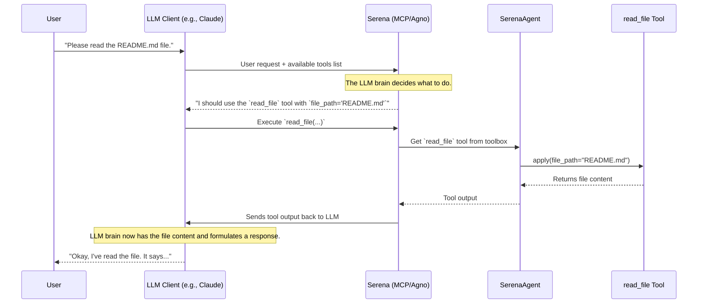

# Chapter 7: Agent Communication Protocols (MCP & Agno)

Welcome to the final chapter of our core tutorial! In the [previous chapter](06_prompting_system_.md), we learned how Serena's [Prompting System](06_prompting_system_.md) acts as a director, giving the Large Language Model (LLM) the script it needs to perform its tasks. We have all the pieces in place: an agent that can see and edit code, a toolbox full of capabilities, and a script to guide its actions.

But how does Serena actually *talk* to the LLM? How does it send the script and receive the LLM's decisions? This is the final and crucial connection that brings everything to life.

## What's the Big Idea?

Imagine you have a state-of-the-art smart home system. You have smart lights, a smart thermostat, and smart speakers. These are like Serena's tools. But to control them, you need an app on your phone.

Now, what if you have an iPhone and your friend has an Android phone? Your iPhone uses Apple's "HomeKit" protocol to talk to the smart home hub. Your friend's Android phone uses the "Google Home" protocol. The smart home hub needs to be able to speak both languages to be truly useful. It needs two different communication channels.

This is exactly the role of the **Agent Communication Protocols** in Serena. They are the communication channels that connect Serena to the "brains" of the operation—the LLM. Serena is designed to be "model-agnostic," meaning it can work with different LLMs, just like a smart hub that works with different phones.

Serena supports two main protocols, like a phone with two SIM card slots:

1.  **Model Context Protocol (MCP)**: This is one communication line, specifically designed for clients like the Claude Desktop app. It's a standardized way for an external tool (like Serena) to provide an LLM with a set of tools it can use.
2.  **Agno Integration**: This is a second, more versatile communication line. Agno is a framework that allows Serena to connect to a huge variety of LLMs, such as Google's Gemini or even local models you run on your own computer via Ollama.

The key is that Serena has special adapter modules that take its standard set of [Tools](05_tool_.md) and "translate" them into the specific format that each protocol (MCP or Agno) expects. This makes Serena incredibly flexible.

## A Concrete Example: Starting Serena in Two Different Modes

Let's see how you would start Serena to talk to two different LLMs. You don't need to understand the code in these scripts, just what they do.

### Scenario 1: Connecting to Claude via MCP

If you want to use Serena with the Claude Desktop app, you'll configure Claude to run a specific command. That command launches Serena's MCP server.

```bash
# This command starts the MCP server
uv run serena-mcp-server /path/to/myproject.yml
```

When you run this, Serena starts a "listener" that speaks the MCP language. The Claude app can then connect to this listener, send the user's chat messages, and see the list of tools Serena provides.

### Scenario 2: Connecting to Gemini via Agno

If you want to use a different model, like Gemini, you'll run a different script that uses the Agno framework.

```bash
# This command starts the Agno agent
uv run python scripts/agno_agent.py --project-file /path/to/myproject.yml
```

This script does something very similar: it starts a listener. But this listener speaks the "Agno" language. You can then connect the Agno UI (a separate web interface) to this listener, and Agno will handle the communication between Serena's tools and the Gemini API in the background.

In both cases, Serena's core logic and tools remain identical. The only thing that changes is the "adapter" used to communicate with the outside world.

## How It Works Under the Hood

No matter which protocol is used, the flow of a conversation is generally the same. The protocol acts as a messenger, ferrying information back and forth between the LLM and Serena's tools.

Let's trace a single request: a user asks Serena to read a file.


1.  **User to LLM Client**: The user types their request.
2.  **LLM Client to Serena**: The client (Claude or Agno) sends the request to Serena, along with the list of available tools Serena has provided.
3.  **LLM Decides**: The LLM analyzes the request and decides to use the `read_file` tool. It sends this decision back as a "tool use" request.
4.  **Serena Executes**: Serena receives the request, finds the `ReadFileTool` in the [SerenaAgent](03_serenaagent_.md)'s toolbox, and calls its `apply()` method.
5.  **Serena Responds**: The tool's output (the file content) is sent back to the LLM.
6.  **LLM Formulates Answer**: The LLM now has the information it needs and generates a final, human-readable answer.
7.  **Final Answer to User**: The LLM Client displays the final answer to the user.

The communication protocol is the invisible infrastructure that manages every step of this back-and-forth conversation.

### A Peek at the Code

The elegance of Serena's design is in its "adapter" modules. These modules are very thin layers that translate Serena's internal `Tool` format into the format required by the external framework (MCP or Agno).

**1. The MCP Adapter**

The `mcp.py` file contains the logic for the MCP server. Its key job is to wrap our tools.

*File: `src/serena/mcp.py`*
```python
def make_tool(tool: Tool) -> MCPTool:
    """Create an MCP-compatible Tool from our internal Tool."""
    # ... (code to get function name, docs, etc.) ...

    def execute_fn(ctx: Context, **kwargs) -> str:
        # This is the function the MCP server will call.
        # It simply calls our standard tool's execution method.
        return tool.apply_ex(log_call=True, **kwargs)

    # Wrap it all in the special MCPTool class
    return MCPTool(fn=execute_fn, ...)
```
This `make_tool` function is a translator. It takes a standard Serena `Tool` and wraps its `apply_ex` method inside a function that the `fastmcp` library understands.

**2. The Agno Adapter**

The `agno.py` file does the exact same thing, but for the Agno framework.

*File: `src/serena/agno.py`*
```python
class SerenaAgnoToolkit(Toolkit):
    def __init__(self, serena_agent: SerenaAgent):
        super().__init__("Serena")
        # Loop through all of Serena's tools
        for tool in serena_agent.tools.values():
            # And create an Agno-compatible function for each one
            self.functions[tool.get_name()] = self._create_agno_function(tool)

    @staticmethod
    def _create_agno_function(tool: Tool) -> Function:
        # This is another translator!
        # It creates a function that Agno can call.
        def entrypoint(**kwargs: Any) -> str:
            return tool.apply_ex(log_call=True, **kwargs)

        # Wrap it in Agno's `Function` class
        function = Function.from_callable(tool.get_apply_fn())
        function.entrypoint = entrypoint
        return function
```
Notice the identical pattern! The `SerenaAgnoToolkit` loops through the `SerenaAgent`'s tools and uses a helper, `_create_agno_function`, to wrap each one in the format Agno expects.

This adapter pattern is what makes Serena so powerful. The core agent logic doesn't need to know or care about MCP or Agno. It just provides a standard set of tools, and the adapters handle the translation.

## Conclusion: The Journey is Complete!

And with that, we've connected the final wire. The agent communication protocols are the bridge between Serena's powerful codebase analysis engine and the vast reasoning capabilities of modern LLMs. By using a flexible adapter pattern, Serena can speak multiple "languages" (MCP, Agno) and connect to a wide array of AI "brains."

Over the course of this tutorial, we have journeyed through the entire architecture of Serena:

1.  We started with the **[Language Server Abstraction (multilspy)](01_language_server_abstraction__multilspy__.md)**, which gives Serena its "code sense" to see and navigate code semantically.
2.  We learned how the **[Symbol and SymbolManager](02_symbol_and_symbolmanager_.md)** turn raw locations into structured objects that Serena can understand and manipulate.
3.  We saw how the **[SerenaAgent](03_serenaagent_.md)** acts as the central project manager, assembling all the components.
4.  We gave the agent a "notebook" with **[Onboarding and Memories](04_onboarding_and_memories_.md)**, allowing it to learn from its interactions.
5.  We opened the toolbox and saw how every capability is defined as a simple, extensible **[Tool](05_tool_.md)**.
6.  We learned how the **[Prompting System](06_prompting_system_.md)** provides the "script" that directs the LLM's actions.
7.  Finally, we connected Serena to the world with the **Agent Communication Protocols**.

You now have a complete, high-level understanding of how Serena works. We encourage you to explore the codebase, try building your own custom tool, and see what amazing things you can build with a truly powerful and open coding agent. Happy coding

---

Generated by [AI Codebase Knowledge Builder](https://github.com/The-Pocket/Tutorial-Codebase-Knowledge)