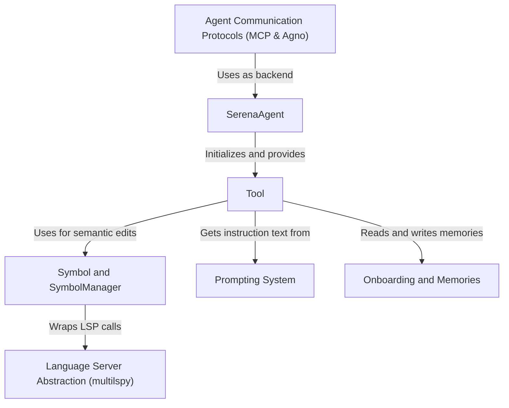

# Tutorial: serena

Serena is a **free and open-source coding agent** that connects powerful *Large Language Models (LLMs)* directly to your local codebase. Instead of the LLM just seeing text, Serena acts as a smart assistant, providing it with a toolbox of *semantic code understanding and editing capabilities*. By integrating with standard **Language Servers** (the same technology that powers IDEs), Serena allows the LLM to perform complex tasks like finding symbol definitions, locating all usages of a function, and performing precise code edits, turning any LLM into a sophisticated, project-aware developer.

**Source Repository:** [None](None)

## Chapters

1. [Language Server Abstraction (multilspy)
](01_language_server_abstraction__multilspy__.md)
2. [Symbol and SymbolManager
](02_symbol_and_symbolmanager_.md)
3. [SerenaAgent
](03_serenaagent_.md)
4. [Onboarding and Memories
](04_onboarding_and_memories_.md)
5. [Tool
](05_tool_.md)
6. [Prompting System
](06_prompting_system_.md)
7. [Agent Communication Protocols (MCP & Agno)
](07_agent_communication_protocols__mcp___agno__.md)

---

Generated by [AI Codebase Knowledge Builder](https://github.com/The-Pocket/Tutorial-Codebase-Knowledge)