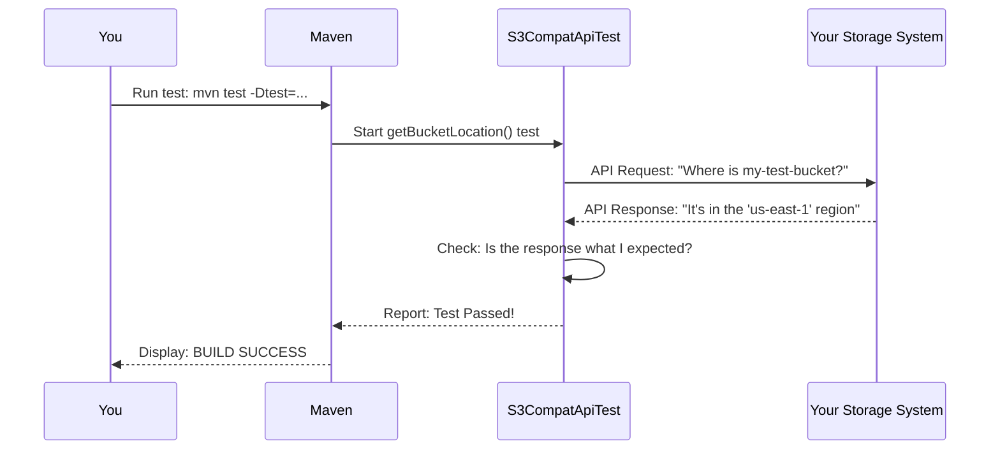

# Chapter 1: S3 Compatibility Test Suite

Welcome to the tutorial for the `snowflake-s3compat-api-test-suite`! In this first chapter, we'll explore the core purpose of this project: to act as a standardized test suite that verifies if a storage system is "S3 Compatible."

### Why Do We Need a Test Suite?

Imagine you're Snowflake, a powerful data platform. You need to load and query huge amounts of data, which are often stored in cloud object storage systems. The most popular and well-established of these is Amazon's Simple Storage Service (S3). Snowflake is built to communicate with S3 perfectly.

Now, what if you're a company with your own, on-premises storage system, or you use a different cloud provider? You want to use your storage with Snowflake, but how can Snowflake trust that your system speaks the same "language" as S3?

This is where our test suite comes in.

Think of it like a driving examiner for cars. Before a new car model is allowed on public highways, it must pass a series of standard tests: Does it accelerate correctly? Do the brakes work as expected? Can it turn safely? The examiner's job is to certify that the car is safe and predictable.

Our test suite is the "driving examiner" for storage systems. It puts your storage system through a series of standard tests to certify that it behaves just like Amazon S3, making it "safe" to be used with Snowflake.

### What Does "S3 Compatible" Really Mean?

"S3 Compatible" means that a storage system's Application Programming Interface (API) behaves identically to Amazon S3's API. An API is just a set of rules and tools for building software and applications. It's how different programs talk to each other.

Let's use an analogy. When you order a "latte" at a coffee shop, you expect a specific result: espresso, steamed milk, and a bit of foam, served in a cup. If you go to a new shop, order a "latte," and they hand you a glass of iced tea, that shop is not "latte compatible," even though they gave you a beverage.

Similarly, for a storage system to be S3 compatible, it must respond to a specific set of commands in the exact same way S3 does. Our test suite checks these commands, including:

*   `putObject`: Uploading a file.
*   `getObject`: Downloading a file.
*   `listObjectsV2`: Listing the files in a bucket (a "bucket" is like a root folder).
*   `deleteObject`: Deleting a file.
*   And several others.

If your system responds correctly to all these commands, it passes the test and is considered S3 compatible, ready for integration with Snowflake.

### Running Your First Test

Let's see how this works in practice. Once you have the project set up (we'll cover that in the next chapter), you can run a single, specific test to check one piece of functionality.

We'll try to run the `getBucketLocation` test. This simple test asks your storage system, "Which geographical region is this bucket in?"

To run just this test, you would use the following command in your terminal:

```bash
mvn test -Dtest=S3CompatApiTest#getBucketLocation
```

Let's break that down:
*   `mvn test`: This is the command that tells our build tool, Maven, to start running tests.
*   `-Dtest=S3CompatApiTest#getBucketLocation`: This is a special instruction. Instead of running all tests, it tells Maven to only run the test named `getBucketLocation` from our main test file.

When you run this, the test suite will send a request to your storage system. If your system gives the correct answer in the expected format, you'll see a success message. If not, it will fail and tell you what went wrong.

### Under the Hood: What Just Happened?

When you ran that command, a few things happened in sequence. The process looks like this:

1.  **You** tell **Maven** to run the specific test.
2.  **Maven** starts our **Test Suite**.
3.  The **Test Suite** sends an API request to **Your Storage System**, asking for the bucket's location.
4.  **Your Storage System** sends a response back.
5.  The **Test Suite** checks if the response is exactly what Amazon S3 would have sent.
6.  The **Test Suite** reports "Pass" or "Fail" back to you.

Here is a diagram illustrating that flow:



This simple loop of "send request -> receive response -> check for correctness" is the fundamental principle behind the entire test suite.

### Conclusion

In this chapter, you've learned the "what" and "why" of the S3 Compatibility Test Suite. It's a validation tool that acts like an examiner, ensuring a storage system's API behaves just like Amazon S3. This compatibility is a critical prerequisite for seamless integration with Snowflake.

We've only scratched the surface. To actually run these tests, you first need to configure the test suite to point to your storage system. In the next chapter, we'll do just that.

Next up: [Test Environment Configuration](02_test_environment_configuration_.md)

---

Generated by [AI Codebase Knowledge Builder](https://github.com/The-Pocket/Tutorial-Codebase-Knowledge)