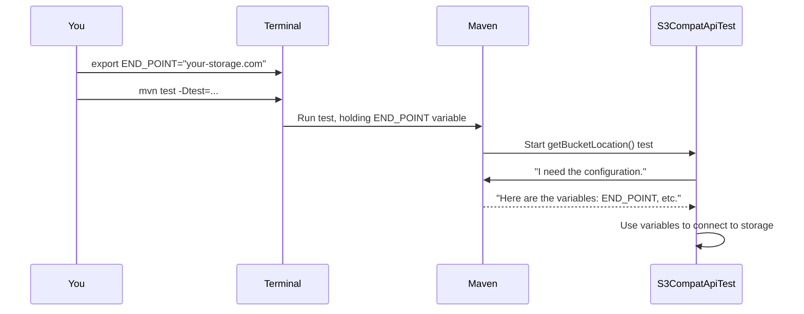

# Chapter 2: Test Environment Configuration

In the [previous chapter](01_s3_compatibility_test_suite_.md), we learned that this project is like a "driving examiner" for your storage system. We even ran a sample test command. But something was missing: How does the test suite know *which* storage system to test?

This chapter will answer that question. Before a self-driving car can begin its test drive, you need to give it two crucial things: a destination address and the keys to the car. Similarly, before our test suite can run, we must provide it with the "address" of your storage system and the "keys" to access it. This is the **Test Environment Configuration**.

### The "Address" and "Keys" for Your Storage

To connect to your storage system, the test suite needs a few key pieces of information. Think of them as the coordinates for a GPS and the security credentials to get inside. The most important ones are:

*   `END_POINT`: This is the main URL or web address of your storage system. It's the front door that all requests will go to.
*   `BUCKET_NAME_1`: A "bucket" is the main container for your files, like a top-level folder. We need the name of a specific bucket to run our tests in.
*   `S3COMPAT_ACCESS_KEY`: This is like a username. It's a public key that identifies who is making the request.
*   `S3COMPAT_SECRET_KEY`: This is the matching password for the access key. It's a secret that proves you are who you say you are.
*   `REGION_1`: The geographical region where your bucket is located, for example, `us-east-1`.

Without this information, the test suite is like a car with no destination and no keys—it can't go anywhere or do anything.

### How to Provide the Configuration

There are two common ways to give this information to the test suite. You can choose whichever one is more convenient for you.

#### Method 1: Environment Variables (The "Set It and Forget It" Approach)

You can set these values as "environment variables" in your terminal. This is like saving a "Home" address in your car's navigation system. Once you set them, they stick around for your entire terminal session, and you don't have to type them again for each command.

You use the `export` command to set them.

```bash
# The address of your storage system's API
export END_POINT="your-storage-system.company.com"

# Your username and password
export S3COMPAT_ACCESS_KEY="YOUR_ACCESS_KEY_HERE"
export S3COMPAT_SECRET_KEY="YOUR_VERY_SECRET_KEY_HERE"

# The bucket and region to test against
export BUCKET_NAME_1="my-test-bucket"
export REGION_1="us-west-2"
```
After running these commands, you can simply run your test, and the suite will automatically pick up these values.

```bash
# The test suite now knows where to go!
mvn test -Dtest=S3CompatApiTest#getBucketLocation
```
This command now has all the information it needs to connect to `your-storage-system.company.com`, use your keys, and ask for the location of `my-test-bucket`.

#### Method 2: Command-Line Arguments (The "One-Time Trip" Approach)

What if you want to test a different endpoint or use a different set of keys just once, without changing your saved "Home" address? You can provide the configuration directly in the `mvn` command line.

This is like typing a specific destination into your car's GPS for a single trip. These values are used for this one command only.

You pass them using the `-D` flag, like so:

```bash
mvn test -Dtest=S3CompatApiTest#getBucketLocation \
  -DEND_POINT="your-storage-system.company.com" \
  -DBUCKET_NAME_1="my-test-bucket" \
  -DS3COMPAT_ACCESS_KEY="YOUR_ACCESS_KEY" \
  -DS3COMPAT_SECRET_KEY="YOUR_SECRET_KEY" \
  -DREGION_1="us-west-2"
```
Notice that we are providing the exact same information, just in a different way. This is perfect for quick, one-off tests or for automated scripts where setting environment variables isn't practical.

### Under the Hood: How Configuration Works

When you run `mvn test`, the very first thing the test suite does—before sending a single request to your storage—is to look for its configuration. It's programmed to check for these specific variables.

1.  The test suite code needs to know the endpoint.
2.  It first checks if a command-line argument like `-DEND_POINT` was provided.
3.  If not, it then checks for an environment variable named `END_POINT`.
4.  Once it finds the value, it uses it to create an S3 client, which is the component responsible for communicating with your storage system.
5.  It repeats this process for the bucket name, keys, and region.

Here is a simplified diagram of that flow:



This simple but crucial step ensures that all subsequent tests are aimed at the correct target. If you ever see an error message about a missing "endpoint" or "access key," it almost always means that the test environment configuration wasn't set up correctly.

### Conclusion

You've now learned the second fundamental concept of our project: **Test Environment Configuration**. You know what information the test suite needs to connect to a storage system and the two ways to provide it: environment variables for persistent settings and command-line arguments for one-off tests.

With our "driving examiner" test suite configured and pointed at the right car, we're ready to start the actual examination. In the next chapter, we'll explore the specific tests that make up the core of the suite.

Next up: [API Functional Validation](03_api_functional_validation_.md)

---

Generated by [AI Codebase Knowledge Builder](https://github.com/The-Pocket/Tutorial-Codebase-Knowledge)