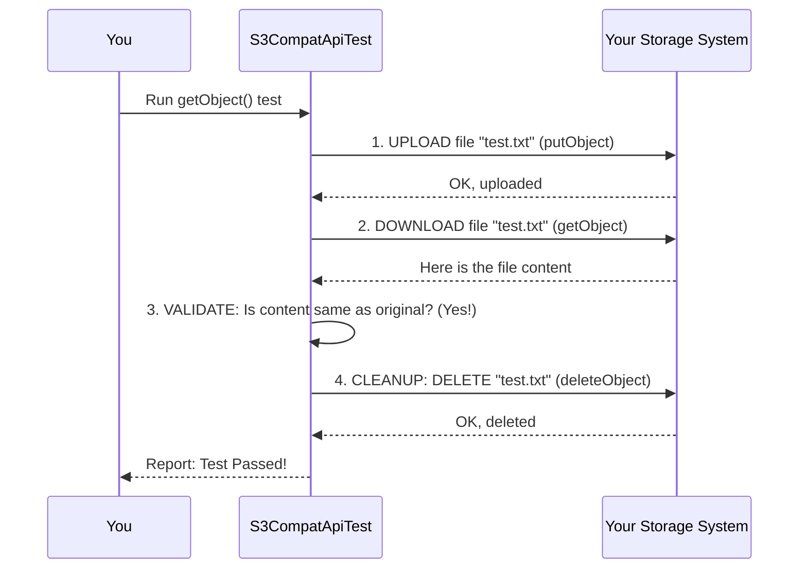

# Chapter 3: API Functional Validation

In the [previous chapter](02_test_environment_configuration_.md), we learned how to perform the crucial first step: giving our test suite the "address" and "keys" to your storage system. We've pointed our driving examiner at the right car and given them the keys. Now, it's time to start the actual driving test.

This chapter covers the heart of the project: the specific tests that verify if your storage system works correctly. This is **API Functional Validation**.

### The Inspector's Checklist

Imagine our driving examiner has a clipboard with a long checklist. It doesn't just say "Car drives." It has very specific items:
*   ✅ Brakes engage within 3 meters at 30 km/h.
*   ✅ Headlights turn on and are aimed correctly.
*   ✅ Windshield wipers clear the glass effectively.
*   ✅ Horn makes a sound.

API Functional Validation is our test suite's version of this checklist. It doesn't just check if your storage system is "on." It checks that each individual API command behaves *exactly* as expected, just like Amazon S3.

Each S3 command, like `putObject` (uploading a file) or `getObject` (downloading a file), is a "function" your storage system must perform. Our tests "validate" that these functions work perfectly.

This includes checking:
*   **Successful Operations:** If we upload a file, is it stored correctly? If we download it, is the content identical?
*   **Responses:** Does the system send back the right confirmation messages and headers? For example, S3 sends back a special checksum (an "ETag") after an upload to verify the file's integrity. Our test checks for this.
*   **Error Handling:** What happens if we try to download a file that doesn't exist? A compatible system must return a `404 Not Found` error, not a different error or a system crash. This is called "negative testing," and it's just as important.

### Running a Functional Test

Let's run a test for one of the most common S3 functions: `getObject`. This test will first upload a small, temporary file and then try to download it, checking if the contents match.

Make sure your environment is configured as we discussed in the last chapter. Then, run this command in your terminal:

```bash
mvn test -Dtest=S3CompatApiTest#getObject
```
Let's break that down:
*   `mvn test`: The standard command to run tests.
*   `-Dtest=S3CompatApiTest#getObject`: This is our filter. It tells Maven to run *only* the test method named `getObject` inside our main test file, `S3CompatApiTest`.

If your storage system's `getObject` API is working correctly, you will see a `BUILD SUCCESS` message. This confirms that one item on our inspector's checklist has been ticked off!

You can do this for any API function we support. For instance, to test the function that lists files in a bucket (`listObjectsV2`), you would run:

```bash
mvn test -Dtest=S3CompatApiTest#listObjectsV2
```

### Under the Hood: What a Test Really Does

When you ran the `getObject` test, it performed a sequence of actions to ensure a thorough validation. It's not as simple as just asking for a file.

Here is the step-by-step flow of what happened behind the scenes:

1.  **Setup:** The test creates a small, temporary file with known content (e.g., a text file containing "hello world").
2.  **Act (Upload):** It sends a `putObject` request to your storage system to upload this temporary file.
3.  **Act (Download):** It then immediately sends a `getObject` request for that same file.
4.  **Validate:** It receives the downloaded file and compares its content to the original "hello world". Are they identical?
5.  **Cleanup:** Whether the test passed or failed, it sends a `deleteObject` request to remove the temporary file, leaving your bucket clean.
6.  **Report:** It reports "Pass" or "Fail" based on the validation step.

This "Setup -> Act -> Validate -> Cleanup" cycle is a standard pattern for reliable testing.

Here’s a diagram illustrating the process:



This simple loop ensures that the `getObject` function is truly working as part of a realistic workflow. Every test in our suite follows a similar, careful logic to validate its specific API function.

### Conclusion

In this chapter, you've learned about the core purpose of the test suite: **API Functional Validation**. You now understand that it's like a detailed inspector's checklist, where each test validates a specific S3 command like `getObject` or `listObjectsV2`. You've seen how to run these individual tests and what they do under the hood to ensure your storage system behaves just like Amazon S3.

Now that we've confirmed your system's features work *correctly*, a new question arises: how *well* do they work? Are they fast and efficient enough for Snowflake's demanding workloads? The next chapter will show you how to answer that.

Next up: [Performance Statistics Collection](04_performance_statistics_collection_.md)

---

Generated by [AI Codebase Knowledge Builder](https://github.com/The-Pocket/Tutorial-Codebase-Knowledge)