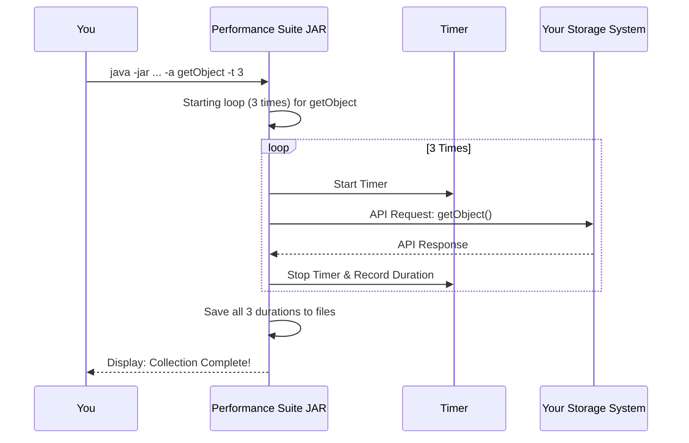

# Chapter 4: Performance Statistics Collection

In the [previous chapter on API Functional Validation](03_api_functional_validation_.md), we learned how to check if your storage system's API works *correctly*. We acted like a driving examiner with a checklist, making sure every function, from turning on the headlights to hitting the brakes, worked as expected. Your system passed!

But now, a new question arises. Your car is certified to be on the road, but is it ready for a race? Knowing that the brakes work is one thing; knowing how *fast* they work, over and over again, is another. This is where **Performance Statistics Collection** comes in.

### Why Measure Performance?

Just being "correct" isn't enough for a high-performance system like Snowflake, which moves massive amounts of data. The connection to your storage system needs to be not only reliable but also fast and efficient.

Think of it like timing a professional sprinter. You wouldn't just time them once. You'd time them over multiple runs to understand their:
*   **Average Speed:** What's their typical time?
*   **Consistency:** Do they run at a steady pace, or are some runs much slower than others?
*   **Best Performance:** What's their personal best?

Our test suite does the same for your storage API. It runs the same command—like `getObject`—in a loop, timing each run with a precise "stopwatch." This helps you answer critical questions:
*   "How long does it take to download a file on average?"
*   "Is the upload speed consistent, or does it sometimes slow down?"
*   "Can my system handle many requests quickly?"

### How to Collect Performance Statistics

Collecting performance data uses a slightly different command than the functional tests we ran before. Instead of using `mvn test`, we run the compiled test suite directly as a Java application.

Make sure your [Test Environment Configuration](02_test_environment_configuration_.md) is still set up (e.g., `END_POINT`, `S3COMPAT_ACCESS_KEY`, etc.).

#### 1. Running a Default Performance Test

To collect performance stats for all supported APIs, with each one running 20 times, navigate to the `s3compatapi` folder and run this simple command:

```bash
java -jar target/snowflake-s3compat-api-tests-1.0-SNAPSHOT.jar
```
This command tells the application to:
1.  Connect to your storage system.
2.  Run the `getBucketLocation` test 20 times and record the timings.
3.  Run the `getObject` test 20 times and record the timings.
4.  ...and so on for all other APIs.
5.  Save all the results into new files.

#### 2. Running a Custom Performance Test

What if you only care about `getObject` and `putObject`, and you want to test them 10 times each? You can customize the run with special arguments.

```bash
java -jar target/snowflake-s3compat-api-tests-1.0-SNAPSHOT.jar -a getObject,putObject -t 10
```
Let's break down those new flags:
*   `-a getObject,putObject`: The `-a` stands for "APIs." It tells the suite to *only* test `getObject` and `putObject`.
*   `-t 10`: The `-t` stands for "times." It sets the number of loops (iterations) to 10 instead of the default 20.

### Understanding the Output: The Data Files

After the command finishes, you will see new files created in your directory. These files contain the precious timing data you just collected. They will typically be named something like `s3compat-perf-....tsdb2` and `s3compat-perf-....txt`.

*   **The `.txt` file:** This is a simple, human-readable file. You can open it in any text editor to see the raw results and a summary. It's great for a quick look.

*   **The `.tsdb2` file:** This is a special, binary file designed for time-series data. It's not human-readable but is perfect for feeding into visualization tools to create graphs and charts, which makes it much easier to spot trends and outliers.

### Under the Hood: The Sprinter's Training Log

What exactly happens when you run the performance collection command? Let's follow the process.

1.  **Warm-up:** The application starts and reads its configuration to know which storage system to connect to.
2.  **Choose the Drill:** It checks which APIs to test (e.g., `getObject`, from the `-a` flag) and how many laps to run (e.g., `10`, from the `-t` flag).
3.  **Start the Timer:** It begins a loop for the first API, `getObject`.
4.  **Run the Laps:** Inside the loop, for each of the 10 laps, it:
    a. Starts a high-precision timer.
    b. Sends the `getObject` request to your storage system.
    c. Waits for the response.
    d. Stops the timer and records the exact duration.
5.  **Log the Results:** After all 10 laps for `getObject` are complete, it saves all 10 recorded times into the `.tsdb2` and `.txt` files.
6.  **Repeat:** It moves on to the next API in the list (`putObject`) and repeats the entire process.

Here is a diagram of the workflow for a single API:



This systematic, repetitive process is what allows the suite to build a reliable performance profile of your storage system's API.

### Conclusion

In this chapter, you've moved beyond simple correctness to the exciting world of performance testing. You've learned how to measure the speed and consistency of your storage API by running commands in a loop, just like timing a sprinter. You now know how to run these tests and where to find the resulting `.tsdb2` and `.txt` data files.

This performance data is invaluable for ensuring your system is robust enough for demanding, real-world applications. But how does this whole test suite—with its functional tests, performance collectors, and dependencies—get put together? In the next chapter, we will peek behind the curtain to understand the project's foundation.

Next up: [Build & Dependency Management](05_build___dependency_management_.md)

---

Generated by [AI Codebase Knowledge Builder](https://github.com/The-Pocket/Tutorial-Codebase-Knowledge)