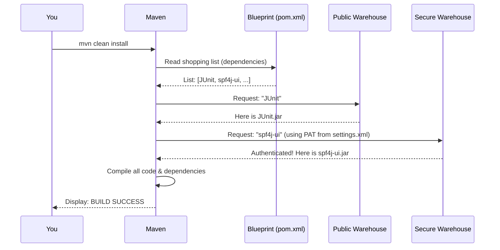

# Chapter 5: Build & Dependency Management

In the previous chapter on [Performance Statistics Collection](04_performance_statistics_collection_.md), we learned how to measure the speed and efficiency of your storage API. We've run functional tests, and we've run performance tests. But we've skipped a critical, one-time-only first step: how is the test suite application itself put together?

This chapter covers the initial setup required to "assemble" or **build** the project. Think of it like this: before you can drive a car, someone has to build it in a factory. This is the factory assembly step for our test suite.

### The Project Blueprint and Its Parts

Every complex machine is built from a blueprint and a list of parts. Our project is no different.
*   **The Blueprint:** Our project's blueprint is a file named `pom.xml`.
*   **The Factory Manager:** Our factory manager is a tool called **Maven**. Maven reads the `pom.xml` blueprint to understand what to do.
*   **The Parts:** The parts are called **dependencies**. These are pre-built pieces of code (libraries) that our project needs to function. For example, we use a dependency to help us talk to S3 APIs and another to help us run tests.

Maven's job is to read the blueprint, find all the required parts from various warehouses, and assemble them into our final, runnable test suite (`.jar` file).

### The Special Part from a Secure Warehouse

Most of our project's parts (dependencies) are standard and can be found in a huge, public warehouse called "Maven Central." Maven knows how to go there automatically to get what it needs.

However, our project requires one very special part: a modified version of a library called `spf4j-ui`. This part is not in the public warehouse. We keep it in our own private, secure warehouse: **GitHub Packages**.

To get a part from a secure warehouse, you can't just walk in. You need a special keycard to prove you have permission. This is the core challenge of our build process.

To build our project, you must:
1.  Get a "keycard" (a GitHub Personal Access Token).
2.  Show this keycard to Maven so it can access the secure warehouse.

Let's walk through how to do this.

### Step 1: Get Your "Keycard" - A GitHub Personal Access Token

A Personal Access Token (or PAT) is like a special-purpose password that you can give to applications like Maven. It's much safer than using your actual GitHub password. We need to create a PAT that gives Maven permission to *read* packages from our GitHub warehouse.

1.  Go to your GitHub settings.
2.  Navigate to `Developer settings` -> `Personal access tokens` -> `Tokens (classic)`.
3.  Click "Generate new token" and select "Generate new token (classic)".
4.  Give it a descriptive name, like `maven-s3-test-suite`.
5.  Set the expiration date.
6.  In the "Select scopes" section, check the box for **`read:packages`**. This is the most important step! It grants read-only access to GitHub Packages.
7.  Click "Generate token" and **copy your new token immediately**. You won't be able to see it again!

You now have your keycard!

### Step 2: Configure Maven's "Key Fob" - The `settings.xml` file

Now you have a keycard, but Maven doesn't know about it. We need to put this keycard on Maven's "key fob" so it can use it automatically. Maven's key fob is a configuration file located at `~/.m2/settings.xml`. (If this file or the `.m2` directory doesn't exist, you can create it).

Add the following block inside the `<servers>` section of your `settings.xml` file.

```xml
<server>
  <id>github</id>
  <username>YOUR_GITHUB_USERNAME</username>
  <password>YOUR_PERSONAL_ACCESS_TOKEN</password>
</server>
```

Let's break this down:
*   `<id>github</id>`: This is a nickname for the secure warehouse. Our project's blueprint (`pom.xml`) will tell Maven, "Hey, for the part I need, go to the warehouse nicknamed `github`."
*   `<username>...</username>`: Put your actual GitHub username here.
*   `<password>...</password>`: Paste the Personal Access Token you just generated here.

Now, when Maven is told to get a part from the `github` warehouse, it will look in this file, find the matching keycard, and use it to log in.

### Step 3: Run the Assembly Line - `mvn clean install`

With the configuration complete, you are finally ready to build the project. Navigate to the project's root directory in your terminal and run the following command:

```bash
mvn clean install -DskipTests
```

This command tells our factory manager, Maven, to do the following:
*   `clean`: "Clear the workbench." This deletes any old parts or previous assemblies.
*   `install`: "Start the assembly line." This is the main command that downloads dependencies, compiles the code, and packages it into a runnable application.
*   `-DskipTests`: "Don't run the driving test yet." This flag tells Maven to just build the application but not to run the [API Functional Validation](03_api_functional_validation_.md) tests during the build. We'll run those ourselves later.

If everything is configured correctly, Maven will download all the parts (including the special one from GitHub Packages) and you'll see a final `BUILD SUCCESS` message.

### Under the Hood: Maven's Shopping Trip

When you run `mvn clean install`, a quick and complex sequence of events happens. Here's a simplified look at Maven's "shopping trip" for dependencies.

1.  **You** tell **Maven** to start the build.
2.  **Maven** reads the project **Blueprint (`pom.xml`)** to get its shopping list of dependencies.
3.  For a standard part like "JUnit," the blueprint doesn't specify a warehouse, so Maven goes to the **Public Warehouse (Maven Central)** and downloads it.
4.  For our special part, `spf4j-ui`, the blueprint says, "This part is in the warehouse named `github`."
5.  Maven checks its `settings.xml` file for a server with the `id="github"`. It finds your username and Personal Access Token.
6.  Maven goes to the **Secure Warehouse (GitHub Packages)** and presents your token as its keycard.
7.  GitHub Packages validates the keycard and gives Maven the special part.
8.  Once all parts are downloaded, Maven assembles the final product.

Here is a diagram of that process:



### Conclusion

In this chapter, you've learned about the one-time setup process of **Build & Dependency Management**. You now understand that Maven acts as our project's factory manager, using the `pom.xml` blueprint to assemble our test suite. Most importantly, you know how to configure Maven with a GitHub Personal Access Token to download special dependencies from a secure repository.

With the test suite fully built and assembled, we can explore its final capability: ensuring your storage system meets important security standards.

Next up: [Security & Compliance Checks](06_security___compliance_checks_.md)

---

Generated by [AI Codebase Knowledge Builder](https://github.com/The-Pocket/Tutorial-Codebase-Knowledge)