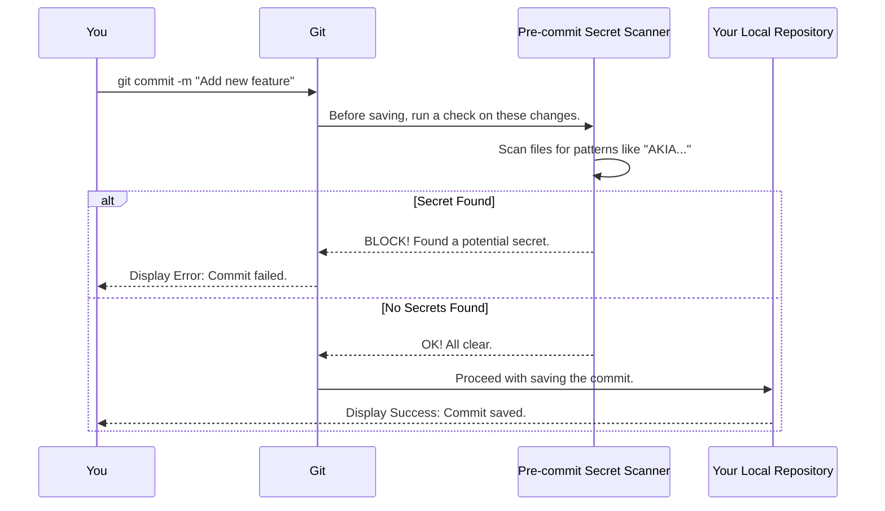
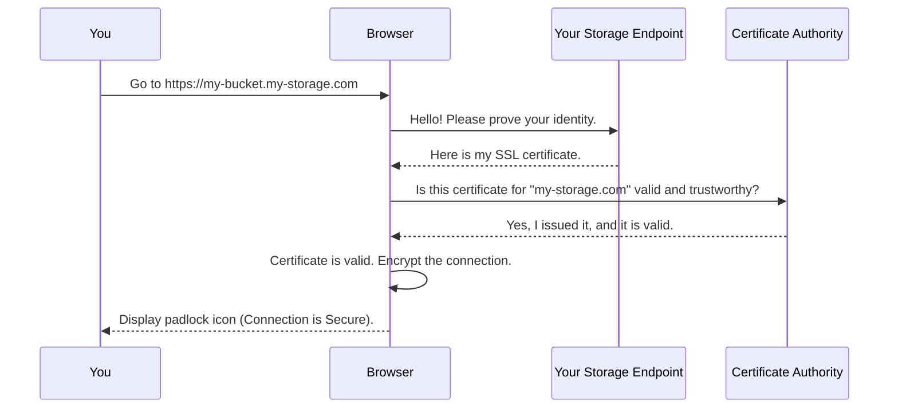

# Chapter 6: Security & Compliance Checks

In the [previous chapter on Build & Dependency Management](05_build___dependency_management_.md), you learned how to be a factory manager, assembling our entire test suite from its blueprint and parts. The application is now built and ready. But before we use it in a real-world setting, we need to talk about safety and security. It's not enough for our tools to work well; they must also work *safely*.

This chapter covers the crucial security guardrails built into and around our project: **Security & Compliance Checks**.

### Why We Need Security Checks

Imagine you're setting up the test suite. You copy and paste your credentials—including your secret access key—into a temporary file for convenience. Later, you forget to remove it and accidentally try to save this file to a public code repository like GitHub. If that happens, your secret key is exposed to the world, and malicious actors could use it to access your data. This is a major security breach.

How can we prevent accidents like this? This is where our security checks come in.

Think of it like securing your house. You have two lines of defense:
1.  **An automatic alarm system:** This system is always on. If an intruder (like an accidentally committed secret key) tries to get in, the alarm sounds, and the entry is blocked *automatically*.
2.  **A final manual check:** Before you leave, you walk around and manually check that all doors and windows are securely locked.

Our project uses both of these approaches to keep you and your data safe.

### Concept 1: The Automated Security Alarm (Pre-commit Hook)

The first line of defense is an automated scanner that checks your work *before* you save it to the project's history. In the world of Git (the version control system we use), saving your work is called a "commit." A "pre-commit hook" is a small program that runs automatically right before a commit is finalized.

Our project is configured with a pre-commit hook that acts as a **secret scanner**.

*   **What it does:** It scans any changes you are about to save.
*   **What it looks for:** It searches for text patterns that look like secret keys, access tokens, or passwords.
*   **What happens if it finds something:** It blocks the commit from happening and shows you an error message, preventing the secret from ever being saved in the project's history.

This is your automatic security alarm. It's always on, protecting you from common mistakes without you having to think about it.

### Concept 2: The Manual Lock Check (SSL Certificate Verification)

The second line of defense is a manual but vital compliance check. Your test suite communicates with your storage endpoint over the internet. How do you know that connection is secure and that you're talking to the real server, not an imposter?

This is where **SSL certificates** come in. An SSL certificate is like an official, government-issued ID for a website or server. It proves two things:
1.  **Identity:** The server is who it claims to be.
2.  **Encryption:** The connection between you and the server is scrambled (encrypted), so no one can eavesdrop.

Our test suite requires that your storage endpoint has a valid SSL certificate. This is a manual check you must perform to ensure you're compliant with security best practices. It's like walking up to the front door of your storage system and checking that it has a strong, certified lock.

#### How to Perform the SSL Check

This is a simple check you can do in your web browser. Follow these steps:
1.  Construct a "host-style" URL for your bucket. It looks like this: `https://<YOUR_BUCKET_NAME>.<YOUR_END_POINT>`
2.  Paste this URL into your browser's address bar and press Enter.
3.  Look for a **padlock icon** in the address bar. Click on it.
4.  You should see a message confirming the connection is secure and the certificate is valid.

If the certificate is valid, you'll see something like this:


If it is invalid or missing, your browser will show a prominent warning:


Ensuring you have a valid certificate is a critical step before using your storage with Snowflake.

### Under the Hood: How the Checks Work

Let's peek behind the curtain to see how these two security mechanisms operate.

#### The Pre-commit Hook

When you type `git commit` in your terminal, Git doesn't immediately save your files. It first triggers our pre-commit hook.


This entire process is defined in a simple configuration file in our project called `.pre-commit-config.yaml`.

```yaml
# File: .pre-commit-config.yaml
repos:
- repo: git@github.com:snowflakedb/casec_precommit.git
  rev: v1.5
  hooks:
  - id: secret-scanner
```
This file tells the pre-commit framework:
*   `repo`: Go to this specific GitHub repository to get the security tool.
*   `id: secret-scanner`: From that repository, use the tool named `secret-scanner`.

#### The SSL Certificate Check

When you check the SSL certificate in your browser, a process called an "SSL Handshake" happens in milliseconds.


The "Certificate Authority" (CA) is a globally trusted organization (like Verisign or Let's Encrypt) that issues and verifies these digital IDs. Your browser has a built-in list of these trusted authorities.

### Conclusion

Congratulations! You have completed the entire tutorial for the `snowflake-s3compat-api-test-suite`.

In this final chapter, you've learned about the two critical layers of security that protect the project: an **automated pre-commit hook** that acts like a security alarm to prevent accidental secret leaks, and a **manual SSL certificate check** that acts as a final inspection to ensure your connection is secure and compliant.

Over the course of this tutorial, you've gone from zero to hero. You've learned:
*   **Chapter 1:** What an S3 Compatibility Test Suite is and why it's needed.
*   **Chapter 2:** How to configure the test environment with your endpoint and keys.
*   **Chapter 3:** How to run functional tests to validate your API's correctness.
*   **Chapter 4:** How to collect performance statistics to measure your API's speed.
*   **Chapter 5:** How the project is built and its dependencies are managed.
*   **Chapter 6:** How security and compliance are maintained.

You are now fully equipped to use this test suite to validate your storage system, measure its performance, and ensure it's ready for seamless and secure integration with Snowflake. For further details and troubleshooting, always refer to the project's `README.md` and the official Snowflake documentation. Happy testing

---

Generated by [AI Codebase Knowledge Builder](https://github.com/The-Pocket/Tutorial-Codebase-Knowledge)