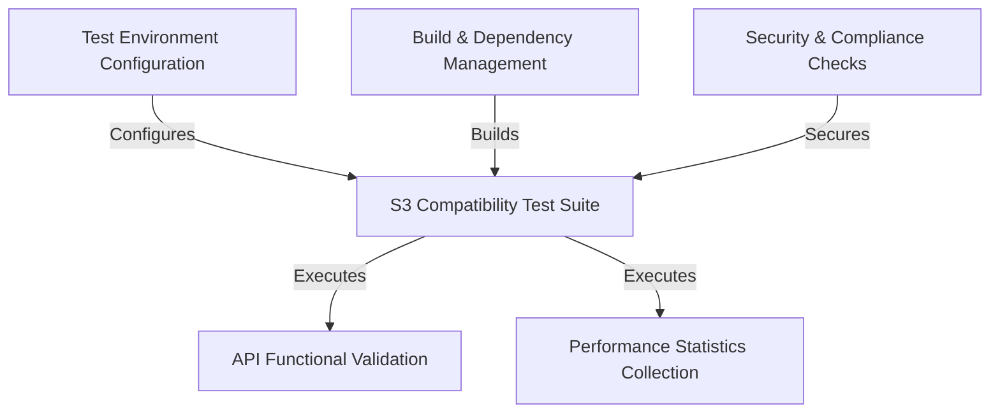

# Tutorial: snowflake-s3compat-api-test-suite

This project is a **test suite** designed by Snowflake to help storage vendors verify that their systems are *compatible with Amazon S3*. By running a series of automated checks, it validates that essential API functions work correctly and also measures their performance. Successfully passing these tests is a key step for ensuring a storage system can be integrated with the **Snowflake Data Cloud**.

**Source Repository:** [None](None)

## Chapters

1. [S3 Compatibility Test Suite
](01_s3_compatibility_test_suite_.md)
2. [Test Environment Configuration
](02_test_environment_configuration_.md)
3. [API Functional Validation
](03_api_functional_validation_.md)
4. [Performance Statistics Collection
](04_performance_statistics_collection_.md)
5. [Build & Dependency Management
](05_build___dependency_management_.md)
6. [Security & Compliance Checks
](06_security___compliance_checks_.md)

---

Generated by [AI Codebase Knowledge Builder](https://github.com/The-Pocket/Tutorial-Codebase-Knowledge)