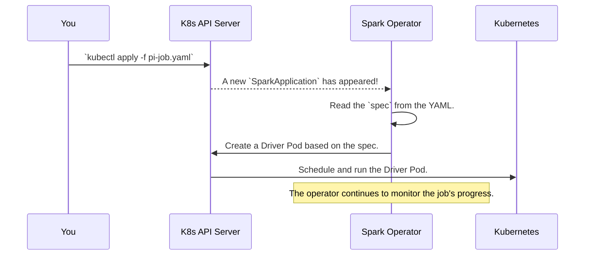

# Chapter 1: Custom Resources (CRDs): `SparkApplication` & `SparkCluster`

Welcome to the `spark-kubernetes-operator` tutorial! If you've ever wanted to run Apache Spark jobs on Kubernetes but felt overwhelmed by the complexity, you're in the right place. This operator is designed to make your life much, much easier.

In this first chapter, we'll start with the most fundamental concept: how you tell the operator *what* you want to run.

### The Problem: Running Spark is Complicated!

Imagine you have a simple Spark script. To run it on Kubernetes, you'd normally need to:
- Build a custom Docker image with your Spark code.
- Manually create Kubernetes configurations for the Spark driver pod.
- Figure out how to create and manage the Spark executor pods.
- Configure networking, storage, and permissions.

That's a lot of work just to run a single job! The `spark-kubernetes-operator` solves this by giving you a much simpler way to describe your Spark workload.

### The Solution: Simple "Order Forms" for Spark

Let's use an analogy. Think of your Kubernetes cluster as a massive, powerful restaurant kitchen. The `spark-kubernetes-operator` is the master chef working in that kitchen.

You, the customer, don't need to know how the ovens work or how to chop vegetables. You just need to fill out an order form.

The `spark-kubernetes-operator` gives you two special "order forms":

1.  **`SparkApplication`**: This is like ordering a specific dish from the menu. You use it to define a single Spark job that will start, run to completion, and then shut down. Perfect for batch processing, ETL jobs, or model training.
2.  **`SparkCluster`**: This is like booking the entire kitchen for a private party. You use it to create a long-running, standalone Spark cluster (a master and some workers) that stays active. You can then submit many jobs to this cluster interactively.

These "order forms" are technically called **Custom Resources** in Kubernetes. Let's see what they look like.

---

### `SparkApplication`: Ordering a Single Spark Job

Let's say we want to run the classic "Calculate Pi" example. Instead of writing complex Kubernetes manifests, we just fill out a simple `SparkApplication` YAML file.

**`pi-job.yaml`**
```yaml
apiVersion: spark.apache.org/v1alpha1
kind: SparkApplication
metadata:
  name: spark-pi
spec:
  image: apache/spark:4.0.0
  mainClass: org.apache.spark.examples.SparkPi
  mainApplicationFile: "local:///opt/spark/examples/jars/spark-examples_2.13-4.0.0.jar"
  driver:
    cores: 1
  executor:
    instances: 2
    cores: 1
```

Let's break down this order form:

*   `kind: SparkApplication`: This tells Kubernetes we're ordering a single Spark job.
*   `metadata.name: spark-pi`: We're naming our order "spark-pi".
*   `spec.image`: This is the container image that has Spark pre-installed.
*   `spec.mainClass` & `spec.mainApplicationFile`: This tells Spark which code to run.
*   `spec.driver` & `spec.executor`: This specifies the resources. "Chef, please give the main cook (driver) 1 CPU core, and give the 2 kitchen helpers (executors) 1 core each."

To submit this order, you just run one command:
```bash
kubectl apply -f pi-job.yaml
```

**What happens next?**
The operator (our chef) sees your order, reads the `spec`, and automatically handles all the complicated Kubernetes steps to run your job. You don't have to worry about creating pods or services yourself!

---

### `SparkCluster`: Setting Up a Persistent Spark Environment

Now, imagine your team needs a shared Spark environment that's always on, ready for quick experiments. For this, you'd use the `SparkCluster` order form.

**`my-persistent-cluster.yaml`**
```yaml
apiVersion: spark.apache.org/v1alpha1
kind: SparkCluster
metadata:
  name: prod-cluster
spec:
  image: apache/spark:4.0.0
  master:
    cores: 1
  worker:
    instances: 3
    cores: 1
```

This is even simpler!

*   `kind: SparkCluster`: We're ordering a persistent cluster.
*   `metadata.name: prod-cluster`: The name of our cluster.
*   `spec.master` & `spec.worker`: We're asking for one master node and three worker nodes, each with 1 CPU core.

You apply it just like before:
```bash
kubectl apply -f my-persistent-cluster.yaml
```

**What happens next?**
The operator sees this order and builds a durable Spark environment for you inside Kubernetes. It creates a master pod and three worker pods that will keep running until you decide to delete the `SparkCluster`. Your team can now connect to this cluster and submit jobs whenever they want.

---

### Under the Hood: From YAML to Running Pods

So how does this magic actually work? It's a collaboration between you, Kubernetes, and the operator.

1.  When you run `kubectl apply`, you send your YAML "order form" to the Kubernetes API Server.
2.  The `spark-kubernetes-operator`, which is always running and watching, gets a notification: "A new `SparkApplication` has been created!"
3.  The operator reads your `spec` to understand your requirements (image, resources, etc.).
4.  It then translates your simple request into the complex, low-level Kubernetes resources (like `Pods`, `Services`, and `ConfigMaps`) that are needed to actually run Spark.
5.  Kubernetes takes those low-level resources and runs them on your cluster.

Here is a simplified view of the process:



The Java code that defines these "order forms" is surprisingly straightforward. These are called **Custom Resource Definitions (CRDs)**.

For example, this is the core definition for `SparkApplication` in the operator's code.

**File:** `spark-operator-api/src/main/java/org/apache/spark/k8s/operator/SparkApplication.java`
```java
// ... imports ...
@ShortNames({"sparkapp"})
public class SparkApplication
    extends BaseResource<
        // ... generic types for status and spec ...
        ApplicationSpec,
        ApplicationStatus> {
  // ... methods ...
}
```
This Java class directly corresponds to the `SparkApplication` YAML we write. The `@ShortNames({"sparkapp"})` annotation is a neat trick that lets us use the shorter `kubectl get sparkapp` command!

The `spec` section of our YAML is defined by another class.

**File:** `spark-operator-api/src/main/java/org/apache/spark/k8s/operator/spec/ApplicationSpec.java`
```java
public class ApplicationSpec extends BaseSpec {
  protected String mainClass;
  @Required protected RuntimeVersions runtimeVersions;
  protected String jars;
  // ... many other fields for configuration ...
  protected BaseApplicationTemplateSpec driverSpec;
  protected BaseApplicationTemplateSpec executorSpec;
}
```
As you can see, fields like `mainClass`, `driverSpec`, and `executorSpec` in this Java code map directly to the keys you use in your YAML file. The operator uses these classes to parse your YAML and understand exactly what you want it to do.

---

### Conclusion

You've just learned the most important concept of the `spark-kubernetes-operator`!

*   You don't interact with low-level Kubernetes objects directly.
*   Instead, you declare your intent using high-level **Custom Resources**.
*   Use `SparkApplication` for single, self-contained jobs.
*   Use `SparkCluster` for persistent, multi-job environments.

These CRDs are the "what"—they describe the desired state of your Spark workload. The operator is the "how"—it's the active component that makes your desired state a reality.

Now that we understand the "order forms", let's learn how to install the "chef" that processes them. In the next chapter, we'll explore the [Helm Chart](02_helm_chart_.md), which is the standard way to install and configure the operator itself.

---

Generated by [AI Codebase Knowledge Builder](https://github.com/The-Pocket/Tutorial-Codebase-Knowledge)