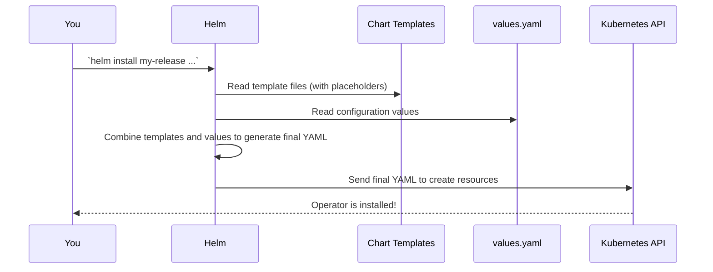

# Chapter 2: Helm Chart

In the [previous chapter](01_custom_resources__crds____sparkapplication_____sparkcluster__.md), we learned about the "order forms" (`SparkApplication` and `SparkCluster`) that we use to tell the operator what Spark jobs to run. But before we can start placing orders, we need to hire the "chef"—the operator itself—and set it up in our Kubernetes kitchen.

This chapter is all about the easiest and official way to install the `spark-kubernetes-operator`: using its Helm Chart.

### The Problem: Installing Kubernetes Apps is a Puzzle

Imagine you're building a complex Lego model. You have dozens of different types of bricks and a thick instruction manual. Installing a Kubernetes application like our operator is similar. It's not just one thing; it's a collection of many different Kubernetes resources that have to work together perfectly:

*   **Deployment:** To run the operator's main program.
*   **ServiceAccount:** To give the operator an identity within the cluster.
*   **ClusterRole** & **ClusterRoleBinding:** To give the operator the necessary permissions to manage other resources (like creating Spark pods).
*   **ConfigMaps:** To hold the operator's configuration files.

If you had to create all these YAML files by hand, it would be a tedious and error-prone process. A single typo could break the entire setup.

### The Solution: Helm, An Installation Wizard for Kubernetes

Helm is a package manager for Kubernetes. Think of it like `apt` on Debian/Ubuntu, `yum` on CentOS, or `Homebrew` on macOS. Instead of you manually downloading and configuring software, Helm does it for you with a single command.

The `spark-kubernetes-operator` provides an official **Helm Chart**, which is a pre-packaged bundle containing all the necessary Kubernetes resource templates and a simple way to configure them.

Using our kitchen analogy, the Helm Chart is like an "Install a Chef" kit. It comes with:
1.  Blueprints for the chef's workstation (`Deployment`).
2.  An ID badge for the chef (`ServiceAccount`).
3.  A set of keys giving the chef access to the pantry and ovens (`RBAC Rules`).
4.  A cookbook with default recipes (`ConfigMap`).

You don't build these things yourself. You just use the kit, maybe tell it you want a bigger oven, and Helm assembles everything for you.

### Installing the Operator with Helm

Getting the operator up and running is as simple as running one command. First, you add the operator's chart repository, and then you install it.

```bash
# 1. Add the repository that contains the chart
helm repo add spark-operator https://apache.github.io/spark-kubernetes-operator

# 2. Install the chart into your cluster
helm install my-release spark-operator/spark-kubernetes-operator --namespace spark-operator --create-namespace
```
And that's it! The operator is now running in your cluster, ready to accept `SparkApplication` orders.

### The Magic Ingredient: `values.yaml`

How does Helm know how to configure the operator? The magic is in a file called **`values.yaml`**. This file is the main configuration file for the Helm chart. It acts like a settings panel or an installation wizard, exposing all the important options you might want to change.

Let's look at a tiny, simplified piece of the `values.yaml` file that comes with the chart.

**File:** `build-tools/helm/spark-kubernetes-operator/values.yaml`
```yaml
# The container image for the operator
image:
  repository: apache/spark-kubernetes-operator
  tag: 0.5.0-SNAPSHOT

# How many operator pods to run (usually just 1)
operatorDeployment:
  replicas: 1

# Permissions for the operator
operatorRbac:
  serviceAccount:
    create: true # Should Helm create an identity for the operator?
    name: "spark-operator"
```
This file provides sensible defaults for every setting. If you want to use a different version of the operator, you don't need to edit complicated Kubernetes manifests. You just change the `image.tag` value when you install.

For example, to install a specific version, you can override the default value directly from the command line:

```bash
helm install my-release spark-operator/spark-kubernetes-operator \
  --namespace spark-operator \
  --create-namespace \
  --set image.tag="0.4.0"
```
This simple command tells Helm: "Install the operator, but use version `0.4.0` instead of the default." This makes upgrading and managing the operator incredibly easy.

---

### Under the Hood: From Templates to Live Resources

So how does Helm turn these simple values into full-fledged Kubernetes resources? It uses a powerful templating engine.

Inside the Helm chart, there's a `templates/` directory full of YAML files that look like regular Kubernetes manifests but with special placeholders.

Let's look at a simplified snippet from the operator's `Deployment` template.

**File:** `build-tools/helm/spark-kubernetes-operator/templates/spark-operator.yaml`
```yaml
apiVersion: apps/v1
kind: Deployment
spec:
  # The placeholder {{ .Values.operatorDeployment.replicas }}
  # will be replaced by the value from values.yaml
  replicas: {{ .Values.operatorDeployment.replicas }}
  template:
    spec:
      containers:
        - name: {{ .Chart.Name }}
          # These placeholders will also be replaced
          image: "{{ .Values.image.repository }}:{{ .Values.image.tag }}"
```
When you run `helm install`, Helm performs a "mail merge":

1.  It reads the `values.yaml` file (and any overrides you provided with `--set`).
2.  It goes through every file in the `templates/` directory.
3.  It replaces all the placeholders like `{{ .Values.image.tag }}` with the actual values.
4.  It sends the final, complete YAML manifests to Kubernetes to be created.

This process is visualized below:



The core of the Helm chart defines the Kubernetes `Deployment` that runs the operator, the `ServiceAccount` it uses for identity, and the `ClusterRole` that grants it permissions.

For example, the permissions the operator needs are defined in a template file and are created by Helm.

**File:** `build-tools/helm/spark-kubernetes-operator/templates/operator-rbac.yaml`
```yaml
# This template defines the permissions (Role) for the operator.
apiVersion: rbac.authorization.k8s.io/v1
kind: ClusterRole
metadata:
  name: {{ .Values.operatorRbac.clusterRole.name }}
rules:
  - apiGroups: [""]
    resources: ["pods", "services", "configmaps"]
    verbs: ["*"]
  - apiGroups: ["spark.apache.org"]
    resources: ["*"] # <-- This is the most important permission!
    verbs: ["*"]
```
This template ensures that when you install the chart, a `ClusterRole` is created that gives the operator full permission (`*`) to watch and manage `spark.apache.org` resources—our `SparkApplication` and `SparkCluster` CRDs!

---

### Conclusion

You've now learned about the packaging and deployment mechanism for the `spark-kubernetes-operator`.

*   **Helm** is the standard package manager for Kubernetes.
*   The **Helm Chart** is the official package for installing the Spark Operator.
*   It bundles all the necessary Kubernetes resources into one easy-to-manage package.
*   The **`values.yaml`** file is your main configuration interface, allowing you to customize the installation without touching complex Kubernetes YAML.

We've successfully "hired the chef" and set up their workstation. Now, let's open the door to the kitchen and see what the chef is actually doing. In the next chapter, we will look inside the operator's code to understand the [`SparkOperator` (Main Class)](03__sparkoperator___main_class__.md), the entry point of the entire application.

---

Generated by [AI Codebase Knowledge Builder](https://github.com/The-Pocket/Tutorial-Codebase-Knowledge)