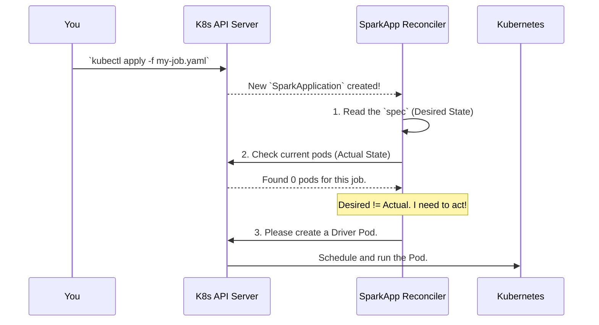

# Chapter 4: Reconcilers: `SparkAppReconciler` & `SparkClusterReconciler`

In the [previous chapter](03__sparkoperator___main_class__.md), we met the `SparkOperator` class, the "master conductor" that starts everything up. We saw that it creates and registers two very important workers: `SparkAppReconciler` and `SparkClusterReconciler`.

But what do these "reconcilers" actually do? They are the heart and soul of the operator. If the `SparkOperator` class is the manager who opens the factory in the morning, the reconcilers are the diligent foremen on the assembly line, doing the real work all day long.

### The Problem: Desires vs. Reality

You've submitted your `SparkApplication` YAML file to Kubernetes. You've *declared* your desire: "I want a Spark job running with one driver and two executors."

But just wanting something doesn't make it real. Your Kubernetes cluster is a dynamic, busy place. Pods can crash, nodes can fail, and networks can have issues. Who is constantly checking to make sure that the *actual state* of the cluster matches your *desired state*? Who is the tireless worker that notices your driver pod hasn't been created yet and takes action to create it?

### The Solution: The Thermostat Analogy

This is where reconcilers come in. A reconciler runs a continuous **control loop**. The best way to understand this is with a simple analogy: a thermostat.

1.  **Desired State:** You set the thermostat to 72°F (22°C). This is your `spec`.
2.  **Actual State:** The thermostat's sensor constantly reads the current room temperature, let's say it's 75°F (24°C). This is the real state of the world.
3.  **Reconcile:** The thermostat's logic compares the desired state (72°F) to the actual state (75°F). It sees a difference.
4.  **Act:** Because the room is too warm, the thermostat takes action: it turns on the air conditioning. It will keep the AC on until the actual state matches the desired state.

The `spark-kubernetes-operator` has two of these "thermostats," each specialized for a different type of resource:

*   **`SparkAppReconciler`**: This is the thermostat for your [`SparkApplication`](01_custom_resources__crds____sparkapplication_____sparkcluster__.md) resources. It works tirelessly to make your single Spark job run as you've defined it.
*   **`SparkClusterReconciler`**: This is the thermostat for your [`SparkCluster`](01_custom_resources__crds____sparkapplication_____sparkcluster__.md) resources. It ensures your persistent Spark cluster (master and workers) is always up and running according to your spec.

Every time you create, update, or delete a `SparkApplication`, the `SparkAppReconciler` wakes up, checks what needs to be done, and takes action.

---

### Under the Hood: The Reconciliation Loop in Action

Let's walk through what happens when you submit a new `SparkApplication`.

1.  You run `kubectl apply -f my-spark-job.yaml`.
2.  The Kubernetes API Server receives your YAML and stores it. It then sends out an event: "Hey everyone, a new `SparkApplication` named `my-spark-job` was just created!"
3.  The `SparkAppReconciler`, which is always listening for these events, hears the notification and wakes up.
4.  It fetches the `SparkApplication` object you just created.
    *   **Desired State Check:** It reads the `spec` section. "Okay, the user wants the `SparkPi` class, image `apache/spark:4.0.0`, one driver, and two executors."
5.  It then checks the cluster for the *actual state*.
    *   **Actual State Check:** "Are there any pods for `my-spark-job` running right now? No."
6.  The reconciler sees that the actual state (zero pods) does not match the desired state (a running driver pod).
7.  **Act:** It takes the first step to fix this. It generates the necessary configuration and tells the Kubernetes API Server, "Please create a driver pod for me based on these specifications."
8.  The reconciler then updates the `status` of your `SparkApplication` to say "DriverRequested" and goes back to sleep, waiting for the next event.

This loop repeats over and over. When the driver pod starts running, another event is triggered, the reconciler wakes up again, sees that the driver is running, and moves on to the next step, like requesting the executor pods.

This entire process can be visualized with a simple diagram:



---

### Diving into the Code

The logic for this control loop is defined in the `reconcile` method of each reconciler class. Let's look at a simplified version of the one for `SparkApplication`.

**File:** `spark-operator/src/main/java/org/apache/spark/k8s/operator/reconciler/SparkAppReconciler.java`
```java
@ControllerConfiguration
public class SparkAppReconciler implements Reconciler<SparkApplication> {
  // ... constructor and other fields ...

  @Override
  public UpdateControl<SparkApplication> reconcile(
      SparkApplication sparkApp, Context<SparkApplication> context) {
    // ... setup and status loading ...

    // Get the sequence of steps to perform for this app's current state
    List<AppReconcileStep> reconcileSteps = getReconcileSteps(sparkApp);

    // Execute each step in order
    for (AppReconcileStep step : reconcileSteps) {
        // ... execute the step ...
    }
    return /* tells the operator what to do next */;
  }
}
```

This code shows the core idea:
1.  The `reconcile` method is the main entry point for the loop. It gets called automatically whenever there's a change to a `SparkApplication`.
2.  It doesn't contain a giant `if/else` block. Instead, it calls another method, `getReconcileSteps`, to get a "to-do list" based on the application's current status.
3.  It then simply executes the steps on that list.

This `getReconcileSteps` method is like a playbook for the reconciler. It looks at the application's state and decides what actions are appropriate.

**File:** `spark-operator/src/main/java/org/apache/spark/k8s/operator/reconciler/SparkAppReconciler.java`
```java
protected List<AppReconcileStep> getReconcileSteps(final SparkApplication app) {
    List<AppReconcileStep> steps = new ArrayList<>();
    // First, always validate the spec is correct.
    steps.add(new AppValidateStep());

    // Now, let's see what state the app is in.
    switch (app.getStatus().getCurrentState().getCurrentStateSummary()) {
      case Submitted:
        // If it's brand new, our first step is to initialize it.
        steps.add(new AppInitStep());
        break;
      case DriverReady:
        // If the driver is ready, we need to monitor its execution.
        steps.add(new AppRunningStep());
        break;
      // ... cases for other states like Failed, Completed, etc.
    }
    return steps;
  }
```

This is the "brain" of the reconciler.
*   It takes the `SparkApplication` object as input.
*   It checks the `status` field (the actual state).
*   Based on the status, it builds a list of actions to perform. For a `Submitted` app, the action is `AppInitStep`. For a `DriverReady` app, the action is `AppRunningStep`.

This clean, step-based approach makes the operator's logic easy to follow and extend.

### Conclusion

You've now learned about the most critical component of the `spark-kubernetes-operator`!

*   **Reconcilers** are the active workers that make things happen.
*   They run a continuous **control loop**, just like a thermostat.
*   They compare the **desired state** (from your YAML `spec`) with the **actual state** of the cluster.
*   They take action to make the actual state match the desired state.
*   `SparkAppReconciler` handles `SparkApplication` resources, and `SparkClusterReconciler` handles `SparkCluster` resources.

The reconciler uses a "playbook" of steps to do its job. In the next chapter, we'll take a closer look at these individual plays and understand what each [Reconcile Steps](05_reconcile_steps_.md) does.

---

Generated by [AI Codebase Knowledge Builder](https://github.com/The-Pocket/Tutorial-Codebase-Knowledge)