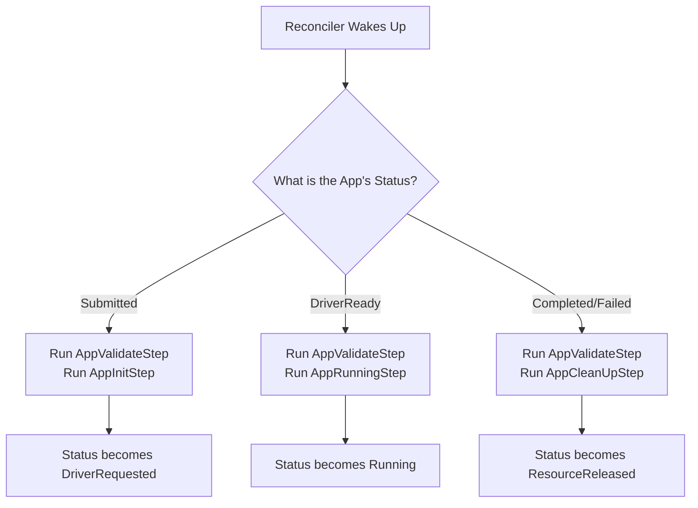

# Chapter 5: Reconcile Steps

In the [previous chapter](04_reconcilers___sparkappreconciler_____sparkclusterreconciler__.md), we learned that [Reconcilers: `SparkAppReconciler` & `SparkClusterReconciler`](04_reconcilers___sparkappreconciler_____sparkclusterreconciler__.md) are like tireless thermostats, constantly working to make reality match your desired state. We saw a `reconcile` method that gets called every time a change happens.

You might be wondering: what's inside that `reconcile` method? Is it one giant, thousand-line function with complex `if/else` statements for every possible scenario? That would be a nightmare to understand and maintain!

This chapter reveals the elegant solution to that problem: **Reconcile Steps**.

### The Problem: A Chef in a Messy Kitchen

Imagine a chef trying to cook a complex dish. If they tried to do everything at once—chopping vegetables, searing the meat, preparing the sauce, and plating the dish all at the same time—the kitchen would be chaos. It would be inefficient, error-prone, and almost impossible to fix if something went wrong.

A single, massive `reconcile` method would be just like that chaotic chef. It would have to handle:
*   Validating the user's YAML.
*   Creating the driver pod for the first time.
*   Checking if the driver pod is running.
*   Checking if the driver pod has failed.
*   Creating the executors.
*   Cleaning up resources when the job is done.
*   Cleaning up resources when the job fails.

This is too much for one function to do well.

### The Solution: An Assembly Line for Spark Jobs

Instead of a chaotic kitchen, the `spark-kubernetes-operator` uses a clean and efficient **assembly line**. The process of managing a `SparkApplication` is broken down into small, manageable stages. Each stage is a **`ReconcileStep`**.

Each `ReconcileStep` is a specialist that handles one specific task. For example:

*   **`AppValidateStep`**: The Quality Inspector. Its only job is to check if your `SparkApplication` YAML is valid.
*   **`AppInitStep`**: The Starter. Its job is to create the very first Kubernetes resources, like the driver pod.
*   **`AppRunningStep`**: The Monitor. It watches the job while it's running to make sure it has enough executors and is healthy.
*   **`AppCleanUpStep`**: The Cleaner. It comes in at the end to delete the pods and services after the job is finished.

The `SparkAppReconciler` acts as the **foreman** of this assembly line. When it wakes up, it doesn't do the work itself. Instead, it looks at the `SparkApplication`'s current status and decides which station on the assembly line should handle it next.

---

### A `SparkApplication` on the Assembly Line

Let's follow a brand new `SparkApplication` as it moves through the process.

1.  **You submit your YAML.** The `SparkApplication` is created with a status of `Submitted`.
2.  The `SparkAppReconciler` (the foreman) wakes up. It sees the `Submitted` status and creates a to-do list:
    *   Task 1: Send the job to the `AppValidateStep` station.
    *   Task 2: Send the job to the `AppInitStep` station.
3.  The `AppInitStep` creates the driver pod and updates the `SparkApplication`'s status to `DriverRequested`. The reconcile cycle ends for now.
4.  A moment later, Kubernetes starts the driver pod. The reconciler wakes up again, this time seeing the status is `DriverReady`.
5.  The foreman checks its playbook for the `DriverReady` status and creates a new to-do list:
    *   Task 1: Send the job to the `AppValidateStep` station (always good to double-check).
    *   Task 2: Send the job to the `AppRunningStep` station.
6.  The `AppRunningStep` now takes over, monitoring the job until it completes or fails, at which point the `AppCleanUpStep` is called.

This flow keeps the logic clean and separated. Each step has one job and does it well.

Here's a diagram of this decision-making process:



---

### Under the Hood: The `AppReconcileStep` Blueprint

All of these steps are built from the same blueprint: the `AppReconcileStep` abstract class. It's very simple and just says that every step *must* have a `reconcile` method.

**File:** `spark-operator/src/main/java/org/apache/spark/k8s/operator/reconciler/reconcilesteps/AppReconcileStep.java`
```java
public abstract class AppReconcileStep {
  /**
   * This is the main logic for a specific step.
   * @return A ReconcileProgress object telling the foreman what to do next.
   */
  public abstract ReconcileProgress reconcile(
      SparkAppContext context, SparkAppStatusRecorder statusRecorder);
}
```
This is the contract. Each "station" on our assembly line must have a worker that knows how to `reconcile`.

Let's look at a simplified example of a real step. The `AppInitStep` is responsible for creating the driver pod.

**File:** `spark-operator/src/main/java/org/apache/spark/k8s/operator/reconciler/reconcilesteps/AppInitStep.java`
```java
public class AppInitStep extends AppReconcileStep {
  @Override
  public ReconcileProgress reconcile(
      SparkAppContext context, SparkAppStatusRecorder statusRecorder) {
    try {
      // Get the driver pod specification
      Pod driverPodSpec = context.getDriverPodSpec();

      // Create the pod if it doesn't exist
      ReconcilerUtils.getOrCreateSecondaryResource(
        context.getClient(), driverPodSpec);

      // ... create other resources like services ...

      // Update status to "DriverRequested"
      statusRecorder.appendNewStateAndPersist(context, ...);
      return completeAndDefaultRequeue();
    } catch (Exception e) {
      // Handle errors...
    }
  }
}
```
As you can see, this class is laser-focused on one thing: creating the driver pod and its related resources. It doesn't care about monitoring or cleanup; it leaves that to the other steps.

Another example is the `AppCleanUpStep`, which does the opposite.

**File:** `spark-operator/src/main/java/org/apache/spark/k8s/operator/reconciler/reconcilesteps/AppCleanUpStep.java`
```java
public class AppCleanUpStep extends AppReconcileStep {
  @Override
  public ReconcileProgress reconcile(
      SparkAppContext context, SparkAppStatusRecorder statusRecorder) {

    // Find the driver pod
    Optional<Pod> driver = context.getDriverPod();

    // If it exists, delete it
    driver.ifPresent(pod ->
      ReconcilerUtils.deleteResourceIfExists(context.getClient(), pod, false)
    );

    // ... delete other resources ...
  }
}
```
Again, this step is simple and has a single responsibility. This separation makes the whole system much easier to reason about.

### Conclusion

You've now seen the secret to the operator's clean and maintainable logic!

*   Instead of one massive `reconcile` method, the work is divided into small, single-purpose **`ReconcileStep`s**.
*   This is like an **assembly line**, where each station performs a specific task.
*   The `Reconciler` acts as a foreman, directing the `SparkApplication` to the correct step based on its current `status`.
*   Key steps include `AppValidateStep`, `AppInitStep`, `AppRunningStep`, and `AppCleanUpStep`.

We've seen that the `AppInitStep`'s job is to create resources like the driver pod. But how does it know *exactly* what that pod should look like—what image to use, what commands to run, and what resources to request?

In the next chapter, we'll dive into the factory that builds these specifications: [Resource Spec Generation](06_resource_spec_generation_.md).

---

Generated by [AI Codebase Knowledge Builder](https://github.com/The-Pocket/Tutorial-Codebase-Knowledge)