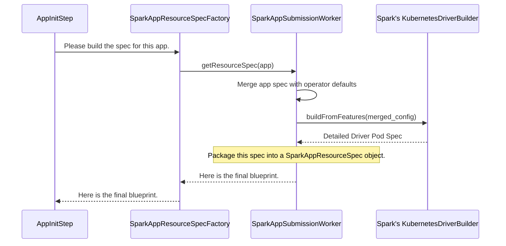

# Chapter 6: Resource Spec Generation

In the [previous chapter](05_reconcile_steps_.md), we saw how the operator uses an assembly line of [Reconcile Steps](05_reconcile_steps_.md) to manage a Spark job. We learned that the `AppInitStep` is responsible for creating the very first Kubernetes resources, like the driver pod.

This raises a crucial question: Your `SparkApplication` YAML is simple and high-level. You just say "use this image" and "I need two executors." But a real Kubernetes `Pod` manifest is long and detailed, with specific environment variables, volume mounts, command arguments, and labels.

How does the operator translate your simple request into a detailed, valid Kubernetes `Pod` spec that Spark can actually use? This chapter explores that brilliant translation layer.

### The Problem: From a Sketch to a Blueprint

Imagine you're hiring an architect to build a house. You give them a simple sketch on a napkin: "I want a two-story house with three bedrooms and a big kitchen."

The architect can't hand that napkin to the construction crew. The crew needs detailed blueprints showing exact measurements, electrical wiring diagrams, plumbing layouts, and building material specifications.

The `SparkApplication` spec is your napkin sketch. It expresses your high-level intent. Kubernetes, the construction crew, needs the detailed blueprints. The **Resource Spec Generation** layer is the architect who creates those blueprints.

### The Solution: An Architect Who Speaks Spark

The operator's "architect" is a set of classes that take your high-level `SparkApplication` spec and produce a detailed `SparkAppResourceSpec` object. This object is a container for the complete, ready-to-use Kubernetes manifests for the driver pod, services, and any other required resources.

The most important part of this process is that the operator doesn't try to invent these blueprints from scratch. Instead, it uses **Spark's own internal libraries** to build them. This is like an architect using the official, city-approved building code software to design the house. It guarantees that the generated pods and services are perfectly configured, just as if you had run the official `spark-submit` command yourself.

The key components in this process are:
*   **`SparkAppSubmissionWorker` / `SparkClusterSubmissionWorker`**: These are the main "architects." They contain the logic for translating your spec.
*   **`SparkAppResourceSpec` / `SparkClusterResourceSpec`**: These are the final "blueprint" objects that hold the generated Kubernetes manifests.

---

### Under the Hood: The Blueprint Creation Process

Let's follow the journey from your simple YAML to a complete Pod spec.

1.  The `AppInitStep` (from our assembly line in the last chapter) realizes it needs to create a driver pod.
2.  Instead of building the spec itself, it asks a factory, `SparkAppResourceSpecFactory`, to do it.
3.  The factory delegates the real work to the `SparkAppSubmissionWorker`.
4.  The `SparkAppSubmissionWorker` gathers all the information: your `SparkApplication` spec, default labels the operator needs to add, the correct namespace, etc.
5.  **This is the magic step:** It feeds all this information into Spark's own internal `KubernetesDriverBuilder` class. This is the same code that `spark-submit` uses.
6.  The `KubernetesDriverBuilder` returns a highly detailed specification for the driver pod and its services.
7.  The worker packages these final manifests into a `SparkAppResourceSpec` object.
8.  This object (the finished blueprint) is returned to the `AppInitStep`, which can now confidently send the pod manifest to the Kubernetes API server.

Here is a diagram showing this delegation:



---

### Diving into the Code

Let's see how this elegant process looks in the code. We'll trace the path from the factory to the core Spark library call.

#### 1. The Factory (`SparkAppResourceSpecFactory`)

The `AppInitStep` calls this factory. Its job is simple: prepare some configuration and call the worker.

**File:** `spark-operator/src/main/java/org/apache/spark/k8s/operator/reconciler/SparkAppResourceSpecFactory.java`
```java
public final class SparkAppResourceSpecFactory {
  public static SparkAppResourceSpec buildResourceSpec(
      final SparkApplication app,
      final KubernetesClient client,
      final SparkAppSubmissionWorker worker) {
    // ... prepare some configuration overrides ...

    // Delegate the heavy lifting to the worker
    SparkAppResourceSpec resourceSpec = worker.getResourceSpec(app, client, confOverrides);
    
    // ... perform some final adjustments ...
    return resourceSpec;
  }
}
```
This class acts as a clean entry point, hiding the messier details of configuration from the `ReconcileStep`.

#### 2. The Worker (`SparkAppSubmissionWorker`)

This is where the real translation begins. It gathers all the necessary configs before calling Spark's internal builder.

**File:** `spark-submission-worker/src/main/java/org/apache/spark/k8s/operator/SparkAppSubmissionWorker.java`
```java
public class SparkAppSubmissionWorker {
  public SparkAppResourceSpec getResourceSpec(
      SparkApplication app, KubernetesClient client, Map<String, String> confOverrides) {
    // 1. Build the Spark configuration from the app spec
    SparkAppDriverConf appDriverConf = buildDriverConf(app, confOverrides);

    // 2. Call the internal method that uses Spark's own code
    return buildResourceSpec(appDriverConf, ...);
  }
}
```
This method separates the task into two parts: preparing the configuration and then building the spec.

#### 3. The Core Logic (Using Spark's `KubernetesDriverBuilder`)

Deep inside the `SparkAppSubmissionWorker`, we find the most important method. This is where the operator hands over control to Spark's own code.

**File:** `spark-submission-worker/src/main/java/org/apache/spark/k8s/operator/SparkAppSubmissionWorker.java`
```java
protected SparkAppResourceSpec buildResourceSpec(
    SparkAppDriverConf kubernetesDriverConf, ...) {
      
  // Use Spark's official builder to create the spec
  KubernetesDriverBuilder builder = new KubernetesDriverBuilder();
  KubernetesDriverSpec kubernetesDriverSpec =
      builder.buildFromFeatures(kubernetesDriverConf, client);

  // Package the result into our own object for easy access
  return new SparkAppResourceSpec(kubernetesDriverConf, kubernetesDriverSpec, ...);
}
```
The call to `builder.buildFromFeatures(...)` is the heart of the entire process. It ensures that the pod created by the operator is identical to one created by a standard Spark user, guaranteeing compatibility.

#### 4. The Final Blueprint (`SparkAppResourceSpec`)

The result of the build process is stored in this simple container object, which holds the final `Pod` manifest.

**File:** `spark-submission-worker/src/main/java/org/apache/spark/k8s/operator/SparkAppResourceSpec.java`
```java
public class SparkAppResourceSpec {
  @Getter private final Pod configuredPod;
  @Getter private final List<HasMetadata> driverResources;
  // ... constructor that populates these fields from KubernetesDriverSpec ...
}
```
The `AppInitStep` can now simply grab the `configuredPod` from this object and send it to Kubernetes.

A very similar process exists for `SparkCluster` resources, using `SparkClusterResourceSpecFactory` and `SparkClusterSubmissionWorker` to generate the specifications for the master and worker `StatefulSet`s and `Service`s. The principle remains the same: translate the high-level custom resource into detailed, low-level Kubernetes objects.

### Conclusion

You've just uncovered the "secret sauce" that makes the operator so reliable!

*   The **Resource Spec Generation** layer acts as an **architect**, translating your high-level `SparkApplication` spec into detailed Kubernetes blueprints.
*   It doesn't reinvent the wheel. It uses **Spark's own internal libraries** (`KubernetesDriverBuilder`) to construct the Pod specifications.
*   This ensures perfect compatibility and correctness, as if you were using `spark-submit` directly.
*   The `SparkAppSubmissionWorker` is the key class that orchestrates this translation, producing a final `SparkAppResourceSpec` object.

Now that we have the blueprints and have submitted them to Kubernetes, the job starts running. The operator needs to watch the job and update the `status` field of your `SparkApplication` object to reflect what's happening. How does it do that? Let's find out in the next chapter on [Status Management](07_status_management_.md).

---

Generated by [AI Codebase Knowledge Builder](https://github.com/The-Pocket/Tutorial-Codebase-Knowledge)