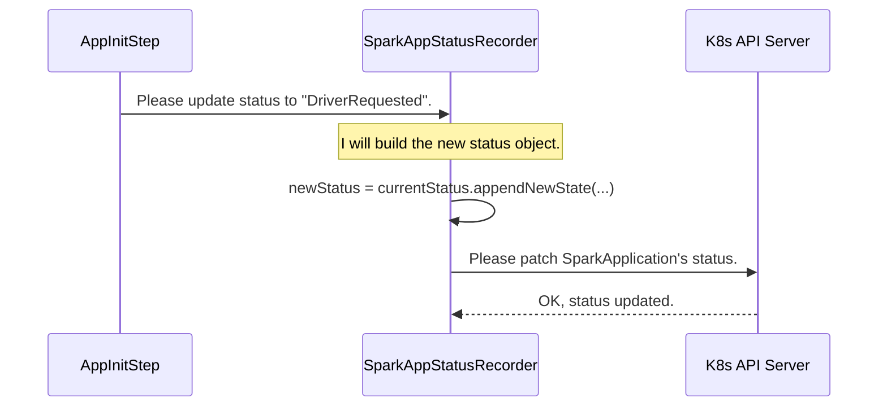

# Chapter 7: Status Management

In the [previous chapter](06_resource_spec_generation_.md), we saw how the operator acts as a skilled architect, translating your simple `SparkApplication` YAML into detailed Kubernetes "blueprints" like `Pod` specs. After the operator submits these blueprints to Kubernetes, the cluster starts creating the pods to run your job.

But then what? How do you know what's happening? Is your job starting? Is it running? Did it fail? You're left in the dark. This chapter introduces the "display panel" that keeps you informed: **Status Management**.

### The Problem: Are We There Yet?

Imagine you put a pizza in a new, high-tech oven that has no window and no display. You set the timer and walk away. Is it preheating? Is it cooking? Is it done? Did something go wrong and it turned off? You have no idea until you open the door.

Running a Spark job on Kubernetes can feel like that. You run `kubectl apply`, and your request disappears into the cluster. You could try to find the driver pod by running `kubectl get pods`, but that's a low-level, messy way to check progress. What you really want is a simple, clear status indicator right on your `SparkApplication` object itself.

### The Solution: A "Display Panel" for Your Spark Job

The `spark-kubernetes-operator` solves this problem by actively managing the `.status` field of your `SparkApplication` or `SparkCluster` resource. Think of this `.status` field as the digital display on our smart oven. It gives you a high-level, easy-to-read summary of what's happening inside.

You can check it easily with a single command:
```bash
kubectl get sparkapplication spark-pi -o yaml
```

And you'll see a `status` section that tells you the story of your job's life:

```yaml
# A snippet of the output
apiVersion: spark.apache.org/v1alpha1
kind: SparkApplication
metadata:
  name: spark-pi
spec:
  # ... your spec here ...
status:
  currentState:
    currentStateSummary: RunningHealthy # <--- The display panel!
    stateMessage: All required executors are running.
  # ... more details like attempt history, start time, etc.
```

This is the operator communicating back to you. Let's see how it works.

---

### The Key Concepts of Status Management

#### 1. The State Machine: A Job's Journey

A Spark job doesn't just go from "off" to "on." It goes through a series of predictable stages. This sequence of stages is called a **state machine**. The operator defines this journey with a set of clear, descriptive states.

Here are a few key states your `SparkApplication` will travel through:
*   `Submitted`: Your job has been accepted by the operator.
*   `DriverReady`: The Spark driver pod is up and running.
*   `RunningHealthy`: The driver and all required executors are running.
*   `Succeeded`: The job finished successfully!
*   `Failed`: The job failed.
*   `ResourceReleased`: The job is finished and all its pods have been cleaned up.

The full list of these states is defined in an `enum` in the code.

**File:** `spark-operator-api/src/main/java/org/apache/spark/k8s/operator/status/ApplicationStateSummary.java`
```java
public enum ApplicationStateSummary implements BaseStateSummary {
  // A few examples from the state machine
  Submitted,
  DriverReady,
  RunningHealthy,
  Succeeded,
  Failed,
  ResourceReleased;
  // ... many other states for fine-grained control
}
```
This enum acts as the official "vocabulary" the operator uses to describe the job's progress.

#### 2. Status Classes: The Structure of the Display Panel

The operator needs a structured way to store this state information. It uses dedicated Java classes that map directly to the YAML you see in the `.status` field.

*   `ApplicationStatus`: Defines the status for a `SparkApplication`.
*   `ClusterStatus`: Defines the status for a `SparkCluster`.

These classes hold the current state, a history of past states, and other useful information. Let's look at a simplified `ApplicationStatus`.

**File:** `spark-operator-api/src/main/java/org/apache/spark/k8s/operator/status/ApplicationStatus.java`
```java
public class ApplicationStatus extends BaseStatus<...> {
  // The current state of the application
  private ApplicationState currentState;
  // A history of all the states this app has been through
  private Map<Long, ApplicationState> stateTransitionHistory;
  // ... other fields for attempt summaries ...

  // Method to move to the next state
  public ApplicationStatus appendNewState(ApplicationState state) {
    // ... logic to update the history and set the new current state ...
  }
}
```
The `appendNewState` method is crucial. It's how the operator transitions the job from one state to the next, like from `Submitted` to `DriverReady`.

#### 3. StatusRecorder: The Safe Writer

Updating a resource in Kubernetes isn't as simple as saving a file. Multiple things could be trying to update the same resource at once, leading to conflicts. To handle this safely, the operator uses a special helper called a `StatusRecorder`.

Think of the `StatusRecorder` as a careful bank teller. You don't just walk into the vault and change your account balance. You give your transaction request to the teller, who ensures it's done correctly, logged properly, and handles any potential errors. The `StatusRecorder` does the same for status updates, making sure they are applied to Kubernetes reliably, even retrying if there's a network glitch.

---

### Under the Hood: How a Status Update Happens

Let's follow a real example. In [Chapter 5](05_reconcile_steps_.md), we learned about `ReconcileStep`s. The `AppInitStep` creates the driver pod. Right after it successfully tells Kubernetes to create the pod, it needs to update the status from `Submitted` to `DriverRequested`.

Here's how it uses the status management system to do that:

1.  The `AppInitStep`'s `reconcile` method is running. It has just created the driver pod.
2.  It creates a new state object: `new ApplicationState(ApplicationStateSummary.DriverRequested)`.
3.  It calls the `SparkAppStatusRecorder` with this new state.
4.  The `StatusRecorder` takes the new state and the current `ApplicationStatus`.
5.  It calls the `appendNewState` method on the `ApplicationStatus` object to create the updated status.
6.  Finally, it sends a "patch" request to the Kubernetes API server, telling it to update *only* the `.status` field of the `SparkApplication` resource. It also includes retry logic to ensure the update succeeds.

This flow is shown in the diagram below:



---

### Diving into the Code

Let's look at the key code snippets that make this happen.

First, the `SparkAppStatusRecorder` provides a very simple method for the reconcile steps to call. It hides all the complexity.

**File:** `spark-operator/src/main/java/org/apache/spark/k8s/operator/utils/SparkAppStatusRecorder.java`
```java
public class SparkAppStatusRecorder extends StatusRecorder<...> {

  public void appendNewStateAndPersist(
      SparkAppContext context, ApplicationState newState) {
    ApplicationStatus appStatus = context.getResource().getStatus();
    // Creates the updated status object
    ApplicationStatus updatedStatus = appStatus.appendNewState(newState);
    // Persists it safely to the cluster
    persistStatus(context, updatedStatus);
  }
}
```
This method is the main entry point for any part of the code that needs to change a job's state.

The real "safety" logic lives in the base `StatusRecorder` class. It retries the update if it fails, which is essential for a robust operator.

**File:** `spark-operator/src/main/java/org/apache/spark/k8s/operator/utils/StatusRecorder.java`
```java
private void patchAndStatusWithVersionLocked(CR resource, KubernetesClient client) {
  // ... checks if status has actually changed ...

  // Loop to retry the update on failure
  for (long i = 0; i < maxRetry; i++) {
    try {
      client.resource(resource).lockResourceVersion().updateStatus();
      return; // Success!
    } catch (KubernetesClientException e) {
      log.warn("Error while patching status, retrying...", e);
      // ... wait a moment before retrying ...
    }
  }
}
```
This retry loop is what makes the `StatusRecorder` so important. It prevents temporary network issues from causing the operator to fail.

### Conclusion

You've now learned how the operator communicates with you, keeping you informed about your Spark job's progress.

*   The `.status` field of your custom resource is the **"display panel"**.
*   It follows a clear **state machine** (e.g., `Submitted`, `RunningHealthy`, `Succeeded`).
*   The structure of the status is defined by Java classes like `ApplicationStatus`.
*   A **`StatusRecorder`** is used to update the status safely and reliably, handling potential Kubernetes API conflicts and errors.

This system is the key to providing a user-friendly experience, turning the "black box" of Kubernetes into something transparent and observable.

So far, we've discussed how the operator is installed, how it processes your requests, and how it reports its status. But what about all the different knobs and dials you can turn to customize its behavior? In the next chapter, we'll explore [Configuration Management](08_configuration_management_.md).

---

Generated by [AI Codebase Knowledge Builder](https://github.com/The-Pocket/Tutorial-Codebase-Knowledge)