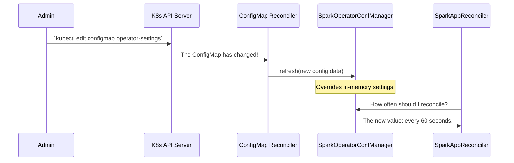

# Chapter 8: Configuration Management

In the [previous chapter](07_status_management_.md), we learned how the operator uses the `.status` field to act as a "display panel," keeping you informed about your Spark job's progress. We've seen how the operator works, from receiving your request to reporting its status.

But what if you need to change *how the operator itself behaves*? For example, how do you tell the operator to watch for `SparkApplication`s in a different namespace? Or change how many jobs it can process at the same time? This chapter introduces the operator's "settings menu": its **Configuration Management** system.

### The Problem: Tuning the Engine

Imagine your car's engine. It comes from the factory with default settings for fuel intake, idle speed, and so on. But a mechanic can plug in a computer and tune these settings for better performance or fuel efficiency.

The `spark-kubernetes-operator` is a complex engine, and a cluster administrator needs to be able to tune it. For example, an admin might need to:
*   Tell the operator to watch namespaces `team-a` and `team-b` instead of just `default`.
*   Increase the number of concurrent reconciliations if the cluster is very busy.
*   Enable leader election so you can run multiple operator pods for high availability.

Changing these settings by rebuilding the operator's Docker image every time would be slow and impractical. You need a simple, external way to provide these settings, just like a mechanic uses a computer instead of taking the engine apart.

### The Solution: A Central "Settings Menu"

The operator provides a robust configuration system that acts as its central settings menu. This system is designed to be simple, flexible, and powerful. It allows administrators to fine-tune almost every aspect of the operator's behavior, often without even needing to restart it.

The key components of this system are:
1.  **`SparkOperatorConf`**: This class is the **settings catalog**. It's a single file that defines every possible configuration option you can set, along with its name, default value, and a description.
2.  **`SparkOperatorConfManager`**: This is the **settings manager**. It's a singleton (meaning there's only one instance for the whole application) that loads all the settings from a configuration file when the operator starts.
3.  **Hot Reloading via `ConfigMap`**: This is the most powerful feature. You can configure the operator to watch a Kubernetes `ConfigMap`. If you change a setting in that `ConfigMap`, the operator will detect the change and apply it **live**, without a restart!

---

### How Settings Are Loaded and Used

When the operator pod starts, the `SparkOperatorConfManager` loads its initial settings from a properties file located inside the container (e.g., `/opt/spark-operator/conf/spark-operator.properties`). This file is typically populated by the [Helm Chart](02_helm_chart_.md) during installation.

Then, whenever any part of the operator needs to know a setting—for example, the main `SparkOperator` class needs to know which namespaces to watch—it doesn't hardcode the value. Instead, it asks the `SparkOperatorConfManager`.

The real magic happens if you enable "dynamic configuration." In this mode, the operator also starts watching a `ConfigMap`. If that `ConfigMap` changes, a special reconciler updates the `SparkOperatorConfManager` with the new values, overriding the initial ones.

Here is a diagram of the hot reloading process:



---

### Diving into the Code

Let's see how this elegant system is implemented.

#### 1. `SparkOperatorConf.java`: The Catalog of Settings

This class is simply a list of all available settings. Each setting is a `public static final ConfigOption` object. This makes all settings discoverable in one place.

**File:** `spark-operator/src/main/java/org/apache/spark/k8s/operator/config/SparkOperatorConf.java`
```java
public final class SparkOperatorConf {

  public static final ConfigOption<String> OPERATOR_WATCHED_NAMESPACES =
      ConfigOption.<String>builder()
          .key("spark.kubernetes.operator.watchedNamespaces")
          .enableDynamicOverride(true) // This one can be hot-reloaded!
          .typeParameterClass(String.class)
          .defaultValue("default")
          .build();

  public static final ConfigOption<Integer> RECONCILER_PARALLELISM =
      ConfigOption.<Integer>builder()
          .key("spark.kubernetes.operator.reconciler.parallelism")
          .enableDynamicOverride(false) // This one requires a restart.
          .typeParameterClass(Integer.class)
          .defaultValue(50)
          .build();
  // ... many more settings definitions ...
}
```
This code defines two settings:
*   `OPERATOR_WATCHED_NAMESPACES`: The key for this setting is `spark.kubernetes.operator.watchedNamespaces`. It's a string, defaults to `"default"`, and it can be updated live.
*   `RECONCILER_PARALLELISM`: This setting controls the size of the thread pool. It's an integer, defaults to `50`, and `enableDynamicOverride` is false, meaning you'd need to restart the operator to change it.

#### 2. `ConfigOption.java`: The Setting Itself

The `ConfigOption` class is a wrapper for a single setting. Its most important method is `getValue()`, which knows how to ask the `SparkOperatorConfManager` for the current value.

**File:** `spark-operator/src/main/java/org/apache/spark/k8s/operator/config/ConfigOption.java`
```java
public class ConfigOption<T> {
  // ... fields for key, defaultValue, etc. ...

  public T getValue() {
    // Ask the central manager for the current value for my key.
    String value = SparkOperatorConfManager.INSTANCE.getValue(key);
    // ... logic to parse the string into the correct type (e.g., Integer) ...
    // ... or return the defaultValue if not set.
    return resolvedValue;
  }
}
```
So, when code elsewhere calls `SparkOperatorConf.RECONCILER_PARALLELISM.getValue()`, this method is what fetches the correctly configured value.

#### 3. `SparkOperatorConfManager.java`: The Manager

This is the singleton that holds all the configuration. It loads the initial properties file and stores any live overrides from a `ConfigMap`.

**File:** `spark-operator/src/main/java/org/apache/spark/k8s/operator/config/SparkOperatorConfManager.java`
```java
public class SparkOperatorConfManager {
  public static final SparkOperatorConfManager INSTANCE = new SparkOperatorConfManager();
  protected final Properties initialConfig; // from properties file
  protected Properties configOverrides;     // from ConfigMap

  public String getValue(String key) {
    // Check for a live override first.
    String currentValue = configOverrides.getProperty(key);
    // If no override, fall back to the initial value from the file.
    return StringUtils.isEmpty(currentValue) ? initialConfig.getProperty(key) : currentValue;
  }

  public void refresh(Map<String, String> updatedConfig) {
    // This is called by the ConfigMap reconciler to update the live overrides.
    this.configOverrides = new Properties();
    configOverrides.putAll(updatedConfig);
  }
}
```
The logic is simple and powerful: the `getValue` method prioritizes live overrides, and the `refresh` method provides the mechanism to apply those overrides.

#### 4. `SparkOperatorConfigMapReconciler.java`: The Live Updater

Finally, this is the specialized reconciler that enables hot reloading. Its `reconcile` method is incredibly simple.

**File:** `spark-operator/src/main/java/org/apache/spark/k8s/operator/config/SparkOperatorConfigMapReconciler.java`
```java
public class SparkOperatorConfigMapReconciler implements Reconciler<ConfigMap> {

  @Override
  public UpdateControl<ConfigMap> reconcile(ConfigMap resource, Context<ConfigMap> context) {
    // Take the data from the changed ConfigMap...
    // ...and tell the singleton manager to refresh its settings.
    SparkOperatorConfManager.INSTANCE.refresh(resource.getData());
    return UpdateControl.noUpdate();
  }
}
```
This tiny class is the bridge between Kubernetes events (a `ConfigMap` changing) and the operator's internal configuration system.

### Conclusion

You've now learned how the `spark-kubernetes-operator` is configured and tuned.

*   The operator has a rich set of configuration options, all defined in the `SparkOperatorConf` class.
*   The `SparkOperatorConfManager` is a central singleton that loads and provides these settings.
*   Settings are loaded from a properties file at startup.
*   The operator supports **hot reloading**, allowing administrators to change certain settings live by editing a Kubernetes `ConfigMap`, without needing to restart the operator pod.

We've configured the operator and understand its internal workings. But how do we know if it's healthy and performing well? In the final chapter, we'll explore how the operator exposes its internal health and performance data through [Metrics & Probes](09_metrics___probes_.md).

---

Generated by [AI Codebase Knowledge Builder](https://github.com/The-Pocket/Tutorial-Codebase-Knowledge)