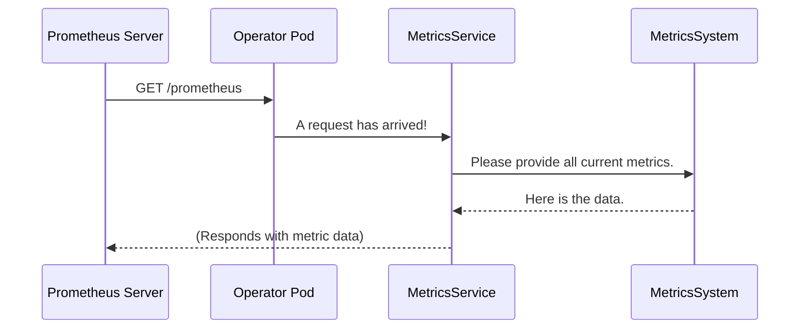

# Chapter 9: Metrics & Probes

In the [previous chapter](08_configuration_management_.md), we learned how to use the operator's "settings menu" with [Configuration Management](08_configuration_management_.md) to tune its behavior. We've now covered the entire lifecycle: from submitting a `SparkApplication`, to the operator processing it, to configuring the operator itself.

But once the operator is running in a production environment, how do we know if it's healthy? Is it performing well, or is it struggling to keep up with the workload? This final chapter introduces the operator's "dashboard" and "health monitor": its **Metrics and Probes**.

### The Problem: Is the Engine Running Smoothly?

Imagine you're driving a car, but the dashboard is completely blank. You have no speedometer, no fuel gauge, and no engine temperature light. You might be driving along just fine, or you might be about to run out of gas or overheat the engine. You have no way of knowing until it's too late!

Running an application in Kubernetes without observability is just like that. You've deployed the operator, and it seems to be working, but you have critical questions:
*   How many Spark jobs is it currently managing?
*   How long is it taking to process new requests?
*   Is the operator's process still alive, or has it frozen?

You need a way to look inside the operator to see its vital signs.

### The Solution: A Dashboard and Warning Lights

The `spark-kubernetes-operator` comes with a built-in health monitoring system, just like a car's dashboard. This system is split into two key parts:

1.  **Metrics**: These are the gauges on your dashboard (speedometer, fuel gauge, RPM). They provide detailed performance data that you can watch over time. For example, "the operator processed 10 `SparkApplication`s in the last minute."
2.  **Probes**: These are the simple warning lights (check engine, oil pressure). They give a simple "yes" or "no" answer to the question, "Are you okay right now?" Kubernetes uses these signals to automatically manage the operator's pod.

Together, these two features provide the **observability** needed to run the operator reliably in production.

---

### Metrics: The Performance Dashboard (`MetricsSystem`)

The operator constantly collects data about its own performance. It tracks things like:
*   The number of times it has successfully reconciled a `SparkApplication`.
*   The time it takes to generate the resources for a new job.
*   The health of its own Java Virtual Machine (JVM), like memory usage.

This data is collected by the `MetricsSystem`. However, just collecting data isn't enough; you need a way to view it. The operator's `MetricsService` starts a tiny web server that exposes all this data at a special URL endpoint: `/prometheus`.

This endpoint is designed to be read by **Prometheus**, a very popular open-source monitoring tool. Prometheus can be configured to periodically "scrape" (read) the data from this endpoint and store it. You can then use tools like Grafana to create beautiful dashboards to visualize the operator's performance over time.

Think of the `MetricsSystem` as the car's internal computer that gathers all the sensor data, and the `/prometheus` endpoint as the diagnostic port that a mechanic plugs into.

#### Under the Hood: Exposing Metrics

The startup process is very simple and is initiated by the main [`SparkOperator` (Main Class)](03__sparkoperator___main_class__.md).

1.  A `MetricsSystem` is created. This object acts as a central registry for all the different metrics being collected.
2.  A `MetricsService` is created, which wraps the `MetricsSystem`.
3.  When the `MetricsService` is started, it launches a simple HTTP server.
4.  It tells this server that any request to the `/prometheus` path should be handled by the `MetricsSystem`, which will respond with all the current metric data in the Prometheus text format.



#### Diving into the Code

The code to start this service is straightforward. The `MetricsService` takes the `MetricsSystem` and starts a server.

**File:** `spark-operator/src/main/java/org/apache/spark/k8s/operator/metrics/MetricsService.java`
```java
public class MetricsService {
  HttpServer server;
  final MetricsSystem metricsSystem;

  // ... constructor ...

  public void start() {
    log.info("Starting Metrics Service for Prometheus ...");
    // Tell the server to use our metrics system to handle /prometheus requests
    server.createContext("/prometheus", metricsSystem.getPrometheusPullModelHandler());
    server.start();
  }
}
```
This small class is all it takes to expose the rich set of internal metrics to the outside world.

---

### Probes: The Health Warning Lights (`ProbeService`)

While metrics are great for tracking performance, Kubernetes needs a much simpler signal to manage the operator's pod. It needs to know: "Are you alive?" and "Are you ready for work?"

The `ProbeService` provides this. It's another tiny web server that exposes two critical endpoints defined by Kubernetes:

1.  **/healthz (Liveness Probe)**: Kubernetes hits this endpoint periodically to check if the operator is still alive. If the operator's main threads were frozen or deadlocked, it wouldn't be able to respond, or it would report an error. If the liveness probe fails multiple times, Kubernetes assumes the pod is broken and **restarts it**. This is like a heartbeat monitor.

2.  **/readyz (Readiness Probe)**: Kubernetes hits this endpoint to check if the operator is ready to start processing new `SparkApplication`s. When the operator first starts up, it might need a few seconds to connect to the Kubernetes API. During this time, it's "alive" but not "ready." If the readiness probe is failing, Kubernetes will **stop sending it new work** until it becomes ready. This is like a shop owner flipping the sign to "Open."

#### Under the Hood: Answering Health Checks

The `ProbeService` works just like the `MetricsService`.

1.  When the operator starts, a `ProbeService` is created.
2.  It launches an HTTP server with two endpoints: `/healthz` and `/readyz`.
3.  The `/healthz` endpoint is handled by a `HealthProbe` class. This class checks critical internal components. For example, it asks the underlying operator framework, "Is your connection to the Kubernetes API server healthy?" If everything is okay, it responds with a "200 OK".
4.  The `/readyz` endpoint is handled by a `ReadinessProbe` class, which performs similar checks to ensure the operator is fully initialized.

This simple mechanism allows Kubernetes to automate the lifecycle management of the operator, making it highly resilient.

#### Diving into the Code

The code to create these health endpoints is very clean.

**File:** `spark-operator/src/main/java/org/apache/spark/k8s/operator/probe/ProbeService.java`
```java
public class ProbeService {
  // ... constructor ...
  public ProbeService(
      List<Operator> operators, ...) {
    // ... create server ...

    // When a request comes to /readyz, use a ReadinessProbe to handle it.
    server.createContext(READYZ, new ReadinessProbe(operators));

    // When a request comes to /healthz, use a HealthProbe to handle it.
    server.createContext(HEALTHZ, new HealthProbe(operators, ...));

    // ... set executor ...
  }
}
```
And the logic inside a probe is also a simple check. Here is a simplified view of the `HealthProbe`.

**File:** `spark-operator/src/main/java/org/apache/spark/k8s/operator/probe/HealthProbe.java`
```java
public class HealthProbe implements HttpHandler {
  // ... fields ...

  public boolean isHealthy() {
    // Check if the core operator components have started.
    boolean operatorsReady = areOperatorsStarted(operators);
    if (!operatorsReady) {
      return false;
    }

    // Check if the connection to Kubernetes API is healthy.
    boolean informersHealthy = checkInformersHealth(...);
    return informersHealthy;
  }
}
```
If `isHealthy()` returns `true`, the probe responds with a success code, and Kubernetes knows the operator is in good shape.

### Conclusion

Congratulations! You've reached the end of the `spark-kubernetes-operator` internals tutorial. You've just learned how the operator exposes its vital signs to ensure it can be run reliably.

*   **Metrics** (`MetricsSystem`) provide a detailed **performance dashboard** for monitoring tools like Prometheus, showing *how well* the operator is doing.
*   **Probes** (`ProbeService`) provide simple **health warning lights** for Kubernetes, indicating *if* the operator is okay.
*   The liveness probe (`/healthz`) allows Kubernetes to restart the operator if it freezes.
*   The readiness probe (`/readyz`) allows Kubernetes to wait until the operator is ready for work.

From understanding the high-level `SparkApplication` [Custom Resources (CRDs): `SparkApplication` & `SparkCluster`](01_custom_resources__crds____sparkapplication_____sparkcluster__.md) to diving deep into the [Reconcilers: `SparkAppReconciler` & `SparkClusterReconciler`](04_reconcilers___sparkappreconciler_____sparkclusterreconciler__.md) and finally seeing how it's monitored, you now have a comprehensive view of the entire architecture. You are well-equipped to use, configure, and even contribute to this powerful project. Happy Sparking on Kubernetes

---

Generated by [AI Codebase Knowledge Builder](https://github.com/The-Pocket/Tutorial-Codebase-Knowledge)