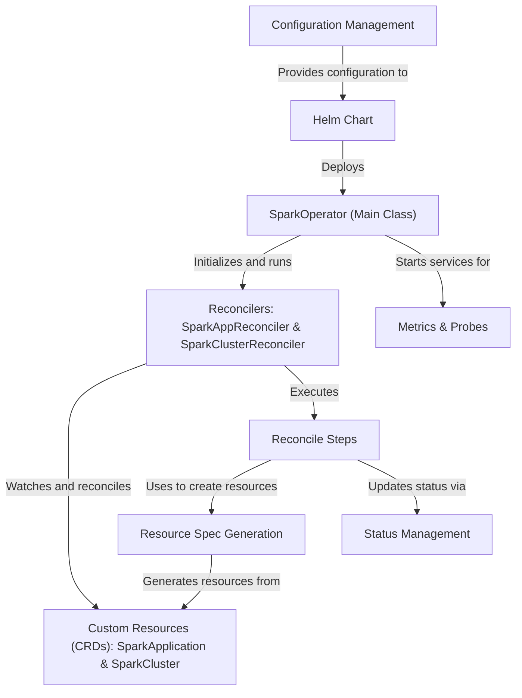

# Tutorial: spark-kubernetes-operator

The Apache Spark Kubernetes Operator is a tool that makes it easy to run *Apache Spark* jobs directly on a *Kubernetes cluster*. Instead of manually managing complex Spark and Kubernetes components, you simply define your workload using a custom blueprint called a **`SparkApplication`** for a single job, or a **`SparkCluster`** for a long-running cluster. The operator then automatically handles all the heavy lifting, acting like a smart assistant to manage the entire lifecycle of your Spark workloads.

**Source Repository:** [None](None)

## Chapters

1. [Custom Resources (CRDs): `SparkApplication` & `SparkCluster`
](01_custom_resources__crds____sparkapplication_____sparkcluster__.md)
2. [Helm Chart
](02_helm_chart_.md)
3. [`SparkOperator` (Main Class)
](03__sparkoperator___main_class__.md)
4. [Reconcilers: `SparkAppReconciler` & `SparkClusterReconciler`
](04_reconcilers___sparkappreconciler_____sparkclusterreconciler__.md)
5. [Reconcile Steps
](05_reconcile_steps_.md)
6. [Resource Spec Generation
](06_resource_spec_generation_.md)
7. [Status Management
](07_status_management_.md)
8. [Configuration Management
](08_configuration_management_.md)
9. [Metrics & Probes
](09_metrics___probes_.md)

---

Generated by [AI Codebase Knowledge Builder](https://github.com/The-Pocket/Tutorial-Codebase-Knowledge)