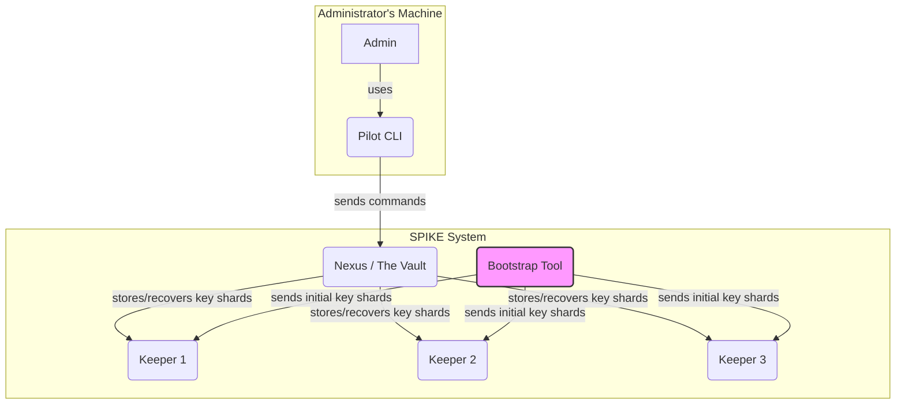

# Chapter 1: Component Architecture

Welcome to the SPIKE tutorial! We're excited to have you on board. If you've ever wondered how modern applications handle sensitive information like API keys, passwords, or database credentials, you've come to the right place. SPIKE is a system designed to manage these "secrets" in a way that is both secure and reliable.

Let's start our journey by understanding the big picture.

### What's the Big Idea? A Secure Vault

Imagine you need to protect a priceless treasure. You wouldn't just leave it in a drawer; you'd put it in a high-tech vault. This vault would have several features:

*   A main, impenetrable chamber to store the treasure.
*   A complex master key that is too powerful for one person to hold.
*   A group of trusted key-holders, each with just a piece of the master key.
*   A secure remote control to manage the vault without being physically present.
*   An initial setup process to create the master key and distribute the pieces.

SPIKE works exactly like this secure vault system. It's not one single program, but a team of four specialized applications that work together. Let's meet the team!

### The Four Core Components of SPIKE

SPIKE is composed of four main applications. Each has a very specific and important job.

1.  **Nexus:** The main vault that stores and manages all secrets.
2.  **Keeper:** The trusted key-holders who help the vault recover if something goes wrong.
3.  **Pilot:** The remote control used by administrators to interact with the vault.
4.  **Bootstrap:** The one-time setup tool that forges the master key.

Let's look at each one in more detail.

#### 1. Nexus: The Vault

**Nexus** is the heart of the entire SPIKE system. Think of it as the central, secure vault.

*   **Its Job:** To store all your secrets.
*   **How it Works:** Nexus doesn't just store secrets in plain text. It encrypts everything using a single, ultra-powerful "root key". Without this root key, all the stored data is just meaningless gibberish. Nexus is the only component that can encrypt new secrets or decrypt existing ones.

You can find its source code in the `./app/nexus` directory of the project.

#### 2. Keeper: The Key-Holders

A single root key is a single point of failure. What if Nexus crashes and forgets its root key? The entire system would be locked forever! That's where the **Keepers** come in.

*   **Their Job:** To ensure the system can recover from a disaster.
*   **How they Work:** During setup, SPIKE's root key is split into several unique pieces, called "shards". Each Keeper holds just *one* of these shards in its memory. A single shard is useless on its own. You need a specific number of shards (e.g., 3 out of 5) to put the original root key back together. This clever technique is the focus of a later chapter, [Root Key Management & Shamir's Secret Sharing](05_root_key_management___shamir_s_secret_sharing_.md).

By spreading the key shards across multiple Keepers, SPIKE ensures that even if Nexus restarts, it can ask the Keepers for their shards and rebuild its root key automatically.

#### 3. Pilot: The Remote Control

How does a system administrator actually use the vault? They can't just walk up and open it. They need a secure way to interact with it from their own computer. This is the job of the **Pilot**.

*   **Its Job:** To act as the command-line interface (CLI) for SPIKE.
*   **How it Works:** An administrator uses the `spike` command (which is the Pilot application) to perform actions like adding a new secret or retrieving an existing one. For example:

```bash
# This command tells Nexus to store a database password
spike put secrets/database/prod password="super-secret-password"
```

When you run this command, Pilot sends a secure, encrypted message to Nexus. This ensures that only authorized administrators can manage the vault.

#### 4. Bootstrap: The Initial Setup

Before the vault can be used, it needs to be built and secured. The master key needs to be created, split into pieces, and given to the key-holders. This crucial, one-time setup is handled by **Bootstrap**.

*   **Its Job:** To initialize the entire SPIKE system.
*   **How it Works:** Bootstrap is a tool that you run only once. It generates the powerful root key, uses a special algorithm to split it into shards, and securely delivers one shard to each Keeper. Once its job is done, Bootstrap is no longer needed for day-to-day operations.

### How They All Work Together

Now that we've met the individual components, let's see how they interact. The following diagram shows the relationships between them.



Let's walk through the flow:

1.  **Setup (One Time):** The **Bootstrap** tool is run. It creates the master root key, splits it into shards, and sends one shard to each **Keeper**.
2.  **Normal Operations:** An administrator uses the **Pilot** CLI to send a command (e.g., "store this secret").
3.  **Action:** The **Pilot** securely communicates this command to **Nexus**.
4.  **Storage:** **Nexus** encrypts the secret using its root key and stores it.
5.  **Recovery:** If **Nexus** ever restarts (due to a crash or update), it wakes up without its root key. It then contacts the **Keepers**, collects enough shards, rebuilds the root key in its memory, and resumes normal operation.

### Conclusion

You've just learned the fundamental architecture of SPIKE! By understanding it as a secure vault system, you can see how each of the four components—Nexus, Keeper, Pilot, and Bootstrap—plays a vital role in keeping secrets safe and accessible.

*   **Nexus** is the vault.
*   **Keepers** are the trusted key-holders for recovery.
*   **Pilot** is the admin's remote control.
*   **Bootstrap** is the initial locksmith.

But a big question remains: how do these components talk to each other so securely? How does Nexus know it's talking to a real Keeper and not an imposter? This is handled by giving each component a strong, verifiable digital identity.

In the next chapter, we will dive into this fascinating topic.

[Next Chapter: SPIFFE Identity & mTLS Communication](02_spiffe_identity___mtls_communication_.md)

---

Generated by [AI Codebase Knowledge Builder](https://github.com/The-Pocket/Tutorial-Codebase-Knowledge)