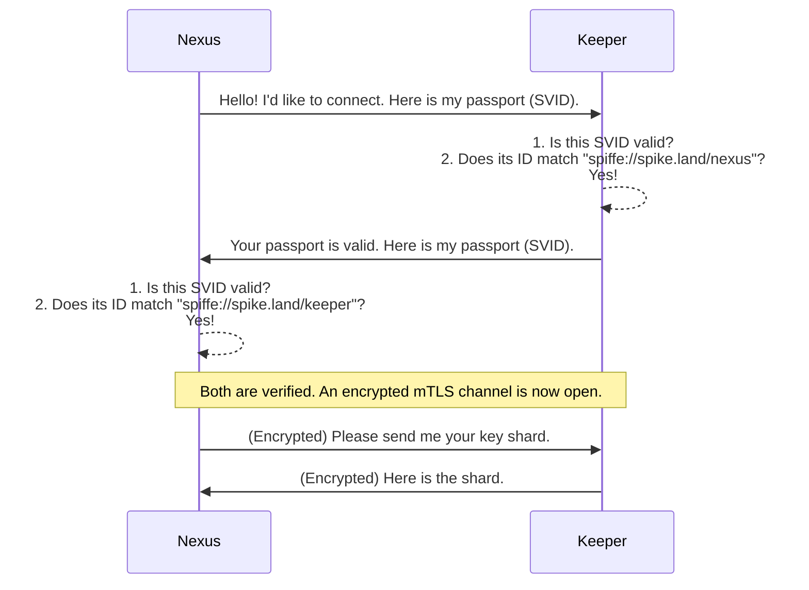

# Chapter 2: SPIFFE Identity & mTLS Communication

In the [previous chapter](01_component_architecture_.md), we learned that SPIKE is a system of four components—Nexus, Keeper, Pilot, and Bootstrap—that work together like a high-tech vault. A crucial question we left unanswered was: how do these components trust each other?

When the Pilot CLI sends a command to Nexus, how does Nexus know it's a real command from an authorized administrator and not an attacker trying to steal secrets? This chapter dives into the security foundation of SPIKE, which ensures that every conversation is secure and every participant is who they say they are.

### The Problem: Trust in a Digital World

Imagine an exclusive, members-only club. To get in, you have to show your membership card to the bouncer. The bouncer's job is to:
1.  Check that your card is a real, non-forged membership card.
2.  Check that the photo on the card matches your face.

In the digital world of SPIKE, Nexus is the exclusive club, and other components like Pilot and Keeper are the members trying to get in. We need a digital equivalent of a membership card and a bouncer. This is where SPIFFE comes in.

### What is SPIFFE? The Digital Passport Office

**SPIFFE** (the **S**ecure **P**roduction **I**dentity **F**ramework **F**or **E**veryone) is an open-standard set of rules for issuing digital identities to software. Think of it as a highly secure, automated passport office for your applications.

Just like a real passport proves who you are, a SPIFFE identity proves what a piece of software is.

#### Key Concept 1: The SPIFFE ID and SVID

SPIFFE provides two key things to each SPIKE component:

1.  **SPIFFE ID:** A unique name for a service. It looks like a special web address. For example, the SPIFFE ID for the Nexus component might be `spiffe://spike.land/nexus`. This is like your name written in your passport.
2.  **SVID (SPIFFE Verifiable Identity Document):** The actual, physical passport. It's a cryptographic document (specifically, an X.509 certificate) that contains the SPIFFE ID and is digitally signed by a trusted authority. An SVID is proof that a component is who it claims to be. It's very difficult to forge.

So, when Nexus starts, the "SPIFFE passport office" issues it an SVID containing the ID `spiffe://spike.land/nexus`. The Keepers and Pilot get their own SVIDs with their own unique IDs.

```mermaid
graph LR
    subgraph "SPIFFE 'Passport Office'"
        A[SPIFFE Authority]
    end
    
    A -- issues SVID --> N(Nexus)
    A -- issues SVID --> K(Keeper)
    A -- issues SVID --> P(Pilot)

    N -- SVID has ID: "spiffe://spike.land/nexus" --> N
    K -- SVID has ID: "spiffe://spike.land/keeper" --> K
    P -- SVID has ID: "spiffe://spike.land/pilot" --> P
```

### How Components Talk: Mutual TLS (mTLS)

Now that every component has a passport (SVID), how do they use it? They use a secure communication protocol called **Mutual TLS**, or **mTLS**.

You might already be familiar with TLS. It's the technology that puts the little padlock icon in your web browser, securing your connection to a website. In a normal TLS connection, only the website shows you its ID (its certificate) to prove it's the real `google.com`. You don't have to prove your identity back to Google.

**Mutual TLS** takes this one step further. It's like a secret agent rendezvous where *both agents must show their credentials to each other* before they exchange any information.

When two SPIKE components want to talk:
1.  Component A shows its SVID to Component B.
2.  Component B shows its SVID to Component A.
3.  Both components check the other's SVID to make sure it's valid and signed by the trusted "passport office".
4.  Only if both checks pass do they establish a secure, encrypted communication channel.

This process ensures that Nexus will *only* talk to a component that can prove it's a legitimate Keeper or Pilot, and vice-versa.

### Identity Checks in Action

Let's look at a real-world example in the SPIKE codebase. The Keeper component is designed to only accept connections from Nexus. It doesn't want to talk to anyone else.

Here is the simplified code that acts as the "bouncer" for the Keeper:

*File: `app/keeper/internal/net/serve.go`*
```go
// Serve starts a secure server for the Keeper.
func Serve(appName string, source *workloadapi.X509Source) {
	// ... server setup happens here ...

	// This function decides who is allowed to connect.
	allowConnection := func(peerSpiffeId string) bool {
		// Only SPIKE Nexus can talk to SPIKE Keeper.
		return spiffeid.PeerCanTalkToKeeper(
			env.TrustRootForNexus(), peerSpiffeId,
		)
	}

	// Start the server with our bouncer rule.
	net.ServeWithPredicate(source, ..., allowConnection, ...)
}
```

This code is incredibly powerful. Let's break it down:
1.  We define a rule called `allowConnection`. This function will be run every time a new component tries to connect to the Keeper.
2.  It receives the `peerSpiffeId`—the "passport ID" of the component that is trying to connect.
3.  The line `spiffeid.PeerCanTalkToKeeper(...)` checks if that ID belongs to Nexus.
4.  It returns `true` (let them in) if the ID is for Nexus, and `false` (slam the door) for everyone else.

This simple check is the heart of SPIKE's zero-trust security. No component is trusted by default. Its identity must be cryptographically proven first.

### Under the Hood: A Secure Handshake

So what happens step-by-step when Nexus needs to ask a Keeper for a key shard?



This entire handshake happens automatically in milliseconds every time two components communicate, ensuring constant security.

#### Getting an Identity at Startup

Before any of this can happen, each component needs to get its SVID. When a SPIKE component starts, one of its first actions is to contact the local SPIFFE agent to receive its identity.

*File: `app/nexus/cmd/main.go`*
```go
func main() {
    // ... setup ...

    // Ask the local SPIFFE "passport office" for our identity.
    source, selfSPIFFEID, err := spiffe.Source(ctx, spiffe.EndpointSocket())
    if err != nil {
        log.FatalLn("failed to get source", "err", err.Error())
    }
    defer spiffe.CloseSource(source)

    log.Log().Info("My SPIFFE ID is: " + selfSPIFFEID)
}
```
This code gets the SVID (stored in `source`) and the SPIFFE ID string (`selfSPIFFEID`). Immediately after, the component performs a self-check to make sure it received the *correct* identity.

*File: `app/nexus/cmd/main.go`*
```go
// I am supposed to be Nexus. Let's check my passport.
if !spiffeid.IsNexus(env.TrustRoot(), selfSPIFFEID) {
    log.FatalLn("My SPIFFE ID is not the one for Nexus. Shutting down.")
}
```
This is like looking at your new passport and making sure the name printed on it is actually yours. If a component is misconfigured and gets the wrong identity, it will refuse to start, preventing a major security risk.

This same principle is used by the `spike` CLI (Pilot) to ensure only authorized administrators can run sensitive commands. The logic is encapsulated in helper functions.

*File: `app/spike/internal/trust/spiffeid.go`*
```go
// Authenticate verifies the user has a "super user" SPIFFE ID.
func Authenticate(SPIFFEID string) {
	if !svid.IsPilot(env.TrustRoot(), SPIFFEID) {
		log.FatalLn("You are not authorized to use this command.")
	}
}
```
Before running a command like `spike put secret ...`, the Pilot uses this function to check its own SVID. If it doesn't have the required "pilot" identity, the command fails instantly. This is a core part of the [Access Control Policies](04_access_control_policies_.md) we will cover later.

### Conclusion

You've just learned about the security backbone of SPIKE. Instead of relying on network locations or simple passwords, SPIKE operates on a "zero-trust" model powered by strong, cryptographic identities.

Here are the key takeaways:
*   **SPIFFE** acts as a passport office for software.
*   Every SPIKE component gets a passport, called an **SVID**, which contains its unique **SPIFFE ID**.
*   Components use **mTLS** to perform a mutual passport check before establishing a secure, encrypted communication channel.
*   These identities are not just for connection—they are also used to make decisions about *who* is allowed to do *what*.

Now that we understand *how* components talk securely, we can explore *what* they talk about. How does Pilot tell Nexus what to do? How are API requests structured and handled?

[Next Chapter: API Routing & Interceptors](03_api_routing___interceptors_.md)

---

Generated by [AI Codebase Knowledge Builder](https://github.com/The-Pocket/Tutorial-Codebase-Knowledge)