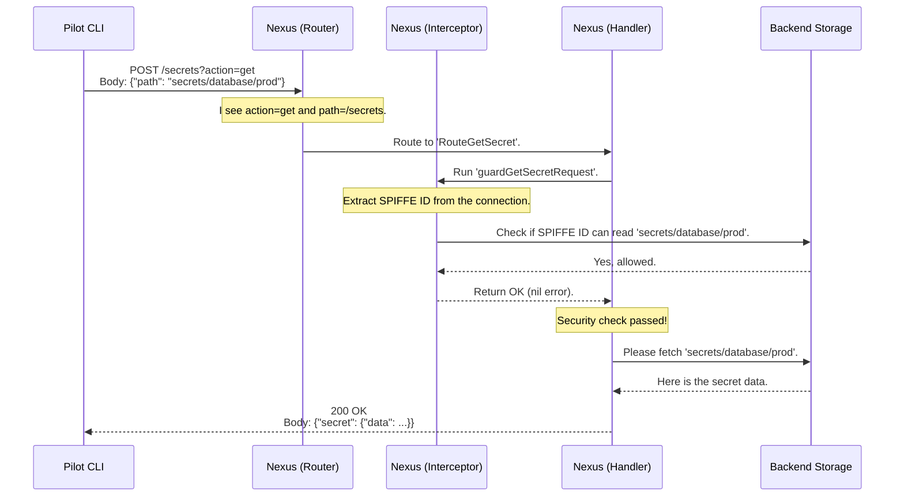

# Chapter 3: API Routing & Interceptors

In the [previous chapter](02_spiffe_identity___mtls_communication_.md), we discovered how SPIKE components use SPIFFE IDs and mTLS to establish secure, trusted communication channels. It's like having a secret, encrypted phone line where both parties know for sure who they are talking to.

But now that they have a secure line, what do they talk about? How does Nexus understand a command like "store this new password" and make sure the person asking is actually allowed to do it?

This chapter explores the "central nervous system" of the Nexus API: the system that receives requests, understands them, and most importantly, checks for permission before acting.

### The Use Case: Asking for a Secret

Let's imagine an administrator, Alice, needs to retrieve a database password for a production application. She runs a command using the Pilot CLI:

```bash
spike get secrets/database/prod
```

This command sends an HTTP request over a secure mTLS channel to Nexus. Nexus now has two critical questions to answer:
1.  **What does the user want?** (The "Routing" part)
2.  **Is the user allowed to do it?** (The "Interceptor" part)

Think of Nexus as the front desk of a high-security building. When you arrive, you first tell the receptionist where you want to go. Then, a security guard checks your ID and guest list before letting you proceed.

```mermaid
graph TD
    A[Pilot sends request: "Get secrets/database/prod"] --> B{Nexus API};
    subgraph Nexus
        B -- "What do you want?" --> C[Router];
        C -- "You want to 'get a secret'. Now, let's check your ID." --> D[Interceptor / Security Guard];
        D -- "Are you allowed to read 'secrets/database/prod'?" --> E{Permission Check};
        E -- "Yes, you are." --> F[Handler / The Office];
        F -- "Here is the secret!" --> G[Nexus sends Response];
    end
    G --> H[Pilot receives secret];
    
    style D fill:#f9f,stroke:#333,stroke-width:2px
```

Let's break down how this works inside Nexus.

### Step 1: Routing - The Receptionist

When a request arrives at Nexus, the first component it meets is the **Router**. The router's job is simple: look at the request's URL and figure out which piece of code should handle it. It's like a receptionist looking at your appointment slip and telling you to go to "Room 201".

In SPIKE, all API requests are sent to a single entry point. The router then uses a factory pattern to decide what to do next.

*File: `app/nexus/internal/route/base/route.go`*
```go
// Route handles all incoming HTTP requests by selecting the right handler.
func Route(w http.ResponseWriter, r *http.Request, ...) error {
	return net.RouteFactory(
		// ... path, action, method ...
		// This is the function that acts as our receptionist.
		func(a url.APIAction, p url.APIURL) net.Handler {
			// ... some readiness checks ...
			return routeWithBackingStore(a, p)
		})(w, r, a)
}
```
This code sets up a `RouteFactory` which acts as our main router. Its job is to call the "receptionist" function (the `func(...)` part), which in turn decides the final destination. The destination is determined by `routeWithBackingStore`.

Let's look inside that function to see the actual routing table.

*File: `app/nexus/internal/route/base/impl.go`*
```go
func routeWithBackingStore(a url.APIAction, p url.APIURL) net.Handler {
	switch {
	// If the action is "Get" and the path is for "Secrets"...
	case a == url.ActionGet && p == url.NexusSecrets:
		// ...then send the request to the "Get Secret" handler.
		return secret.RouteGetSecret
	// ... other routes for putting secrets, deleting policies, etc. ...
	default:
		return net.Fallback // If we don't recognize it, reject.
	}
}
```
This `switch` statement is the core of the router. It's a simple set of rules. For Alice's request (`get secrets/...`), the router matches the second line and directs the request to a special function called `secret.RouteGetSecret`. This function is our "handler"—the code that actually knows how to fetch a secret from storage.

### Step 2: Interceptors - The Security Guard

The request has now been routed to the correct handler, `RouteGetSecret`. But before this handler is allowed to touch any sensitive data, it must pass a security check. This is the job of the **Interceptor**, which we call a "guard" function in the code.

The very first thing the handler does is call its guard.

*File: `app/nexus/internal/route/secret/get.go`*
```go
// RouteGetSecret handles requests to retrieve a secret.
func RouteGetSecret(w http.ResponseWriter, r *http.Request, ...) error {
	// ... code to read the request ...
	
	// STOP! Before we do anything, call the security guard.
	err := guardGetSecretRequest(*request, w, r)
	if err != nil {
		// If the guard says no, stop right here.
		return err
	}

	// If we get here, the guard said yes. Proceed to get the secret.
	secret, err := state.GetSecret(path, version)
	// ... handle success or failure ...
	return nil
}
```
Notice how the logic is separated. The `RouteGetSecret` function coordinates the process, but the critical security check is delegated to `guardGetSecretRequest`. If the guard function returns an error, the main handler stops immediately and never even tries to access the secret.

So, what does this security guard actually do?

*File: `app/nexus/internal/route/secret/get_intercept.go`*
```go
func guardGetSecretRequest(
	request reqres.SecretReadRequest, w http.ResponseWriter, r *http.Request,
) error {
	// Step 1: Get the caller's ID card (SPIFFE ID) from the request.
	sid, err := spiffe.IDFromRequest(r)
	if err != nil || sid == nil {
		// No ID card? Access denied.
		return apiErr.ErrUnauthorized
	}

	// Step 2: Check if they are on the guest list for this specific secret.
	allowed := state.CheckAccess(
		sid.String(), // Who is asking?
		request.Path, // What are they asking for?
		[]data.PolicyPermission{data.PermissionRead}, // What do they want to do?
	)

	if !allowed {
		// Not on the list? Access denied.
		return apiErr.ErrUnauthorized
	}

	// All checks passed. You may proceed.
	return nil
}
```
This is the heart of SPIKE's API security. Let's break it down:
1.  **Get the Identity:** It uses the secure mTLS connection (from Chapter 2) to extract the caller's verified `SPIFFE ID`. This is like the guard taking your photo ID. If you don't have one, you're immediately turned away.
2.  **Check Permissions:** It then calls `state.CheckAccess`. This function is the "guest list". It looks up the rules defined in the system's [Access Control Policies](04_access_control_policies_.md) to see if this specific SPIFFE ID (`sid.String()`) is allowed to `Read` the secret at that specific `path`.
3.  **Make a Decision:** If the caller has the right identity and the right permissions, the function returns `nil` (no error), signaling that everything is okay. If not, it returns an `ErrUnauthorized`, which stops the whole process.

### The Full Journey, Under the Hood

Let's visualize Alice's entire request from start to finish with a sequence diagram.



This flow ensures that for every single API call, security is not an afterthought—it's the very first checkpoint. The logic for reading secrets is completely separate from the logic for verifying permissions, making the system easier to understand and more secure.

### Conclusion

You've just learned how Nexus processes incoming API requests securely and efficiently. This two-stage process is fundamental to how SPIKE works.

*   **API Routing** acts like a receptionist, looking at a request's URL and directing it to the correct handler function.
*   **Interceptors** (or "guards") act as security checkpoints. They run *before* the main handler logic, using the caller's SPIFFE ID to verify they have permission to perform the requested action.

This powerful pattern of "route then guard" is used for every API endpoint in Nexus, from managing secrets to configuring policies. It guarantees that no action is ever performed without proper authorization.

But how does that `state.CheckAccess` function actually work? How do we define the rules that say "this service can read secrets, but that one can only write policies"? That's the topic of our next chapter.

[Next Chapter: Access Control Policies](04_access_control_policies_.md)

---

Generated by [AI Codebase Knowledge Builder](https://github.com/The-Pocket/Tutorial-Codebase-Knowledge)