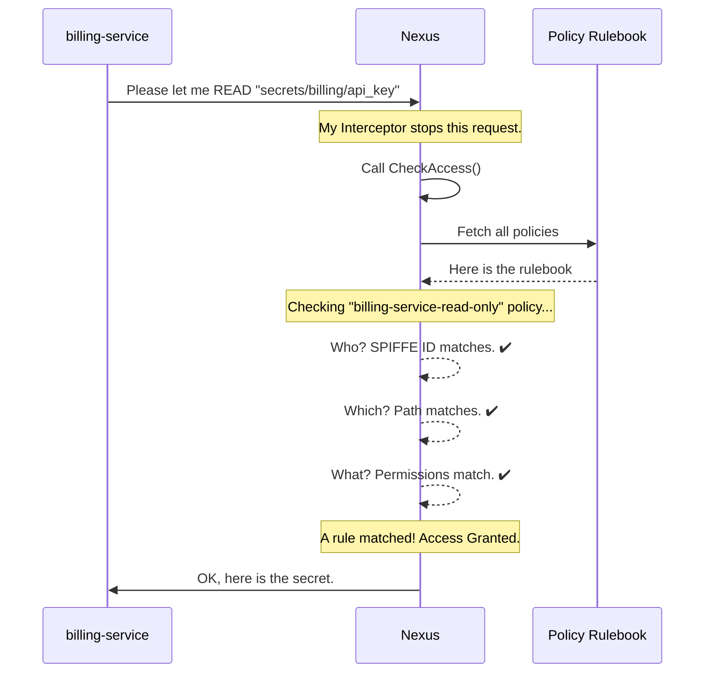

# Chapter 4: Access Control Policies

In the [previous chapter](03_api_routing___interceptors_.md), we saw how Nexus acts like a building with a security guard. Every time a request comes in, an "interceptor" stops it at the door to check for permission by calling a function called `state.CheckAccess`.

But what exactly is that function checking? It's looking at a rulebook, a set of access control policies. This chapter dives into what those policies are and how they form the backbone of SPIKE's security model.

### The Problem: Not All Services Are Created Equal

Imagine you have two different services running in your company:
1.  A `billing-service` that handles payments and needs access to API keys stored at `secrets/billing/api_key`.
2.  A `user-profiles-service` that manages user data and needs access to a database password at `secrets/profiles/db_password`.

You absolutely want the `billing-service` to be able to read its own secrets. But you would *never* want it to be able to read the user profiles database password. A bug or a security breach in the billing service could be disastrous if it had access to everything.

This is where policies come in. They are the fine-grained rules that act as the security guard's official instructions, ensuring that each service can only access the exact secrets it needs, and nothing more. This is known as the **Principle of Least Privilege**.

### What is a Policy? The Three W's

A SPIKE policy is a single, simple rule that answers three questions: **Who**, **What**, and **Which**.

Think of it like an access card for a high-security facility. The card defines:
1.  **Who?** The person's identity (e.g., "Alice, the Engineer").
2.  **What?** The actions they can perform (e.g., "Open doors").
3.  **Which?** The specific rooms they can enter (e.g., "Server Room B").

A SPIKE policy works exactly the same way for your software services:

1.  **Who? (The SPIFFE ID Pattern):** This identifies the service trying to access a secret. It's not just a single name, but a *pattern* that can match a group of services. For example, a pattern could match any service whose [SPIFFE Identity](02_spiffe_identity___mtls_communication_.md) starts with `spiffe://mycompany.com/billing-`.
2.  **What? (The Permissions):** This defines the actions the service is allowed to perform, like `read`, `write`, or `list`.
3.  **Which? (The Path Pattern):** This identifies the secrets the rule applies to. Like the SPIFFE ID, this is also a pattern that can match a group of secret paths, like `secrets/billing/*`.

Access is denied by default. Nexus will only grant access if it finds a policy that explicitly says "yes" to all three questions.

### Creating Our First Policy

Let's solve our problem from earlier. We need to create a policy that allows the `billing-service` to read secrets under the `secrets/billing/` path. We can do this using the Pilot CLI.

Here's the command an administrator would run:

```bash
spike policy create \
  --name="billing-service-read-only" \
  --spiffeid-pattern="^spiffe://mycompany.com/billing-service$" \
  --path-pattern="^secrets/billing/.*$" \
  --permissions="read"
```

Let's break this down piece by piece:

*   `--name="billing-service-read-only"`: This is just a human-friendly name for the policy so we can easily remember what it does.
*   `--spiffeid-pattern="..."`: This is the **"Who"**. It's a regular expression that matches the exact SPIFFE ID of our billing service.
*   `--path-pattern="..."`: This is the **"Which"**. It's another regular expression that matches any secret path starting with `secrets/billing/`.
*   `--permissions="read"`: This is the **"What"**. It grants permission to read secrets.

When you run this command, Pilot sends a request to Nexus to store this new rule. Now, the security guard has a new instruction in its rulebook.

### Under the Hood: The Permission Check

Now we can connect the dots. When our `billing-service` tries to read the secret at `secrets/billing/api_key`, what happens inside Nexus?

1.  The request arrives, and as we saw in the last chapter, the interceptor calls `state.CheckAccess`.
2.  The `CheckAccess` function receives the caller's identity (`spiffe://mycompany.com/billing-service`), the path they want to access (`secrets/billing/api_key`), and the action they want to perform (`read`).
3.  Nexus opens its rulebook and checks our new policy.
    *   **Does the "Who" match?** Yes, `^spiffe://mycompany.com/billing-service$` matches the caller's ID.
    *   **Does the "Which" match?** Yes, `^secrets/billing/.*$` matches the requested path.
    *   **Does the "What" match?** Yes, the policy allows `read`.
4.  Since a policy grants permission, `CheckAccess` returns `true`, and the request is allowed to proceed.

But what if the `billing-service` tries to read `secrets/profiles/db_password`? Nexus would check the rulebook again, find no policy that matches, and deny the request.

Here's a diagram of the successful check:



### A Glimpse at the Code

The logic for this check is beautifully simple. Here's a simplified version of the code that runs inside Nexus.

*File: `app/nexus/internal/state/base/policy.go`*
```go
func CheckAccess(peerSPIFFEID string, path string, wants []data.PolicyPermission) bool {
	// Get all the rules from our rulebook.
	policies, err := ListPolicies()
	// ... error handling ...

	// Go through each rule, one by one.
	for _, policy := range policies {
		// Does the caller's ID match the "Who" pattern?
		if !policy.IDRegex.MatchString(peerSPIFFEID) {
			continue // No match, try the next rule.
		}

		// Does the secret's path match the "Which" pattern?
		if !policy.PathRegex.MatchString(path) {
			continue // No match, try the next rule.
		}

		// Does this rule grant the "What" permission we need?
		if hasAllPermissions(policy.Permissions, wants) {
			return true // Yes! Access granted. Stop searching.
		}
	}

	return false // We checked all rules and found no match. Access denied.
}
```

This code does exactly what we described:
1.  It gets the list of all policies.
2.  It loops through them.
3.  For each policy, it uses pre-compiled regular expressions (`IDRegex` and `PathRegex`) to see if the caller and the secret path match the patterns.
4.  If both patterns match, it checks the permissions.
5.  If a policy grants access, the function returns `true` immediately. If the loop finishes without finding a matching policy, it returns `false`.

### Conclusion

You've just learned about the core of SPIKE's authorization system! Access Control Policies provide a powerful and flexible way to secure your secrets.

Here are the key takeaways:
*   **Policies are the security rules** that Nexus uses to make authorization decisions.
*   Each policy defines **"Who"** (a SPIFFE ID pattern), **"What"** (permissions like `read`), and **"Which"** (a secret path pattern).
*   Access is **denied by default**. A request is only granted if a policy explicitly allows it.
*   This embodies the **Principle of Least Privilege**, ensuring services can only access what they absolutely need.

We now have a complete picture of how secrets are stored and accessed. But this whole system relies on one critical component we haven't discussed: the master "root key" that Nexus uses to encrypt everything. What is it, where does it come from, and how is it kept safe?

[Next Chapter: Root Key Management & Shamir's Secret Sharing](05_root_key_management___shamir_s_secret_sharing_.md)

---

Generated by [AI Codebase Knowledge Builder](https://github.com/The-Pocket/Tutorial-Codebase-Knowledge)