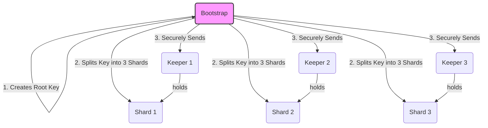
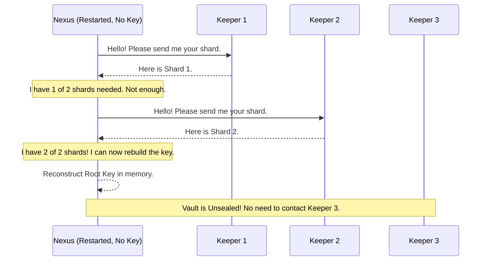

# Chapter 5: Root Key Management & Shamir's Secret Sharing

In the [previous chapter](04_access_control_policies_.md), we learned how SPIKE uses policies to decide who can access what. We know that when Nexus stores a secret, it encrypts it first. But what is it using to encrypt that data?

The answer is a single, ultra-powerful master key called the **Root Key**. This key is the most important secret in the entire system. If you have the Root Key, you can decrypt everything. This chapter explains how SPIKE protects this master key from being lost or stolen, ensuring the system is both secure and resilient.

### The Problem: The Key That's Too Important to Exist

Imagine the Root Key is a physical key to a bank vault. For security, you never want to write "VAULT KEY" on it and leave it on your desk. The safest place for the key is inside the vault operator's head (in memory).

Nexus works the same way: it keeps the Root Key only in its memory. This is great for security because if someone steals the server's hard drive, the key isn't there.

But this creates a huge problem: What happens if the Nexus server crashes or needs to be restarted? Its memory is wiped clean, and the Root Key is lost forever! All the secrets in the vault would be permanently unreadable. This is a massive single point of failure.

How can we recover the key after a restart without ever writing it down in one place?

### The Solution: A Magical Treasure Map

Let's use an analogy. Imagine you have a treasure map that leads to a priceless treasure. The map is too valuable to keep in one piece.

So, you take the map and use magic to tear it into **5 unique scraps**. You also cast a spell on it with a special rule: **any 3 scraps** brought together will instantly reform the original map. However, any 1 or 2 scraps are completely useless and reveal nothing about the treasure's location.

You then give one scrap to each of your 5 most trusted friends.

Now, your map is perfectly safe:
*   No single friend has the whole map.
*   If one or two friends get captured, the map is still safe.
*   To get the treasure, you just need to gather any 3 of your friends and ask for their scraps.

This magical technique is a real cryptographic method called **Shamir's Secret Sharing**, and it's the core of SPIKE's resilience.

In SPIKE:
*   The **Root Key** is the treasure map.
*   The unique scraps are called **shards**.
*   Your trusted friends are the **Keeper** components.
*   The rule (e.g., "3 out of 5") is called the **threshold**.

### Step 1: Initialization - Creating and Splitting the Key

This process of creating the key and splitting it into shards happens only once when SPIKE is first set up. The **Bootstrap** component is the one responsible for this magical ceremony.

Here's what it does:
1.  **Generate Root Key:** Bootstrap creates a new, cryptographically random 32-byte Root Key.
2.  **Split into Shards:** It uses Shamir's Secret Sharing to split the key into a configured number of shards (e.g., 3).
3.  **Set the Threshold:** It configures how many shards are needed for recovery (e.g., 2).
4.  **Distribute to Keepers:** It securely connects to each Keeper and gives it *one* unique shard. The Keepers then hold this shard in their memory, waiting for Nexus to ask for it.



Let's peek at a simplified version of the code inside Bootstrap that does this.

*File: `app/bootstrap/internal/state/state.go`*
```go
// RootShares generates a set of Shamir secret shares.
func RootShares() []shamir.Share {
	// 1. Create a 32-byte cryptographically secure random key.
	var rootKeySeed [32]byte
	rand.Read(rootKeySeed[:]) // Simplified for clarity

	// 2. Define the rules (e.g., 3 total shares, need 2 to unlock).
	totalShares := uint(env.ShamirShares())      // e.g., 3
	threshold := uint(env.ShamirThreshold() - 1) // e.g., 1 (means 2 are needed)

	// 3. Create a secret object from the random key.
	rootSecret := createSecretFrom(rootKeySeed) // Simplified helper

	// 4. Split the secret into shares using the Shamir library.
	ss := shamir.New(..., threshold, rootSecret)
	shards := ss.Share(totalShares)

	log.Log().Info("Successfully generated shards.")
	return shards
}
```
This code performs the one-time setup. Once Bootstrap is done, the Keepers are "seeded" with their key shards, and the system is ready.

### Step 2: Recovery - How Nexus Rebuilds the Key

Now for the main event. Let's say Nexus crashes and restarts. Its memory is empty. The vault is **sealed**. It cannot read or write any secrets.

To become operational again, Nexus must perform the recovery process:
1.  **Wake Up:** Nexus starts but realizes it has no Root Key.
2.  **Contact Keepers:** It reaches out to the list of known Keepers over a secure [mTLS channel](02_spiffe_identity___mtls_communication_.md).
3.  **Collect Shards:** It asks each Keeper, "Please give me your shard." The Keepers respond with the shard they have been holding in memory.
4.  **Check Threshold:** Nexus collects the shards one by one. After it gets the first shard, it's not enough. When it gets the second shard, it meets the threshold (we configured it to be 2).
5.  **Reconstruct Key:** Nexus uses the collected shards and the Shamir's Secret Sharing algorithm to magically reconstruct the original Root Key in its memory.
6.  **Unsealed:** The vault is now **unsealed**! Nexus is fully operational and can encrypt and decrypt secrets again.

This entire process happens automatically and usually takes only a few seconds.

Here is a diagram showing the recovery flow:



This makes the system incredibly resilient. Even if one of the Keepers is down during a Nexus restart, Nexus can just ask the other Keepers and still recover successfully.

Let's look at the code inside Nexus that rebuilds the key.

*File: `app/nexus/internal/initialization/recovery/root_key.go`*
```go
// ComputeRootKeyFromShards reconstructs the original root key.
func ComputeRootKeyFromShards(shards []ShamirShard) *[32]byte {
	// ... code to convert our shards into the library's format ...

	// The number of shards needed to unlock (e.g., 2).
	threshold := uint(env.ShamirThreshold() - 1)

	// Use the magic of Shamir's algorithm to recover the original secret.
	reconstructedSecret, err := secretsharing.Recover(threshold, shares)
	if err != nil {
		log.FatalLn("Failed to recover the root key!")
	}

	// Convert the secret back into a 32-byte key.
	finalKey := convertSecretToKey(reconstructedSecret) // Simplified helper
	return &finalKey
}
```
As you can see, the complex cryptography is handled by a library. The core logic is simple: give it enough shards, and it gives you back the original key.

### Conclusion

You've just learned about the most critical resilience mechanism in SPIKE! By avoiding a single point of failure for the master key, SPIKE ensures it can survive crashes and restarts without manual intervention.

Here are the key takeaways:
*   The **Root Key** is the master key that encrypts all data in Nexus.
*   To avoid it being a single point of failure, SPIKE uses **Shamir's Secret Sharing**.
*   The key is split into **shards**, which are distributed to **Keepers**.
*   When Nexus restarts, it contacts the Keepers, collects a **threshold** of shards, and reconstructs the Root Key in memory.

Now we understand how secrets are managed, authorized, and encrypted. But where does Nexus actually store all this encrypted data? Does it write to a file? A database?

[Next Chapter: Backend Storage Abstraction](06_backend_storage_abstraction_.md)

---

Generated by [AI Codebase Knowledge Builder](https://github.com/The-Pocket/Tutorial-Codebase-Knowledge)