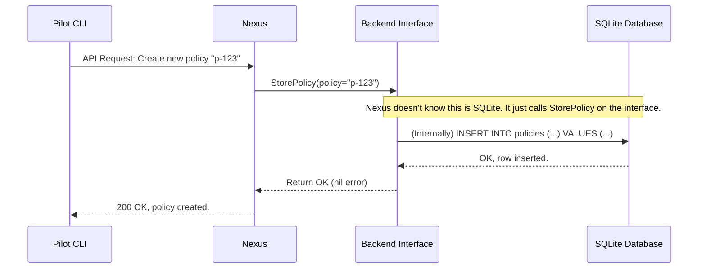

# Chapter 6: Backend Storage Abstraction

In the [previous chapter](05_root_key_management___shamir_s_secret_sharing_.md), we learned how Nexus protects and recovers its master Root Key using Shamir's Secret Sharing. We now know that every secret Nexus manages is encrypted with this key.

But that raises a simple, practical question: after a secret is encrypted, where does Nexus actually *put* it? Does it write it to a file on the server's disk? Or maybe to a powerful database? What if we want to use a cloud storage service instead? This chapter introduces the clever design that makes SPIKE incredibly flexible about where it stores its data.

### The Problem: One Plug, Many Sockets

Imagine you're traveling the world with your laptop. You land in a new country, and you need to charge it. You pull out your charger, but the wall socket is a completely different shape. You have a US plug, but the wall needs a UK socket. You're stuck.

Software faces a similar problem. If you build your application to *only* write to a specific type of database (like SQLite), you're stuck with that database. What if your company later decides to use a different one, like PostgreSQL or a cloud object store? You would have to rewrite large parts of your application. This is slow, expensive, and risky.

### The Solution: A Universal Power Adapter

The solution to the travel problem is a universal power adapter. You plug your laptop into the adapter, and the adapter can plug into any wall socket in the world. Your laptop doesn't need to know or care about the shape of the wall socket; it just needs to know about the adapter.

SPIKE's **Backend Storage Abstraction** is exactly this: a universal adapter for storage.

Nexus doesn't know the specific details of how its data is saved. It doesn't know if it's talking to a file on disk, a database, or an in-memory map used for testing. It only knows how to talk to a generic "storage adapter," which we call the `Backend` interface.

```mermaid
graph TD
    N(Nexus) -- "Save this data for me" --> I{Backend Interface};
    subgraph "Different Storage Implementations"
        I -- "I'll save it to a file." --> F[SQLite Backend];
        I -- "I'll save it in memory." --> M[In-Memory Backend];
        I -- "I'll save it to the cloud." --> C[Cloud Backend (Future)];
    end
    
    style I fill:#f9f,stroke:#333,stroke-width:2px
```

This design makes SPIKE:
*   **Flexible:** You can easily switch out the storage system without changing Nexus.
*   **Extensible:** It's easy for developers to add support for new storage systems in the future.
*   **Testable:** During testing, we can use a super-fast, simple in-memory backend instead of a real database.

### The Core Concept: The `Backend` Interface

In programming, an "interface" is like a contract. It defines a set of actions that something must be able to do, without specifying *how* it does them. The `Backend` interface in SPIKE is a simple contract for any storage system.

Here's a simplified version of that contract.

*File: `app/nexus/internal/state/backend/interface.go`*
```go
// Backend defines the contract for all storage systems.
type Backend interface {
	// StoreSecret saves an encrypted secret.
	StoreSecret(ctx context.Context, path string, secret kv.Value) error
	
	// LoadSecret retrieves an encrypted secret.
	LoadSecret(ctx context.Context, path string) (*kv.Value, error)
	
	// StorePolicy saves a policy rule.
	StorePolicy(ctx context.Context, policy data.Policy) error
	
	// LoadPolicy retrieves a policy rule.
	LoadPolicy(ctx context.Context, id string) (*data.Policy, error)
}
```
This contract is very clear. To be a valid storage backend for SPIKE, you must provide a way to store and load secrets and policies. Nexus can then use any implementation that honors this contract.

### Two Implementations: One for Testing, One for Production

SPIKE ships with two main implementations of this `Backend` interface.

#### 1. The In-Memory Backend (For Testing)

When running automated tests, we need a storage system that is extremely fast and leaves no trace. The `memory` backend does just that: it stores all secrets and policies in a simple map in the computer's memory. When the program stops, all the data disappears.

*File: `app/nexus/internal/state/backend/memory/memory.go`*
```go
// Store provides an in-memory implementation of the Backend.
type Store struct {
	// ... internal details ...
	policies map[string]*data.Policy
}

// StorePolicy stores a policy in the in-memory map.
func (s *Store) StorePolicy(_ context.Context, policy data.Policy) error {
	// ... lock for safety ...
	s.policies[policy.ID] = &policy
	return nil
}
```
This is the simplest possible implementation. It just adds the policy to a map using its ID as the key.

#### 2. The SQLite Backend (For Production)

For real-world use, we need data to be permanent. The `sqlite` backend is the default for SPIKE. It implements the same `Backend` interface, but its methods write the data to a database file on the server's disk.

*File: `app/nexus/internal/state/backend/sqlite/construct.go`*
```go
// New creates a new DataStore that connects to a SQLite database.
func New(cfg backend.Config) (backend.Backend, error) {
	// ... setup database connection and encryption cipher ...
	
	// Return the DataStore, which implements the Backend interface.
	return &persist.DataStore{
		Cipher: gcm, // The cipher for encrypting data before writing.
		Opts:   opts,  // Database connection options.
	}, nil
}
```
The internal code for the SQLite backend is more complex (it has to talk to a database), but from Nexus's perspective, it looks exactly the same as the in-memory backend. It's just another "adapter" that fulfills the `Backend` contract.

### Under the Hood: Choosing an Adapter at Startup

How does Nexus decide which adapter to use? This decision is made right when Nexus starts up, based on its configuration. A central function is responsible for creating the correct backend.

*File: `app/nexus/internal/state/persist/init.go`*
```go
func InitializeBackend(rootKey *[crypto.AES256KeySize]byte) {
	storeType := env.BackendStoreType() // Read from configuration

	switch storeType {
	case env.Memory:
		be = initializeInMemoryBackend()
	case env.Sqlite:
		be = initializeSqliteBackend(rootKey)
	default:
		// If in doubt, use the safe in-memory one.
		be = initializeInMemoryBackend()
	}
}
```
This code reads a configuration setting (e.g., "sqlite") and then calls the appropriate function to create and initialize that specific backend. Once this is done, the rest of Nexus can use the `be` variable without ever knowing or caring which type it is.

Let's see this in action with a sequence diagram for storing a new [Access Control Policy](04_access_control_policies_.md).


This flow perfectly illustrates the abstraction. Nexus's job is simple: call `StorePolicy`. The backend's job is to handle the specifics of writing to a database. The two are cleanly separated.

### Conclusion

You've just learned how SPIKE uses a powerful software design pattern to remain flexible and future-proof. The Backend Storage Abstraction acts as a universal adapter, decoupling the core logic of Nexus from the details of any specific storage system.

Here are the key takeaways:
*   The **`Backend` interface** defines a standard contract for how to store and retrieve data.
*   Different **implementations** (like `in-memory` or `sqlite`) fulfill this contract in different ways.
*   Nexus is configured at startup to use a specific backend, but the rest of its code remains blissfully unaware of the details.
*   This makes SPIKE **extensible** to new storage systems and much **easier to test**.

Now that we know how data is stored, what happens if that storage is completely destroyed in a fire or a server failure? How can we get our secrets back?

[Next Chapter: Disaster Recovery](07_disaster_recovery_.md)

---

Generated by [AI Codebase Knowledge Builder](https://github.com/The-Pocket/Tutorial-Codebase-Knowledge)