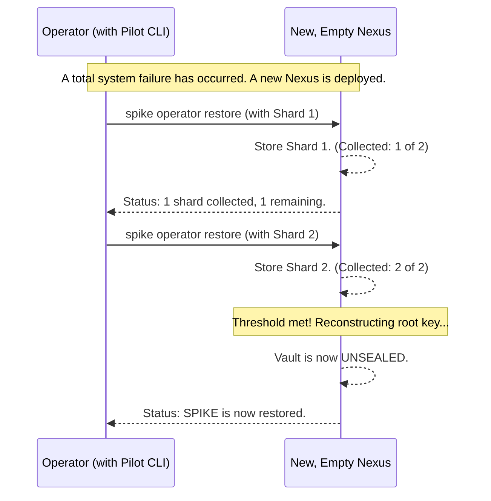

# Chapter 7: Disaster Recovery

In the [previous chapter](06_backend_storage_abstraction_.md), we saw how SPIKE can flexibly store its encrypted data in different backends, like a SQLite database file. This is great for normal operations. But it leads to a terrifying question: what happens if *everything* is destroyed?

What if the server hosting Nexus catches fire, the database file is corrupted, and all the Keeper instances crash at the same time? In this worst-case scenario, the automatic recovery process we learned about in [Chapter 5](05_root_key_management___shamir_s_secret_sharing_.md) won't work. The system is dead in the water.

This chapter covers SPIKE's ultimate safety net: the manual, operator-driven disaster recovery procedure. This is the "break-the-glass" plan for when all else fails.

### The Problem: A Total System Collapse

Imagine a bank's security system. The bank has automated procedures for daily operations and minor issues. But they also have a top-secret, offline procedure for a catastrophic event, like a natural disaster that wipes out the main branch. This procedure involves special keys kept in a separate, high-security location.

SPIKE needs a similar plan. The automatic recovery with Keepers is fantastic for everyday resilience, but it can't protect against a scenario where both Nexus and *all* its Keepers are lost simultaneously. The root key shards they held in memory are gone forever. We need a way to bring the system back from scratch, using a set of emergency keys we prepared ahead of time.

### The Solution: A Two-Step Emergency Plan

SPIKE's disaster recovery is a two-step manual process, performed by a human operator with special privileges.

1.  **Preparation (During Peacetime):** When the system is healthy, an operator generates a set of special **recovery shards**. These are like the emergency keys for the bank vault. They must be taken offline, encrypted, and stored in an extremely secure place (like a physical safe).
2.  **Restoration (During a Disaster):** After a total system failure, the operator sets up a new, empty SPIKE system. They then use a special command to feed the recovery shards back into the new Nexus, one by one. This manually reconstructs the root key, bringing the entire system back to life.

Let's walk through each step.

#### Step 1: `spike operator recover` - Creating the Emergency Keys

You don't wait for a fire to buy a fire extinguisher. Similarly, you must generate recovery shards while your SPIKE system is healthy and operational.

An administrator with special permissions runs the following command:

```bash
spike operator recover
```

When this command is run:
1.  Pilot securely connects to the healthy Nexus instance.
2.  Nexus generates a new set of Shamir's shards from its current root key.
3.  These shards are sent back to the Pilot CLI, which saves them as individual files in a local directory.

*File: `app/spike/internal/cmd/operator/recover.go`*
```go
// Inside the 'recover' command's Run function:
func(cmd *cobra.Command, args []string) {
	// ... authentication checks happen first ...

	api := spike.NewWithSource(source)
	shards, err := api.Recover()
	// ... error handling ...

	// Save each shard to a separate file.
	for i, shard := range shards {
		filePath := fmt.Sprintf("%s/spike.recovery.%d.txt", recoverDir, i)
		err := os.WriteFile(filePath, shard, 0600)
		// ... error handling ...
	}

	fmt.Println("SPIKE Recovery shards saved!")
}
```
This code calls the `api.Recover()` function, which talks to Nexus, and then loops through the returned shards to save them. The output on your screen will tell you where the files are and give you a stern warning:

```
  SPIKE Recovery shards saved to the recovery directory:
  /home/user/.spike/recover

  Please make sure that:
    1. You encrypt these shards and keep them safe.
    2. Securely erase the shards from the recovery directory.
```
This is the most critical part. These files are the keys to your entire kingdom. They must be moved off the machine, encrypted, and stored securely.

#### Step 2: `spike operator restore` - Using the Keys

Now, disaster has struck. The old system is gone. You have deployed a fresh, empty Nexus instance. It's running, but its vault is sealed and empty. It's time to use the emergency keys.

The operator, who has access to the securely stored recovery shards, runs the restore command for each shard.

```bash
# The operator runs the command, and it prompts for a shard
spike operator restore
(your input will be hidden as you paste/type it)
Enter recovery shard: spike:1:a1b2c3d4...

# The system responds with its status
 Shards collected:  1
 Shards remaining:  1
 Please run `spike operator restore` again to provide the remaining shards.
```

The operator repeats the process with the second shard:

```bash
spike operator restore
(your input will be hidden as you paste/type it)
Enter recovery shard: spike:2:e5f6g7h8...

# The system is restored!
  SPIKE is now restored and ready to use.
```

Behind the scenes, the `restore` command sends each shard to the new Nexus instance. Nexus collects them until it has enough to meet the threshold.

*File: `app/nexus/internal/route/operator/restore.go`*
```go
// A global variable to hold the shards as they arrive.
var shards []recovery.ShamirShard

func RouteRestore(w http.ResponseWriter, r *http.Request, ...) error {
	// ... read the shard from the request ...

	// Add the new shard to our collection.
	shards = append(shards, recovery.ShamirShard{
		ID:    uint64(request.ID),
		Value: request.Shard,
	})

	// Check if we have collected enough shards to unlock.
	if len(shards) == env.ShamirThreshold() {
		// Yes! Trigger the full system restoration.
		recovery.RestoreBackingStoreFromPilotShards(shards)
		log.Log().Info("System restoration complete!")
	}
	
	// ... respond to the operator with the current status ...
	return nil
}
```
This handler function is simple but powerful. It acts as a collector. With each call, it adds a shard to its list. Once the list is long enough, it kicks off the `RestoreBackingStoreFromPilotShards` function, which uses the shards to reconstruct the root key and unseal the vault.

### The Full Disaster Recovery Flow

Let's visualize the entire restoration process.



This manual, interactive process ensures that the most powerful recovery operation requires deliberate action from a trusted human operator, providing a critical layer of security and control for worst-case scenarios.

### Conclusion

You have now reached the end of our journey through the core concepts of SPIKE! In this final chapter, we covered the ultimate safety procedure for the system.

Here are the key takeaways:
*   **Disaster Recovery** is a manual, "break-the-glass" procedure for when both Nexus and all Keepers fail.
*   The process has two phases:
    1.  **`spike operator recover`:** Run on a *healthy* system to generate recovery shards, which must be stored securely offline.
    2.  **`spike operator restore`:** Run during a disaster to feed those shards back into a *new* Nexus instance, reconstructing the root key.
*   This procedure provides a final, robust guarantee that you can always regain control of your secrets, even after a catastrophic failure.

Congratulations! You've gone from the basic building blocks of the [Component Architecture](01_component_architecture_.md) to the strong cryptographic guarantees of [SPIFFE Identity](02_spiffe_identity___mtls_communication_.md), the secure logic of the [API and its policies](03_api_routing___interceptors_.md), the resilience of [Root Key Management](05_root_key_management___shamir_s_secret_sharing_.md), and finally, this ultimate Disaster Recovery plan. You now have a comprehensive understanding of how SPIKE keeps your most valuable data safe and available.

---

Generated by [AI Codebase Knowledge Builder](https://github.com/The-Pocket/Tutorial-Codebase-Knowledge)