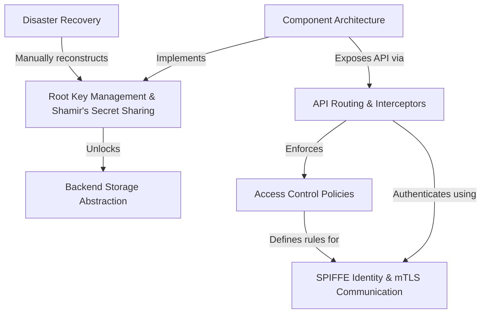

# Tutorial: spike

SPIKE is a secure vault for managing your application's secrets, like passwords and API keys. It's built on a "zero-trust" principle, where every part of the system has a cryptographic passport (*a SPIFFE ID*) and must prove its identity before communicating. The main vault, **Nexus**, protects secrets using a master key that is so important it's split into pieces using *Shamir's Secret Sharing*. These pieces are held by trusted **Keepers**, ensuring that even if the main vault restarts, it can securely recover by reassembling the key from the Keepers. Administrators use a secure remote control, **Pilot**, to manage secrets and access rules.

**Source Repository:** [None](None)

## Chapters

1. [Component Architecture
](01_component_architecture_.md)
2. [SPIFFE Identity & mTLS Communication
](02_spiffe_identity___mtls_communication_.md)
3. [API Routing & Interceptors
](03_api_routing___interceptors_.md)
4. [Access Control Policies
](04_access_control_policies_.md)
5. [Root Key Management & Shamir's Secret Sharing
](05_root_key_management___shamir_s_secret_sharing_.md)
6. [Backend Storage Abstraction
](06_backend_storage_abstraction_.md)
7. [Disaster Recovery
](07_disaster_recovery_.md)

---

Generated by [AI Codebase Knowledge Builder](https://github.com/The-Pocket/Tutorial-Codebase-Knowledge)