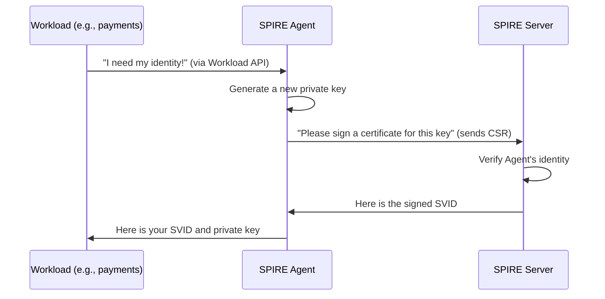

# Chapter 1: SVID (SPIFFE Verifiable Identity Document)

Welcome to the first chapter of our journey into SPIRE! Before we dive into the deep end, let's start with the most fundamental concept in the SPIFFE/SPIRE world: the identity document itself.

Imagine you're building a modern application with many small services. A `payments` service needs to fetch user data from a `database` service. How can the `database` be absolutely sure that the request is coming from the *real* `payments` service and not an imposter?

In the old days, you might have created a password or an API key, stored it in a configuration file, and had the `payments` service send it with every request. But this approach has problems:
*   **What if the key leaks?** An attacker could use it to steal data.
*   **How do you change the key?** You'd have to update it everywhere, risking downtime.
*   **What if you have hundreds of services?** Managing all those keys becomes a nightmare.

SPIRE solves this problem with a much more elegant and secure solution: the **SPIFFE Verifiable Identity Document**, or **SVID**.

### What is an SVID?

Think of an SVID as a passport or driver's license for your software services (which we'll call "workloads"). It's a special document that cryptographically proves a workload's identity to any other workload.

An SVID contains two critical pieces of information:

1.  **The SPIFFE ID:** This is the unique, specific name of the workload, like `spiffe://your-company.com/payments`. It's like the name on your passport.
2.  **A Cryptographic Signature:** The entire document is digitally signed by a trusted authority—the [SPIRE Server](05_spire_server_.md). This signature proves that the SVID is authentic and hasn't been tampered with, just like the official seal on a passport proves it was issued by a government.

The most powerful feature of SVIDs is that they are **short-lived**. They expire after a few minutes or hours. The [SPIRE Agent](04_spire_agent_.md) automatically replaces them with new ones before they expire. If an SVID ever gets stolen, it becomes useless very quickly, dramatically reducing the risk of a breach.

### Two Flavors of SVIDs

Just as you might have a physical passport and a digital ID on your phone, SVIDs come in two standard formats for different situations.

#### 1. X.509-SVID

An X.509-SVID is based on the X.509 certificate standard. This is the same technology that secures websites with HTTPS (the little lock icon in your browser).

*   **Best for:** Securing network connections between two services using mutual TLS (mTLS).
*   **Analogy:** Think of it as a secure ID badge used to open a door between two high-security buildings. Our `payments` service and `database` can use their X.509-SVIDs to establish a private, encrypted communication channel that no one else can listen to.

#### 2. JWT-SVID

A JWT-SVID is based on the JSON Web Token (JWT) standard. These are commonly used in web applications.

*   **Best for:** Sending identity information to an application or API.
*   **Analogy:** Think of it as a single-use ticket to an event. A workload can present this ticket to prove its identity for a specific request. For example, our `payments` service could send a JWT-SVID to an API gateway to authenticate an API call.

### How are SVIDs Created?

The process of creating an SVID is called "minting". While SPIRE handles this automatically for your workloads, you can also mint SVIDs manually for testing or special cases using the command line.

Let's look at how you might mint a JWT-SVID for our `payments` service.

```bash
spire-server jwt mint \
    -spiffeID "spiffe://your-company.com/payments" \
    -audience "database"
```

This command asks the SPIRE server to create a JWT-SVID.
*   `-spiffeID`: The unique identity we are creating the SVID for.
*   `-audience`: The intended recipient of the SVID (our `database` service).

Under the hood, this CLI command is making a request to the SPIRE Server. Here is a tiny peek at the Go code that handles this.

```go
// File: cmd/spire-server/cli/jwt/mint.go

// This code builds a request to the SPIRE Server API.
resp, err := client.MintJWTSVID(ctx, &svidv1.MintJWTSVIDRequest{
	Id: &types.SPIFFEID{
		TrustDomain: "your-company.com",
		Path:        "/payments",
	},
	Audience: []string{"database"},
})
// The server signs and returns the SVID.
token := resp.Svid.Token
```
This snippet constructs a request containing the SPIFFE ID and audience, sends it to the server, and receives the signed SVID (the `token`) back. Minting an X.509-SVID is very similar, but instead of an audience, it involves sending a Certificate Signing Request (CSR).

### Under the Hood: The SVID Lifecycle

So how does a workload like our `payments` service actually get its SVID automatically? It all happens in a few simple steps, orchestrated by SPIRE.



1.  The `payments` workload starts up and asks the local [SPIRE Agent](04_spire_agent_.md) for its identity via the [Workload API](03_workload_api_.md).
2.  The Agent generates a fresh, unique private key for the workload.
3.  The Agent creates a Certificate Signing Request (CSR) and sends it to the [SPIRE Server](05_spire_server_.md).
4.  The SPIRE Server verifies that the request is coming from a legitimate Agent.
5.  The Server signs the workload's certificate, creating the SVID, and sends it back.
6.  The Agent securely delivers the SVID and the private key to the `payments` workload.

The workload can now use this SVID to prove its identity! But what happens when the SVID is about to expire?

### Under the Hood: Automatic Rotation

This is where the magic of SPIRE truly shines. The [SPIRE Agent](04_spire_agent_.md) constantly keeps an eye on the SVID's expiration time. Well before it expires, the Agent automatically repeats the process above to get a new SVID and delivers it to the workload seamlessly.

Here is a simplified look at the logic inside the Agent that decides when to rotate.

```go
// File: pkg/agent/svid/rotator.go

// This is a simplified version of the logic in the Agent's main loop.
func (r *rotator) rotateSVIDIfNeeded(ctx context.Context) error {
	svid_certificate := ... // get current SVID
	
	// ShouldRotateX509 checks if the certificate is past half its life.
	if r.c.RotationStrategy.ShouldRotateX509(time.Now(), svid_certificate) {
		// Time to get a new one!
		return r.rotateSVID(ctx)
	}
	return nil
}
```
This simple check ensures that workloads *always* have a valid SVID without any manual intervention. This automated rotation makes the system incredibly resilient and secure compared to managing static secrets.

### Conclusion

You've just learned about the most important building block in SPIRE: the SVID.

*   An SVID is a **verifiable identity document** for a workload, like a passport for software.
*   It contains a **unique SPIFFE ID** and is **signed by a trusted authority**.
*   It comes in two flavors: **X.509-SVIDs** for network-level security (mTLS) and **JWT-SVIDs** for application-level authentication.
*   Most importantly, SVIDs are **short-lived and automatically rotated** by SPIRE, eliminating the risks of managing static secrets.

Now, a critical question remains: when the `database` service receives an SVID from the `payments` service, how does it verify the signature? How does it know which signing authorities to trust? That's where our next topic comes in.

Next, we'll explore the [Trust Bundle](02_trust_bundle_.md).

---

Generated by [AI Codebase Knowledge Builder](https://github.com/The-Pocket/Tutorial-Codebase-Knowledge)