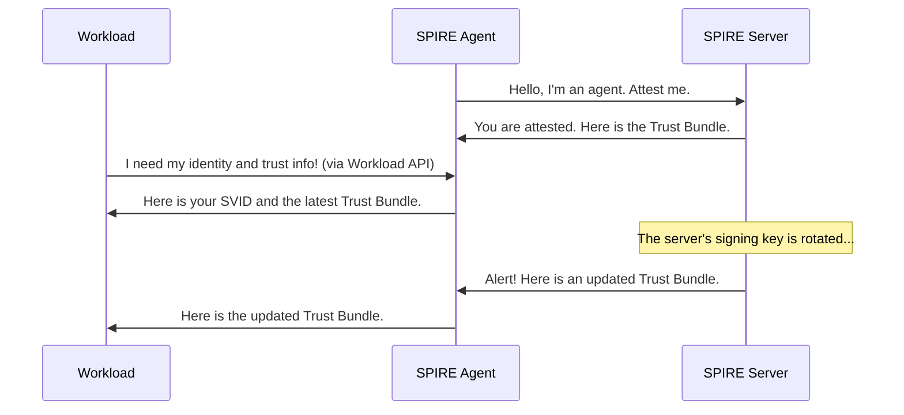

# Chapter 2: Trust Bundle

In the [previous chapter on SVIDs](01_svid__spiffe_verifiable_identity_document__.md), we learned how SPIRE gives each of your services a secure "passport" to prove its identity. This solves half of our problem. The other half is: how does a service know if a passport it receives is real and not a clever fake?

Imagine a border control agent looking at a passport. They don't just trust it because it looks right; they check its security features against a list of known, official ones. They might check the watermark, the hologram, or the digital signature. That list of official features is their source of truth.

In the SPIFFE world, that source of truth is called a **Trust Bundle**.

### What is a Trust Bundle?

A Trust Bundle is a collection of public keys from a trusted authority, known as a Certificate Authority (CA). In SPIRE, the CA is your [SPIRE Server](05_spire_server_.md).

*   **Analogy:** Think of a Trust Bundle as a book of official government seals.
*   The [SPIRE Server](05_spire_server_.md) uses its private key (a secret seal stamp) to sign every SVID it issues.
*   The Trust Bundle contains the matching public keys (the official seals).
*   When one service receives an SVID from another, it uses this book of seals to verify the signature. If the signature matches one of the seals in its book, it knows the SVID is authentic and can be trusted.

The [SPIRE Agent](04_spire_agent_.md) is responsible for delivering the correct Trust Bundle to every workload, ensuring it always knows which authorities to trust.

### How is a Trust Bundle Used?

Let's revisit our `payments` and `database` services. The `payments` service wants to connect to the `database`.

1.  The `payments` service presents its X.509-SVID to the `database`.
2.  The `database` service, which has its own local copy of the Trust Bundle (provided by its [SPIRE Agent](04_spire_agent_.md)), takes the SVID.
3.  It checks the digital signature on the SVID against the public keys in its Trust Bundle.
4.  Since the SVID was signed by the [SPIRE Server](05_spire_server_.md), the signature will match one of the keys in the bundle.
5.  Verification successful! The `database` service is now certain it's talking to the real `payments` service and establishes a secure, encrypted connection.

This all happens automatically in milliseconds, forming the basis of zero-trust security.

### Viewing the Trust Bundle

A Trust Bundle isn't just an abstract concept; it's real data you can inspect. You can use the `spire-server` command-line tool to see the bundle for your own trust domain.

```bash
spire-server bundle show
```

The command will output the public certificates of your server's CA in PEM format, which looks something like this:

```
-----BEGIN CERTIFICATE-----
MIIC...
...
-----END CERTIFICATE-----
-----BEGIN CERTIFICATE-----
MIID...
...
-----END CERTIFICATE-----
```

This output is the "book of seals" for your entire system. Let's see how the command gets this information.

```go
// File: cmd/spire-server/cli/bundle/show.go

// This is the main function for the "bundle show" command.
func (c *showCommand) Run(ctx context.Context, _ *common_cli.Env, serverClient util.ServerClient) error {
	// Create a client to talk to the server's bundle API.
	bundleClient := serverClient.NewBundleClient()

	// Ask the SPIRE server for its own trust bundle.
	resp, err := bundleClient.GetBundle(ctx, &bundlev1.GetBundleRequest{})
	if err != nil {
		return err
	}

	// Print the bundle we received to the screen.
	return c.printer.PrintProto(resp)
}
```
The code is straightforward: it makes a request to the [SPIRE Server](05_spire_server_.md) API, asks for the bundle, and prints the result.

### Under the Hood: Automatic Delivery

Your workloads don't have to run commands to get the Trust Bundle. The [SPIRE Agent](04_spire_agent_.md) delivers it automatically alongside the SVID. It even keeps the bundle updated if the server's signing keys are ever rotated.

Here's how it works:



This ensures that workloads always have the freshest set of trusted keys without any manual work.

Now, let's look at how SPIRE stores this data. Inside the SPIRE Server's database, there's a simple table for bundles.

```go
// File: pkg/server/datastore/sqlstore/models.go

// Bundle holds a trust bundle in the database.
type Bundle struct {
	Model

	// The unique name, like "your-company.com"
	TrustDomain string `gorm:"not null;unique_index"`
	
	// The raw certificate data (the "seals")
	Data        []byte `gorm:"size:16777215"`
}
```
This Go struct directly maps to a database table. When the agent or a CLI command requests a bundle, the server simply fetches the right row from this table.

The server's API handler that responds to these requests looks like this:

```go
// File: pkg/server/api/bundle/v1/service.go

// GetBundle returns the bundle for the server's trust domain.
func (s *Service) GetBundle(ctx context.Context, req *bundlev1.GetBundleRequest) (*types.Bundle, error) {
	// Fetch the bundle from the datastore using the server's trust domain ID.
	commonBundle, err := s.ds.FetchBundle(ctx, s.td.IDString())
	// ... error handling ...

	// Convert the stored bundle into the API format and return it.
	bundle, err := api.BundleToProto(commonBundle)
	// ...
	return bundle, nil
}
```
This function connects the dots: it receives an API request, fetches the raw bundle data from the database, and sends it back to the client.

### Federation: The Superpower of Trust Bundles

What happens when a service in your company (`your-company.com`) needs to communicate securely with a service from a partner (`partner-company.com`)? Your workloads don't trust their SVIDs by default, because they don't have the partner's "seals" in their Trust Bundle.

This is where **federation** comes in. You can tell your SPIRE Server to trust another trust domain by giving it their Trust Bundle.

```bash
# Tell our server to trust SVIDs from partner-company.com
spire-server bundle set \
    -id spiffe://partner-company.com \
    -path ./partner-bundle.pem
```
This command adds the partner's public keys to your SPIRE Server's database. Now, your [SPIRE Agent](04_spire_agent_.md)s will deliver a bundle that contains keys for *both* `your-company.com` and `partner-company.com`. Your workloads can now seamlessly verify SVIDs from the partner, enabling secure cross-company communication.

### Conclusion

You've now learned about the second critical piece of the SPIFFE puzzle: the Trust Bundle.

*   A Trust Bundle is a **collection of public CA keys**, acting as a book of official seals.
*   Workloads use it to **verify the signatures** on SVIDs they receive, confirming they are authentic.
*   The [SPIRE Agent](04_spire_agent_.md) **automatically delivers and updates** the bundle for all workloads.
*   Trust Bundles are the foundation for establishing trust both within a single system and **across different systems** through federation.

We've mentioned several times that workloads get their SVIDs and Trust Bundles from a local [SPIRE Agent](04_spire_agent_.md). But how exactly does that communication happen?

Next, we'll explore the [Workload API](03_workload_api_.md), the interface that connects a workload to SPIRE.

---

Generated by [AI Codebase Knowledge Builder](https://github.com/The-Pocket/Tutorial-Codebase-Knowledge)