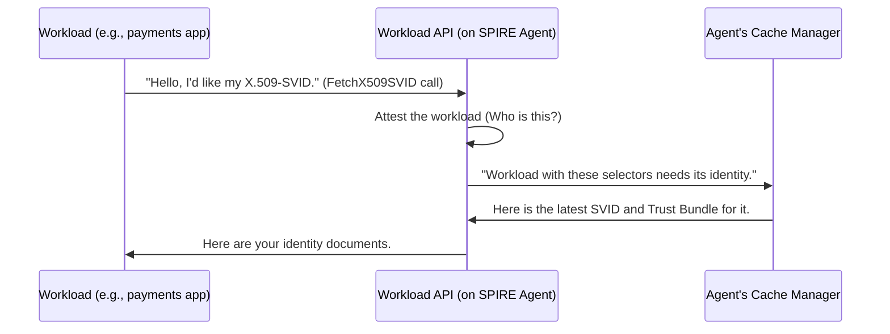

# Chapter 3: Workload API

In the previous chapters, we learned about the "what": the [SVID](01_svid__spiffe_verifiable_identity_document__.md) is a workload's passport, and the [Trust Bundle](02_trust_bundle_.md) is the book of official seals used to check those passports. Now, let's answer the "how": how does a workload actually *get* these critical documents?

Imagine you need a new driver's license. You don't mail a letter to the capital city; you go to the local Department of Motor Vehicles (DMV) office in your town. It's a simple, local place designed for you to walk in and request your official documents.

The **Workload API** is the SPIRE equivalent of that local DMV office.

### What is the Workload API?

The Workload API is a simple, local API that the [SPIRE Agent](04_spire_agent_.md) provides on every single machine where your workloads run. It's the front desk where your applications go to securely pick up their identity documents ([SVIDs](01_svid__spiffe_verifiable_identity_document__.md)) and verification keys ([Trust Bundles](02_trust_bundle_.md)).

Key characteristics:
*   **It's Local:** The API is only accessible on the local machine (the "node"). A workload can't call the Workload API on a different machine.
*   **It's Secure:** Communication typically happens over a special kind of file called a Unix Domain Socket (UDS). Think of a UDS as a private, secure phone line between two programs on the same computer, rather than a public network connection.
*   **It's the Main Entry Point:** This API is the primary way that your applications, or sidecars like Envoy, integrate with SPIRE to get identities.

### Using the Workload API

Your application code won't usually make raw API calls. Instead, you'll use a SPIFFE library (available in Go, Java, Rust, and others) that handles the communication for you. But for learning, we can use a command-line tool to talk to the API directly and see what happens.

The `spire-agent` comes with a tool to do just that. Let's ask the local Workload API for an X.509-SVID:

```bash
spire-agent api fetch x509
```

If your workload is registered correctly, the API will respond with its identity documents, formatted for you to see:

```text
Received 1 SVID after 5.462292ms

SVID #0:
	SPIFFE ID:      spiffe://your-company.com/payments
	Hint:           my-app
	Valid until:    2023-10-27 15:00:00 +0000 UTC
	Bundle:
		spiffe://your-company.com
```
This command connects to the local Workload API, asks "who am I?", and gets back its SPIFFE ID and the necessary certificates.

Let's look at a simplified version of the code that runs when you type that command.

```go
// File: cmd/spire-agent/cli/api/fetch_x509.go

func (c *fetchX509Command) fetchX509SVID(ctx context.Context, client *workloadClient) (*workload.X509SVIDResponse, error) {
	// Prepare a connection to the local SPIRE Agent's API.
	ctx, cancel := client.prepareContext(ctx)
	defer cancel()

	// Call the "FetchX509SVID" endpoint on the API.
	stream, err := client.FetchX509SVID(ctx, &workload.X509SVIDRequest{})
	if err != nil {
		return nil, err
	}

	// Receive the response containing the SVID and Trust Bundle.
	return stream.Recv()
}
```
This snippet does exactly what we described: it connects to the local API, makes a request for an X.509-SVID, and waits for the response.

### Under the Hood: The API in Action

So, what's happening on the other side of that Unix Domain Socket? The [SPIRE Agent](04_spire_agent_.md) is listening for these requests. When a request comes in, it performs a few crucial steps to securely deliver the identity.


1.  **Connection:** A workload connects to the Workload API socket.
2.  **Attestation:** The [SPIRE Agent](04_spire_agent_.md) uses information from the operating system to figure out *exactly* which process is calling. This is a form of local [Attestation](06_attestation_.md). For example, it can identify the user ID or process ID of the caller.
3.  **Lookup:** The Agent takes the workload's properties (its "selectors") and looks them up in its internal cache to find the matching SPIFFE ID.
4.  **Delivery:** The Agent streams the correct SVID and Trust Bundle back to the workload.

The magic of the Workload API is that it's a *streaming* API. When an SVID is about to expire, the [SPIRE Agent](04_spire_agent_.md) automatically gets a new one and pushes the update down the existing connection to the workload. The workload doesn't even have to ask again!

Let's see the simplified code inside the agent that handles these requests.

First, the agent sets up a gRPC server to listen for connections on the socket.

```go
// File: pkg/agent/endpoints/endpoints.go

// This is how the SPIRE Agent starts its API server.
func (e *Endpoints) ListenAndServe(ctx context.Context) error {
	// Create a new gRPC server.
	server := grpc.NewServer(...)

	// Register our Workload API implementation with the server.
	workload_pb.RegisterSpiffeWorkloadAPIServer(server, e.workloadAPIServer)

	// Start listening for connections on the socket.
	l, err := e.createListener()
	// ...
	return server.Serve(l)
}
```
This code registers the API handlers and starts the server, getting it ready to accept connections from workloads.

Next, here's the core logic that runs when a workload calls `FetchX509SVID`.

```go
// File: pkg/agent/endpoints/workload/handler.go

// This function handles a request for an X.509 SVID.
func (h *Handler) FetchX509SVID(_ *workload.X509SVIDRequest, stream workload.SpiffeWorkloadAPI_FetchX509SVIDServer) error {
	ctx := stream.Context()
	
	// 1. Figure out who is calling the API.
	selectors, err := h.c.Attestor.Attest(ctx)
	// ... error handling ...

	// 2. Subscribe to identity updates for this workload.
	subscriber, err := h.c.Manager.SubscribeToCacheChanges(ctx, selectors)
	// ... error handling ...
	defer subscriber.Finish()

	// 3. Loop forever, sending updates as they arrive.
	for {
		select {
		case update := <-subscriber.Updates(): // Wait for a new SVID/bundle
			// Send the update to the workload.
			if err := sendX509SVIDResponse(update, stream, ...); err != nil {
				return err
			}
		case <-ctx.Done(): // The workload has disconnected.
			return nil
		}
	}
}
```
This handler is the heart of the Workload API. It first attests the caller to get its selectors. Then, it subscribes to any changes for that identity. Finally, it enters a loop, immediately sending the current identity and then waiting to send any future updates (like a rotated SVID) down the stream.

### Conclusion

You've now seen the bridge that connects your applications to the world of SPIFFE identity: the Workload API.

*   It's a **local, secure API** provided by the [SPIRE Agent](04_spire_agent_.md).
*   It's the "front desk" where workloads go to **fetch their SVIDs and Trust Bundles**.
*   It uses a **streaming model** to automatically push updated identities to workloads before the old ones expire.
*   It's the **primary integration point** for any piece of software that wants to use a SPIFFE identity.

We've talked a lot about the component that runs this API and manages identities on the machine. It's time to put it under the microscope.

Next, we'll dive into the [SPIRE Agent](04_spire_agent_.md).

---

Generated by [AI Codebase Knowledge Builder](https://github.com/The-Pocket/Tutorial-Codebase-Knowledge)