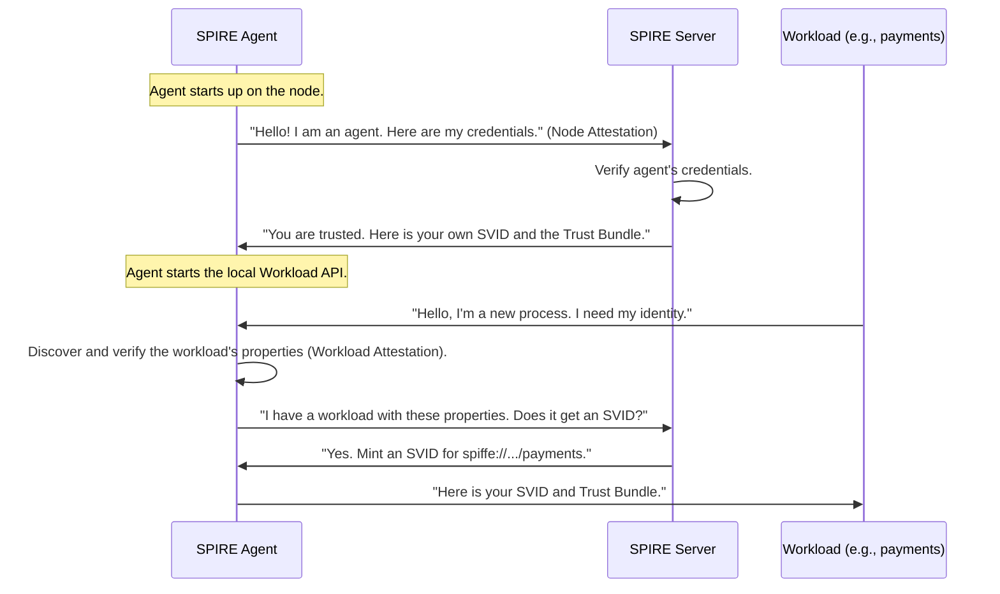

# Chapter 4: SPIRE Agent

In the [previous chapter on the Workload API](03_workload_api_.md), we saw the "front desk" where a workload goes to get its identity documents. But who is running that office? Who is doing the work of verifying local workloads and handing out those documents?

Meet the **SPIRE Agent**.

### What is a SPIRE Agent?

If the [SPIRE Server](05_spire_server_.md) is the central government's main passport office, the SPIRE Agent is the local DMV or government office in every single town. It's a lightweight program that you run on every machine (or "node") that hosts your applications.

The agent is the indispensable worker bee of the SPIRE ecosystem. It has three primary jobs:

1.  **Prove Its Own Identity:** Before it can do anything, the agent must prove to the [SPIRE Server](05_spire_server_.md) that it is a legitimate, authorized agent running on a trusted machine. This process is called **node attestation**.
2.  **Discover and Attest Local Workloads:** Once the server trusts the agent, the agent's job is to discover the applications (workloads) running on its local machine. It carefully inspects each workload to figure out its unique attributes—a process called **workload attestation**.
3.  **Issue SVIDs:** The agent securely provides [SVIDs](01_svid__spiffe_verifiable_identity_document__.md) and [Trust Bundles](02_trust_bundle_.md) to the local workloads it has identified. It does this through the [Workload API](03_workload_api_.md).

This architecture is incredibly powerful. It means your workloads never have to talk to the central server directly. They only need to talk to their local, friendly SPIRE Agent. This keeps things fast, secure, and scalable.

### The Agent Lifecycle

Let's walk through the life of a SPIRE Agent from the moment it starts up.



1.  **Node Attestation:** The agent starts and immediately calls the [SPIRE Server](05_spire_server_.md). It presents evidence about the machine it's running on (e.g., a cloud instance identity document). This is a crucial first step in building the chain of trust.
2.  **Receives its own Identity:** The server validates this evidence. If it checks out, the server issues an SVID to the *agent itself*. Now the agent has a trusted identity it can use for all future communication.
3.  **Serves the Workload API:** The agent starts listening for local connections on the [Workload API](03_workload_api_.md) socket.
4.  **Workload Attestation & SVID Caching:** When a workload connects, the agent uses plugins to discover its properties (like its user ID or Kubernetes service account). It then syncs with the server to find out which SPIFFE IDs the workload is entitled to and keeps a local cache of those SVIDs, ready to serve them.
5.  **Delivers Identity:** The agent delivers the correct [SVID](01_svid__spiffe_verifiable_identity_document__.md) and [Trust Bundle](02_trust_bundle_.md) to the workload. It also automatically handles renewing the SVID before it expires.

### Running the Agent

The SPIRE Agent is a command-line application. You run it as a background process or service on each of your machines. Its behavior is controlled by a configuration file.

First, you run the agent with a command like this:
```bash
spire-agent run -config conf/agent/agent.conf
```
This command tells the agent to start up and load its configuration from the specified file.

The configuration file, `agent.conf`, tells the agent everything it needs to know, like where the server is and what trust domain it belongs to. A minimal configuration looks like this:

```hcl
// File: conf/agent/agent.conf

agent {
    // The address of the central SPIRE Server.
    server_address = "spire-server"
    server_port = "8081"

    // The name of our identity system.
    trust_domain = "your-company.com"

    // Where to create the Workload API socket file.
    socket_path ="/tmp/spire-agent/public/api.sock"
    
    // ... other settings ...
}
```
*   `server_address` and `server_port` point the agent to the central [SPIRE Server](05_spire_server_.md).
*   `trust_domain` tells the agent which identity "nation" it belongs to.
*   `socket_path` defines the location of the Unix Domain Socket for the [Workload API](03_workload_api_.md).

### Under the Hood: How the Agent Starts

When you execute `spire-agent run`, the agent's main function kicks off a sequence of critical tasks. Let's look at a highly simplified version of the code that brings an agent to life.

The entry point for the `run` command sets up and starts a new agent object.

```go
// File: cmd/spire-agent/cli/run/run.go

func (cmd *Command) Run(args []string) int {
	// 1. Load the configuration from the .conf file.
	c, err := LoadConfig(...)
	if err != nil {
		// ... handle error ...
		return 1
	}

	// 2. Create a new Agent instance with the config.
	a := agent.New(c)

	// 3. Start the agent's main event loop.
	err = a.Run(ctx)
	// ... handle shutdown ...
	return 0
}
```
This code first loads the configuration file we just saw, then creates a new agent, and finally calls its `Run` method, which does all the real work.

Inside the agent's `Run` method, the magic begins. This is where the agent performs its lifecycle steps.

```go
// File: pkg/agent/agent.go

func (a *Agent) Run(ctx context.Context) error {
	// 1. Load all configured plugins (e.g., for attestation).
	cat, err := catalog.Load(ctx, ...)
	
	// 2. Attest the agent itself to the server to get its own identity.
	as, err := a.attest(ctx, ...)
	if err != nil {
		return err // Failed to prove our own identity!
	}

	// 3. Create the manager, which handles SVIDs and server communication.
	manager, err := a.newManager(ctx, ..., as)

	// 4. Create and start the Workload API endpoint server.
	agentEndpoints := a.newEndpoints(...)
	
	// 5. Start all background tasks and run forever.
	tasks := []func(context.Context) error{
		manager.Run,
		agentEndpoints.ListenAndServe,
	}
	// ... run tasks ...
}
```
This simplified code shows the agent's startup logic:
1.  It loads its plugins for tasks like [Attestation](06_attestation_.md).
2.  It performs node attestation (`a.attest(...)`) to prove its identity to the server.
3.  It creates a "manager" component to handle all the logic of caching SVIDs and syncing with the server.
4.  It starts the `agentEndpoints`, which is the gRPC server for the [Workload API](03_workload_api_.md).
5.  Finally, it launches these components as background tasks and begins its mission.

### Conclusion

You've now met the local hero of the SPIRE ecosystem: the SPIRE Agent.

*   The agent is a process that runs on **every node** hosting workloads.
*   It acts as a **local representative** of the SPIRE system.
*   It first **attests itself** to the server to gain trust.
*   It then **attests local workloads** and provides them with identities via the [Workload API](03_workload_api_.md).
*   This design **decouples workloads from the server**, making the system scalable and resilient.

The agent can't function in a vacuum. It relies entirely on its connection to the central authority that validates its identity and tells it which SVIDs to issue. It's time to visit the main passport office.

Next, we'll explore the [SPIRE Server](05_spire_server_.md).

---

Generated by [AI Codebase Knowledge Builder](https://github.com/The-Pocket/Tutorial-Codebase-Knowledge)