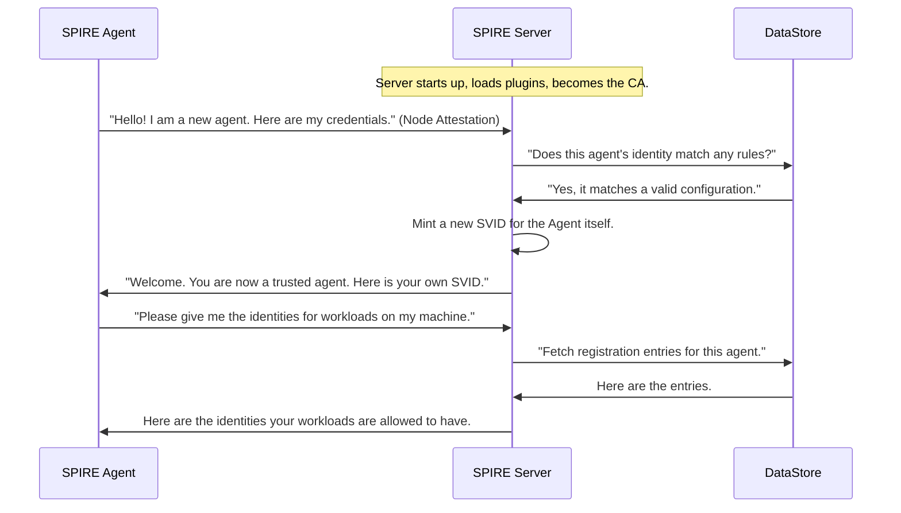

# Chapter 5: SPIRE Server

In our [previous chapter on the SPIRE Agent](04_spire_agent_.md), we got to know the local "DMV office" that runs on every machine, handing out identities to workloads. But where does that local office get its authority? Who decides which identities are valid in the first place? For that, we need to visit the main headquarters.

Welcome to the **SPIRE Server**.

### What is a SPIRE Server?

The SPIRE Server is the central authority and the single source of truth for your entire identity system (your "trust domain").

*   **Analogy:** If the [SPIRE Agent](04_spire_agent_.md) is a local passport branch, the SPIRE Server is the country's **main passport office**. It's the ultimate authority that defines the rules, validates the branch offices, and holds the master list of all citizens.

The server has a few critical responsibilities:

1.  **Act as the Certificate Authority (CA):** The server holds the private keys for the trust domain. It uses these keys to sign and issue every single [SVID](01_svid__spiffe_verifiable_identity_document__.md) in your system. It's the entity that puts the official, unbreakable seal on every passport.
2.  **Verify (Attest) SPIRE Agents:** When a new [SPIRE Agent](04_spire_agent_.md) starts up on a machine, it must first prove its own identity to the server. The server verifies these credentials to ensure that only legitimate, authorized agents are allowed to join the system.
3.  **Manage Identities:** The server maintains a list of all workloads and the specific SPIFFE IDs they are allowed to have. This is done through [Registration Entries](07_registration_entries_.md), which act as the official "citizen registry".

Your workloads never talk to the server directly. Only agents do. This keeps the server's workload manageable and adds a layer of security.

### Running the Server

Just like the agent, the SPIRE Server is a command-line application you run as a long-lived service. Typically, you only need one (or a small, high-availability cluster) for your entire environment.

You start it with a simple command:
```bash
spire-server run -config conf/server/server.conf
```
This tells the server to start up and use the specified configuration file.

The configuration file, `server.conf`, is where you define the server's core properties. A minimal example looks like this:

```hcl
// File: conf/server/server.conf

server {
    // The name of our identity "nation".
    trust_domain = "your-company.com"

    // The IP address and port to listen on for agent connections.
    bind_address = "0.0.0.0"
    bind_port = "8081"

    // Where to store runtime data, like the server's own keys.
    data_dir = "./.data"

    // ... other settings ...
}

plugins {
    // ... plugin configurations go here ...
}
```
*   `trust_domain`: This is the unique name for your identity system, which forms the basis of all your SPIFFE IDs (e.g., `spiffe://your-company.com/...`).
*   `bind_address` and `bind_port`: The network address where the server listens for incoming connections from [SPIRE Agent](04_spire_agent_.md)s.
*   `plugins`: This section is where you configure all the server's plugins, which handle tasks like storing data and attesting agents.

### Under the Hood: The Server's Lifecycle

When a SPIRE Server starts, it performs a sequence of actions to become the root of trust for your system. The interaction with an agent is fundamental to this process.



1.  **Startup:** The server initializes, loads its plugins, and prepares its own Certificate Authority.
2.  **Node Attestation:** A [SPIRE Agent](04_spire_agent_.md) connects and presents proof of the machine it's running on (e.g., a cloud instance identity document). This is the most critical step, which we'll cover in detail in the [Attestation](06_attestation_.md) chapter.
3.  **Validation:** The server uses a **NodeAttestor** plugin to validate the agent's proof.
4.  **Agent SVID Issuance:** If validation succeeds, the server issues an [SVID](01_svid__spiffe_verifiable_identity_document__.md) to the *agent itself*, officially making it a trusted part of the system.
5.  **Synchronization:** The agent can now securely communicate with the server to receive the list of [Registration Entries](07_registration_entries_.md) that apply to the workloads on its node.

Let's look at the simplified code that kicks off this whole process. When you run `spire-server run`, this is what happens first.

```go
// File: cmd/spire-server/cli/run/run.go

func (cmd *Command) Run(args []string) int {
	// 1. Load the configuration from the .conf file.
	c, err := LoadConfig(...)
	// ... error handling ...
	
	// 2. Create a new Server instance with the config.
	s := server.New(*c)

	// 3. Start the server's main event loop. This blocks forever.
	err = s.Run(ctx)
	// ... handle shutdown ...
	return 0
}
```
This code is the entry point. It loads your `server.conf` file, creates the main server object, and tells it to run.

Inside the server's `Run` method, the core components are started in a specific order to build up the system's functionality.

```go
// File: pkg/server/server.go

func (s *Server) run(ctx context.Context) (err error) {
	// Load all configured plugins (DataStore, KeyManager, etc.).
	cat, err := s.loadCatalog(ctx, ...)
	// ...

	// Initialize the server's Certificate Authority (CA).
	serverCA := s.newCA(...)

	// Get the server's own SVID, rotating it automatically.
	svidRotator, err := s.newSVIDRotator(ctx, serverCA, ...)
	// ...

	// Start the API server that agents will connect to.
	endpointsServer, err := s.newEndpointsServer(ctx, cat, svidRotator, ...)
	// ...

	// Run all background tasks (like serving APIs) forever.
	tasks := []func(context.Context) error{
		svidRotator.Run,
		endpointsServer.ListenAndServe,
	}
	// ... run tasks until shutdown ...
}
```
This highly simplified view shows the server's startup logic. It loads its plugins, sets up its own identity and CA capabilities, and then starts listening for connections from agents.

### Conclusion

You've now met the brain of the operation: the SPIRE Server. It is the heart of your trust domain.

*   The SPIRE Server is the **central authority** for issuing and managing identities.
*   It acts as the **Certificate Authority (CA)**, signing all SVIDs.
*   It is responsible for **verifying SPIRE Agents** when they join the network.
*   It maintains the **master list of all identities** in the system.
*   Workloads never talk to the server; only **agents** do.

We've mentioned a few times that the server verifies or "attests" agents. This process of proving identity is a cornerstone of SPIRE's security model. But how does it actually work?

Next, we'll explore the crucial concept of [Attestation](06_attestation_.md).

---

Generated by [AI Codebase Knowledge Builder](https://github.com/The-Pocket/Tutorial-Codebase-Knowledge)